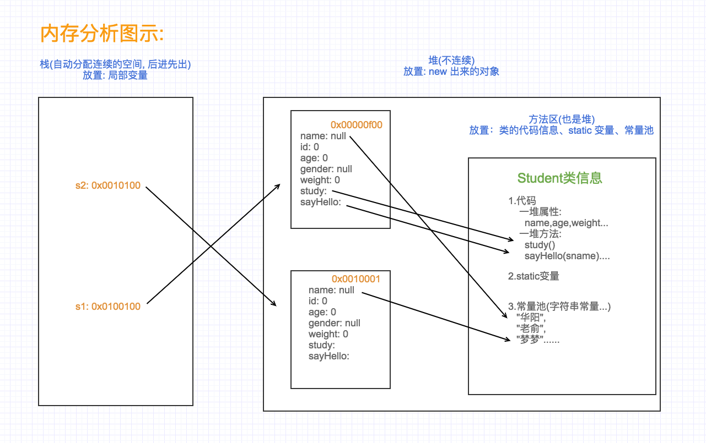
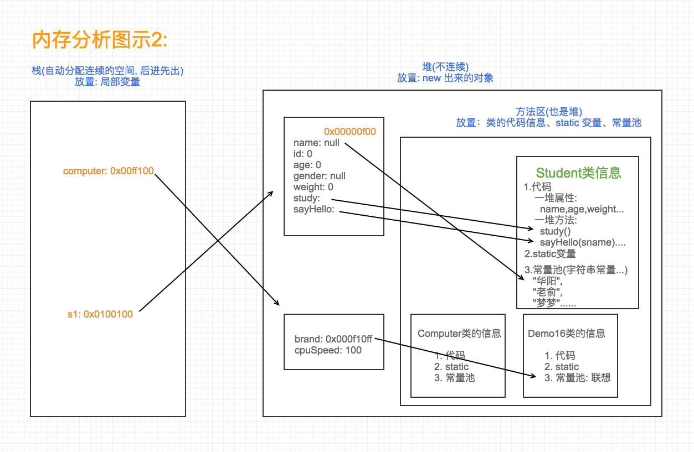
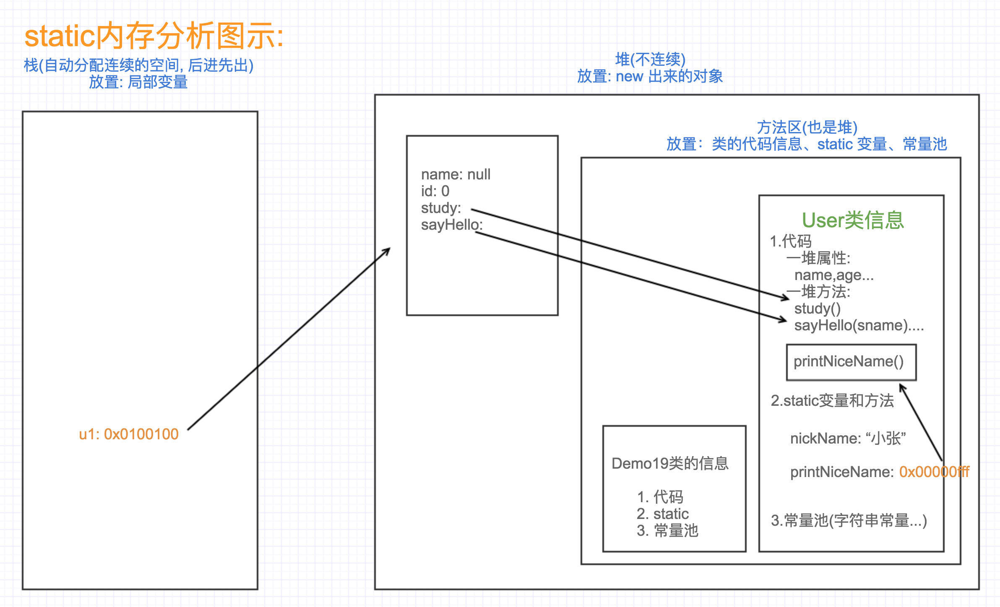
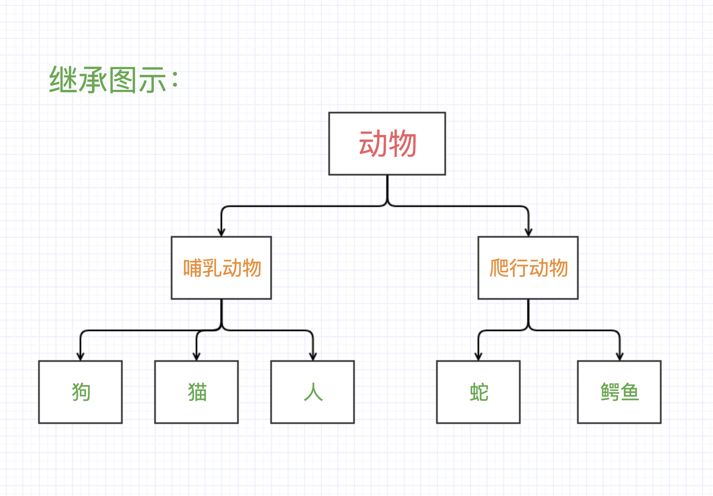
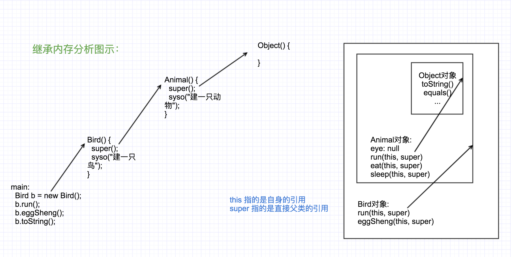
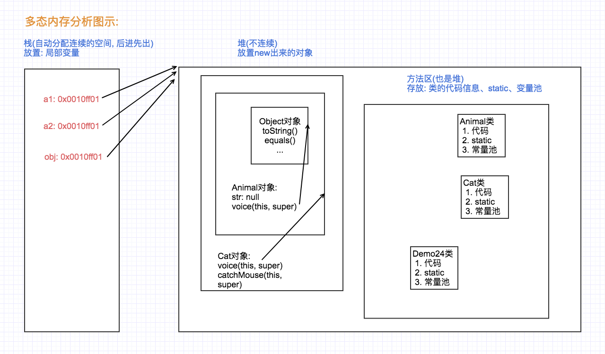
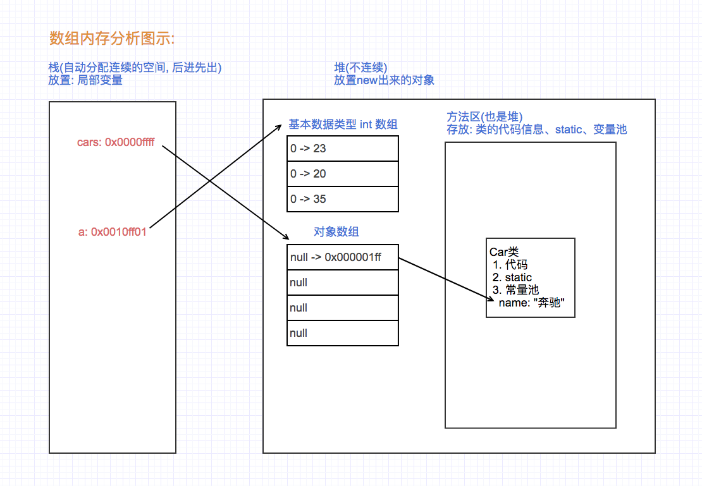
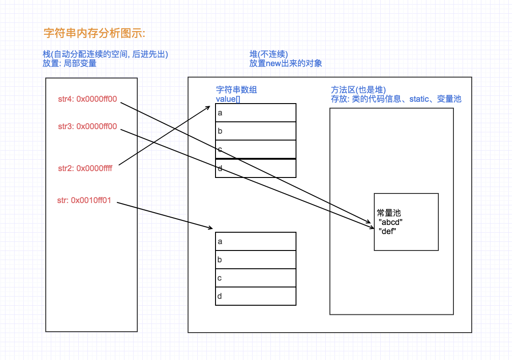
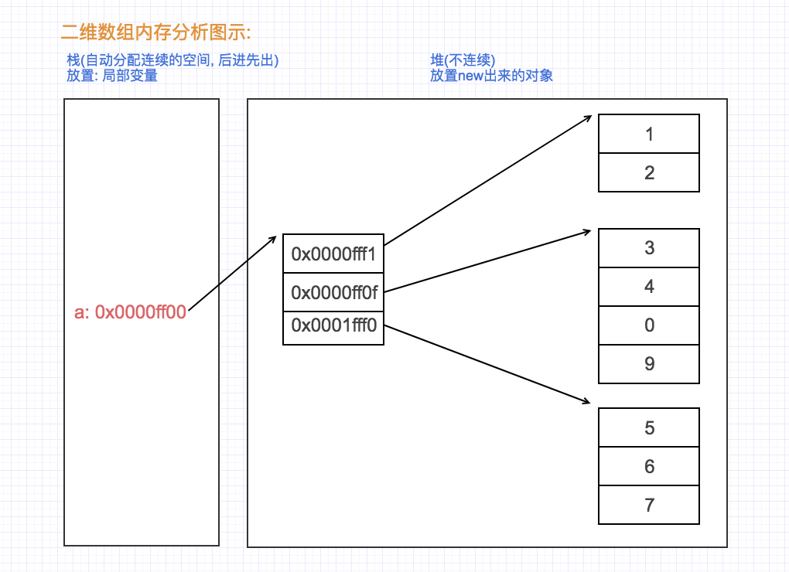

## 语言的发展
机器语言(10001010) -> 汇编语言(mov ax,bx ) -> 高级语言(class...)
## java环境配置
* JAVA_HOME
* PATH
```java
// 校验是否安装成功
java -version 
```
## HelloWorld
```java
public class Welcome {

    public static void main(String[] args) {
        
        System.out.println("Welcome Study Java!");
    }
}
```
## 标识符命名规则
标识符命名规则: [字母、_下划线、$美元符]开头
```java
public class Demo01 {

    public static void main(String[] args) {
        // 标识符命名规则: 以[字母、_下划线、$美元符]开头
        int $abc = 3;
        int $ = 6;
        int _123 = 9;

        // 1. 命名不能与java关键字重合
        // int static = 2;
        // 2. 不能使用数字开头
        // int 123test = 8;
        // 3. 不能包含除[字母、_下划线、$美元符、数字]之外的其他字符
        // int test# = 12;
    }

    
}
```
## 数据类型
* 基本数据类型
    * 数值型
        * 整数类型 (byte int short long)
        * 浮点类型 (float double)
    * 字符型 (char)
    * 布尔型 (boolean)
* 引用数据类型
    * 类 (class)
    * 接口 (interface)
    * 数组 (array)

```java
字节运算:
 1字节 = 8 位 = 2⁸ = 16*16 = 256个状态
 2字节 = 16位 = 2¹⁶ = 256*256 = 65536个状态
```
|类型|占用存储空间|变量范围|
|-|-|-|
|byte|1字节|-128 ~ 127|
|short|2字节|-2¹⁵ ~ 2¹⁵-1|
|int|4字节|-2³¹ ~ 2³¹-1|
|long|8字节|-2⁶³ ~ 2⁶³ -1|
```java
public class Demo02 {

    public static void main(String[] args) {
        int i = 68;
        byte b = 20;
        // byte b = 290; //超范围 (-128 ~ 127)
        System.out.println(b);

        // 二进制 八进制 十进制  十六进制转换
        // 10 -> 2 进制
        System.out.println(Integer.toBinaryString(i));
        // 10 -> 8 进制
        System.out.println(Integer.toOctalString(i));
        // 10 -> 16 进制
        System.out.println(Integer.toHexString(i));

        double d = 3.14; // 浮点数常量默认类型是double;

        float f = 6.25f; // 添加f变为float

        double d2 = 314e-2; // 采用科学计数法的写法
        System.out.println(d2);

        float f1 = 0.1f;
        double d3 = 1.0 / 10;
        System.out.println(f1 == d3); // false 浮点数有误差

        BigDecimal bg = new BigDecimal("3.14");  // 精确计算 一般用于电商,银行系统
    }
}
```
|类型|占用存储空间|变量范围|
|-|-|-|
|float|4字节|-3.403E38 ~ 3.403E38|
|double|8字节|-1.798E308 ~ 1.798E308|

```java
public class Demo03 {

    public static void main(String[] args) {

        char c1 = 'a';
        char c2 = '好'; // unicode (0-65535)
        char c3 = '\''; // \ 转义字符

        System.out.println(c1);
        System.out.println(c2);
        System.out.println(c3);

        char c4 = 'a';
        int i = c4 + 2; // a 对应ascii码表 为97
        System.out.println(i);

        char c5 = (char) i; // 强制类型转换 4字节 -> 2字节

        // 循环打印 a-z
        for(int j = 0; j < 26; j++) {
            char temp = (char) (c4 + j);
            System.out.print(temp);
        }

        System.out.println();
        // java中的字符串是定义成String类
        String str = "abcdefghijklmnopqrstuvwxyz";
        System.out.println(str);

        boolean flag = true; // 占1位 一个字节占8位

        if (flag) {
            System.out.println("true");
        }
    }
}
```

## 基本数据类型自动转换和强制转型以及类型提升
```java
public class Demo04 {

    public static void main(String[] args) {
        // 1. 自动类型转换
        byte b = 123; // 在表示范围之内, 可以自动int -> byte

        byte b1 = (byte) 300; // 不能自动转型

        System.out.println(b);
        System.out.println(b1);

        char c1 = 'a';
        int i = c1;
        System.out.println(i);

        long d1 = 12323;
        float f1 = d1;

        System.out.println(f1);

        // 2. 强制类型转化
        int i2 = 100;
        char c2 = (char) i2; // 强转
        System.out.println(c2);

        // 3. 表达式中的类型提升
        int j = 3;
        long h = 4;
        int k = (int) (j + h);
        System.out.println(k);

        // 4. 测试
        int money = 1000000000; // 10亿
        int years = 10;
        int total = money * years;
        long total2 = (long) money * years;
        System.out.println(total); // 1410065408 值溢出
        System.out.println(total2);
    }
}
```

## Java7新特性之二进制整数以及下划线分隔符
```java
public class Demo05 {

    public static void main(String[] args) {

        // jdk7支持下划线分隔符
        // 二进制整数
        int a = 0b0000_0000_0000_0000_0000_0000_0000_0011;

        int b = 1_1234_5678; jdk7中的分隔符

        System.out.println(a);
        System.out.println(b);
    }
}
```
## 变量和常量以及命名规范
```java
public class Demo06 {

    // 命名规范
    // 1. 类名 首字母大写, 使用驼峰命名法
    // 2. 变量名 使用驼峰命名法
    // 3. 常量名 需全部大写, 单词之间用_分隔

    // 实例变量, 成员变量/属性
    int t;

    public static void main(String[] args) {
        // 1. 变量声明
        int a;
        // 2. 变量初始化
        a = 3;

        // 局部变量: 在方法或语句块内部定义的变量
        int x, y, z;

        int h = 0;
        int sum = h + 3;

        System.out.println(sum);

        // final 只能被初始化一次! (常量)
        final int C = 22;

        final int MAX_SPEED = 120; // 常量字母需全部大写, 单词之间用_分隔

    }
}
```
## 运算符
```java
public class Demo07 {

    public static void main(String[] args) {
        // 算术运算符: +, -, *, /, %, ++, --
        // 赋值运算符: =
        // 关系运算符: >, <, >=, <=, ==, !=, instanceof
        // 逻辑运算符: &&, ||, !
        // 位运算符: &, |, ^, ~, >>, <<, >>> (了解)
        // 条件运算符: ? :
        // 扩展赋值运算符: +=, -=, *=, /=

        double d = 10.2 % 3; // 小数也可以取余数
        int y = 10 % 3;
        System.out.println(d); // 1.1999999999999993

        int a = 3;
        int b = a++;
        int c = ++a;
        System.out.println(b); // 3
        System.out.println(c); // 5

        c += 3; // 5 + 3 = 8
        System.out.println("c=" + c);

        // 0 不可以作为除数
        // int e = 3 / 0; // Exception in thread "main" java.lang.ArithmeticException: / by zero
        // System.out.println(e);
        // boolean g = 1 > 2 && 3 > (3 / 0); // 逻辑短路

        int m = 8;
        int n = 4;
        System.out.println(m & n); // 0 按位与
        System.out.println(m | n); // 12 按位或
        System.out.println(~m); // -9 取反
        System.out.println(m ^ n); // 12 按位异或

        int a1 = 3 * 2 * 2;
        int b1 = 3 << 2; // 左移
        int c1 = 12 / 2 / 2;
        int d1 = 12 >> 2; // 右移
        System.out.println(a1);
        System.out.println(b1);
        System.out.println(c1);
        System.out.println(d1);

        boolean b2 = true & false;
        System.out.println(b2);

        String str = "5";
        int s = 6;
        // 字符串相连, 只要两边有一个是字符串,则结果变为字符串
        System.out.println(str + s);

        int a3 = 3;
        int b3 = 6;
        // 三目运算符
        String str2 = (a3 < b3) ? "a3 < b3" : "a3 > b3";
        System.out.println(str2);
    }
}
```
## 控制语句
```java
public class Demo08 {
    // if语句 switch语句
    public static void main(String[] args) {

        double d = Math.random();
        int e = (int) (d * 5); // 返回0 ~ 4之间的整数
        // System.out.println(d);
        System.out.println(e);

        if (e > 3) {
            System.out.println("大数");
        } else {
            System.out.println("小数");
        }

        double a = Math.random();
        int b = (int) (d * 6) + 1;

        System.out.println(b);
        System.out.println("-------------");
        // switch 语句
        switch (b) { // int 或者可以自动转为int的类型(byte, char, short, enum) jdk7中可以使用字符串
            case 6:
                System.out.println("666666");
                break; // 跳出, switch
            case 5:
                System.out.println("55555");
                break;
            case 4:
                System.out.println("4444");
                break;
            case 3:
                System.out.println("333");
                break;
            case 2:
                System.out.println("22");
                break;
            case 1: // 一般每个case后面都需要break, 防止case穿透.
                System.out.println("1");
                break;
            default:
                System.out.println("默认值");
                break;
        }

        // jdk7 中switch 可以是字符串
        String str = "皮皮虾";
        switch (str) {
            case "皮皮虾":
                System.out.println("输入的是皮皮虾");
                break;
            case "厉害":
                System.out.println("输入的是厉害");
                break;
            case "我的虾":
                System.out.println("输入的是我的虾");
                break;
            default:
                System.out.println("大家好");
                break;
        }

    }
}
```

## 循环结构 while和dowhile语句
```java
public class Demo09 {

    public static void main(String[] args) {

        int a = 1; // 1. 循环初始化

        // 先判断, 后执行
        while (a <= 100) { // 2. 条件判断
            System.out.println(a); // 3. 循环体
            a++; // 4. 迭代
        }

        System.out.println("while循环结束");


        // 计算: 1 + 2 + 3 + .... + 100;
        int b = 1;
        int sum = 0;
        while (b <= 100) {
            // sum = sum + b;
            sum += b;
            b++;
        }
        System.out.println("和为: " + sum);

        // 先执行, 后判断
        do {
            System.out.println("至少执行一次");
        } while (a < 10);

    }
}
```
## 循环结构 for
```java
public class Demo10 {

    public static void main(String[] args) {

        // 打印1 ~ 100
        for (int i = 1; i <= 100; i++) {
            System.out.println(i);
        }

        // 计算100以内的奇数和偶数的和
        test01();

        // 输出 1-1000, 能被5整除的数, 每行输出3个
        test02();

        // 打印九九乘法表
        test03();
    }

    /**
     * 计算100以内的奇数和偶数的和
     */
    public static void test01() {

        int oddSum = 0; // 用来保存奇数的和
        int evenSum = 0; // 用来保存偶数的和
        for (int i = 0; i <= 100; i++) {
            if (i % 2 != 0) {
                oddSum += i;
            } else {
                evenSum += i;
            }
        }
        System.out.println("奇数的和:" + oddSum);
        System.out.println("偶数的和:" + evenSum);
    }

    /**
     * 输出 1-1000, 能被5整除的数, 每行输出3个
     */
    public static void test02() {

        for (int j = 1; j <= 1000; j++) {
            if (j % 5 == 0) {
                System.out.print(j + "\t");
            }
            if (j % 15 == 0) { // 每3个数进行换行
                System.out.println();
            }
        }
        System.out.println();

    }

    /**
     * 打印九九乘法表
     */
    public static void test03() {

        for (int j = 1; j <= 9; j++) {
            for (int i = 1; i <= j; i++) {
                System.out.print(i + " * " + j + " = " + (i * j) + "\t");
            }
            System.out.println();
        }

    }

}
```
## 循环结构中的break和continue
```java
public class Demo11 {

    public static void main(String[] args) {

        // 打印 0 ~ 100 遇到88结束打印
        for (int j = 0; j <= 100; j++) {
            if (j == 88) {
                break; // 结束整个循环
            }
            System.out.print(j + "\t");
        }

        System.out.println();

        // 打印 100 ~ 150之间 不能被3整除的数
        for (int i = 100; i < 150; i++) {
            if (i % 3 == 0) {
                continue; // 结束当次循环, 进行下一次循环
            }
            System.out.print(i + "\t");
        }

    }

}
```

## 方法及参数和返回值
```java
public class Demo12 {

    public static void main(String[] args) {
        test01();

        // 2. 方法的调用
        // 3和5 表示传入方法的实际参数
        int result = add(3, 5);
        System.out.println(result);

        int result2 = add(6, 4);
        System.out.println(result2);
    }

    /**
     * void 表示没有返回值
     */
    public static void test01() {
        System.out.println("方法test01()");
    }

    // 1. 方法的定义
    // a, b 表示方法的形式参数
    public static int add(int a, int b) {
        if (a == 6) { // 满足条件, 结束方法的运行;
            return 0;
        }
        int sum = a + b;
        return sum; // return 的两个作用: 1. 结束方法的运行 2. 返回值
    }

}
```

## 递归算法详解 (自己调用自己)
```java
public class Demo13 {

    static int a = 0;

    public static void test01() {
        a++;
        System.out.println("test01:" + a);
        if (a <= 10) {
            test01(); // 自己调用自己 [递归头]
        } else { // 结束条件 [递归体]
            System.out.println("over");
        }
        // test02(); 可以调用其他方法
        // test03();
    }

    public static void test02() {
        System.out.println("test02");
    }

    public static void test03() {
        System.out.println("test03");
    }

    /**
     * 使用递归算法 求阶乘
     */
    public static long mult(int n) {
        if (n == 1) {
            return 1; // [递归体]
        } else {
            return n * mult(n - 1); // [递归头]
        }
    }

    public static void main(String[] args) {
        test01();
        long result = mult(5);
        System.out.println(result); // 一层层进, 直到遇到结束条件,再一层层返回.
    }

}
```
## package和生成API(应用程序编程接口)文档
```java
package com.yhy;

/**
 * package和生成API(应用程序编程接口)文档
 * @author echo
 * @version v0.0.1
 */
public class Demo14 {
    // java.lang
    // 包含一些Java语言的核心类, 如String, Math, Integer, System和Thread 提供常用功能.

    // java.awt
    // 包含了构建抽象窗口工具集合的多个类. 这些类用来构建应用程序的图形用户界面(GUI)

    // java.net
    // 包含执行与网络相关的操作的类

    // java.io
    // 包含能提供多种输入/输出功能的类

    // java.util
    // 包含一些实用工具类, 如定义系统特性, 使用与日期日历相关的函数

    /**
     * 计算两个数的和
     * @param x 参数x
     * @param y 参数y
     * @return 返回两个数的和
     */
    public static int add(int x, int y) {
        return x + y;
    }

    public static void main(String[] args) {
        int result = add(3, 5);
        System.out.println(result);
    }
}
```

## 键盘输入Scanner类的使用
```java
package com.yhy;

import java.util.Scanner; // 导入Scanner 相关的包

/**
 * 键盘输入Scanner类的使用
 */
public class Demo15 {

    public static void main(String[] args) {
        test01();
    }

    public static void test01() {
        Scanner s = new Scanner(System.in); // 接受键盘的输入

        System.out.println("请输入一个加数:");
        int a = s.nextInt(); // 程序运行到next会阻塞, 等待用户的输入

        System.out.println("请输入一个被加数:");
        int b = s.nextInt();

        int sum = a + b;
        System.out.println("两个数相加的和为:" + sum);
    }
}
```

## 面向对象(OOP)
```java
/**
 * 面向对象(用类的方式来组织代码,用对象的方式来封装数据)
 */
public class Student {

    // 静态的数据 (属性)
    private String name;

    private int id;

    private int age;

    private String gender;

    private int weight;

    // 动态的行为 (方法)
    public void study() {
        System.out.println(name + "在学习");
    }

    public void sayHello(String sname) {
        System.out.println("向" + sname + "说: 你好!");
    }

    public static void main(String[] args) {
        // 通过类加载器Class Loader加载Student类
        // 加载后, 在方法区中就有了Student的信息
        Student s1 = new Student();
        s1.name = "华阳";
        s1.study();
        s1.sayHello("梦梦");

        System.out.println("----------------");

        Student s2 = new Student();
        s2.age = 18;
        s2.name = "小张";
        s2.study();
        s2.sayHello("华阳");
    }

}
```
### 面向对象程序执行过程的内存分析

> Java中的对象是通过引用reference对其进行操作的
```java
Student s = new Student();
对象初始化时, 
基本类型 int 默认是0, 
boolean 默认是false
char 默认 \u0000
其他引用类型 默认值为 null
```
> Java中方法参数传递是: 值传递!

* 栈: 存放 局部变量
* 堆: 存放 new出来的对象
* 方法区: 存放类的信息(代码), static变量, 常量池(字符串常量)等

```java
public class Demo16 {

    public static void main(String[] args) {
        Student s1 = new Student();

        s1.setName("华阳");

        s1.setAge(18);

        Computer computer = new Computer();
        computer.setBrand("联想");

        computer.setCpuSpeed(100);

        s1.setComputer(computer);

        // computer.setBrand("戴尔");

        System.out.println(s1.getComputer().getBrand());

        String str1 = "联想";
        System.out.println(str1 == s1.getComputer().getBrand()); // true
    }

}
```
```java
public class Computer {

    private String brand;

    int cpuSpeed;

    public String getBrand() {
        return brand;
    }

    public void setBrand(String brand) {
        this.brand = brand;
    }

    public int getCpuSpeed() {
        return cpuSpeed;
    }

    public void setCpuSpeed(int cpuSpeed) {
        this.cpuSpeed = cpuSpeed;
    }
}
```
```java
public class Student {

    // 静态的数据 (属性)
    private String name;

    private int id;

    private int age;

    private String gender;

    private int weight;

    private Computer computer;

    // 动态的行为 (方法)
    public void study() {
        System.out.println(name + "在学习");
    }

    public void sayHello(String sname) {
        System.out.println("向" + sname + "说: 你好!");
    }

    public static void main(String[] args) {
        Student s1 = new Student();
        s1.name = "华阳";
        s1.study();
        s1.sayHello("梦梦");

        System.out.println("----------------");

        Student s2 = new Student();
        s2.age = 18;
        s2.name = "小张";
        s2.study();
        s2.sayHello("华阳");
    }

    public String getName() {
        return name;
    }

    public void setName(String name) {
        this.name = name;
    }

    public int getId() {
        return id;
    }

    public void setId(int id) {
        this.id = id;
    }

    public int getAge() {
        return age;
    }

    public void setAge(int age) {
        this.age = age;
    }

    public String getGender() {
        return gender;
    }

    public void setGender(String gender) {
        this.gender = gender;
    }

    public int getWeight() {
        return weight;
    }

    public void setWeight(int weight) {
        this.weight = weight;
    }

    public Computer getComputer() {
        return computer;
    }

    public void setComputer(Computer computer) {
        this.computer = computer;
    }
}
```


### 虚拟机内存管理和垃圾回收机制（C++和Java的比较）
> 对象空间的分配
使用new关键字创建对象即可
> 对象空间的释放
将对象赋值null即可，垃圾回收器将负责回收所有“不可达”
对象的内存空间。
> 要点:
* 程序员无权调用垃圾回收器
* 程序员可以通过System.gc(). 通知GC运行, 但是JAVA规范
并不能保证立刻运行。
* finalize方法，是JAVA提供给程序员来释放对象或资源的方法，
但是尽量少用。

### 构造方法
```java
/**
 * 构造方法 (用于构造该类的实例, 经常也用来初始化对象的属性)
 */
public class Demo17 {

    public static void main(String[] args) {

        // 通过new 关键字调用
        Car car = new Car();


    }
}
```
```java
/**
 * 构造方法 (用于构造该类的实例)
 */
public class Car {


    private int speed;

    // 默认自动添加无参数的构造方法
    public Car() {
        System.out.println("构造一辆小汽车");
    }

}
```
```java
/**
 * 三维空间的点
 */
public class Point {
    /**
     * 定义一个点(Point)类用来表示三维空间中的点(有三个坐标)
     * 1. 可以生成具有特定坐标的点对象
     * 2. 提供可以设置三个坐标的方法
     * 3. 提供可以计算一个点距另外一个点距离的方法
     */

    double x, y, z;

    // 通过构造方法初始化对象的属性
    public Point(double x, double y, double z) {
        this.x = x; // this关键字表示自己
        this.y = y;
        this.z = z;
    }

    public void setX(double x) {
        this.x = x;
    }

    public void setY(double y) {
        this.y = y;
    }

    public void setZ(double z) {
        this.z = z;
    }

    public double distance(Point p) {
        return Math.sqrt((this.x - p.x) * (this.x - p.x) + (this.y - p.y) * (this.y - p.y) + (this.z - p.z) * (this.z - p.z));
    }

    public static void main(String[] args) {

        Point point = new Point(3, 4, 8);
        System.out.println(point.x);

        Point point1 = new Point(6, 8, 16);

        double result = point.distance(point1);

        System.out.println(result);
    }

}
```
### 方法重载和构造方法重载 (Overload)
> 方法的重载是指一个类中可以定义有相同名字,但参数不同的多个方法. 调用时,会根据不同的参数选择对应的方法
```java
public class Demo18 {

    public static void main(String[] args) {
        MyMath m = new MyMath();

        int result = m.add(4, 5);

        System.out.println(result);

        int result2 = m.add(6, 7, 8);

        System.out.println(result2);

        int result3 = m.add(3.2, 3);
        System.out.println(result3);
    }

}

class MyMath {

    int a;

    public MyMath() {

    }

    // 构造方法也可以重载
    public MyMath(int a) {
        this.a = a;
    }

    // add方法的重载
    public int add(int x, int y) {
        return x + y;
    }

    // 1.参数个数不同
    public int add(int x, int y, int z) {
        return x + y + z;
    }

    // 2.参数类型不同
    public int add(double x, int y) {
        return (int) (x + y);
    }

    // 3.参数顺序不同
    public int add(int x, double y) {
        return (int) (x + y);
    }

}
```

### static变量和方法及内存分析
```java
/**
 * static变量和方法及内存分析
 */
public class Demo19 {

    public static void main(String[] args) {
        // 静态变量可以直接赋值, 不需要new
        User.nickName = "小张";
        // 静态方法可以使用静态变量, 但不可以使用非静态变量和方法
        // 非静态变量和方法需要new 对象
        User.printNiceName();
    }
}
```
```java
public class User {

    private String name;

    private int age;

    // 静态成员变量: 类变量
    public static String nickName;

    // 静态方法: 类方法
    public static void printNiceName() {
        System.out.println(nickName);
    }

    public void study() {
        System.out.println("study");
    }

    public void sayHello(String sname) {
        System.out.println("向" + sname + "say hello");
    }
}
```


### this隐式参数和内存分析
```java
/**
 * this隐式参数(还有个super)和内存分析
 */
public class Teacher {

    // this
    // 1. 普通方法中, this总是指向调用该方法的对象
    // 2. 构造方法中, this总是指向正要初始化的对象
    // 3. this不能用于static方法

    private String name;

    private int age;

    public Teacher(String name, int age) {
        // 4. 通过this调用其他构造方法, 必须位于第一句
        this(); // 调用当前类的无参构造器
        // this(name);
        this.name = name;
        this.age = age;
    }

    public Teacher(String name) {
        this.name = name;
    }

    public Teacher() {

    }

    public void study() {
        this.name = "小张";
        System.out.println("study");
    }

    public void sayHello(String sname) {
        System.out.println("向" + sname + "sayHello");
    }

}
```

### 继承的基本概念 (OOA、OOD、OOP) [java中的类只有单继承, 接口可以多继承]
* 类是对对象的抽象，继承是对某一批类的抽象，从而实现对现实世界更好的建模
* 提高代码的复用性
* extends的意思是“扩展”, 子类是父类的扩展

```java
public class Animal {

    private String eye;

    public void run() {
        System.out.println("跑起来...");
    }

    public void eat() {
        System.out.println("吃起来...");
    }

    public void sleep() {
        System.out.println("zzz...");
    }

}

// 哺乳动物
class Mammal extends Animal {

    public void taisheng() {
        System.out.println("我是胎生");
    }
}

// 爬行动物
class Reptile extends Animal {

    public void luansheng() {
        System.out.println("我是卵生");
    }
}
```

### 继承的方法的重写 (Override)
```java
public class Animal {

    private String eye;

    public void run() {
        System.out.println("跑起来...");
    }

    public void eat() {
        System.out.println("吃起来...");
    }

    public void sleep() {
        System.out.println("zzz...");
    }

    // test
    public static void main(String[] args) {
        Bird bird = new Bird();
        bird.run(); // 我是一只鸟, 我飞丫飞起来...
    }

}

class Bird extends Animal {
    // 重写父类的run方法, 实现自身的功能
    public void run() {
        super.run(); // 调用父类的run() 方法
        System.out.println("我是一只鸟, 我飞丫飞起来...");
    }
}
```

### Object类用法以及toString和equals方法
```java
/**
 * Object类用法以及toString和equals方法
 */
public class Demo20 {

    public static void main(String[] args) {

        Object obj = new Object();
        Object obj2 = new Object();

        System.out.println(obj.toString());
        System.out.println(obj2.toString());

        System.out.println(obj == obj2); // false 内存地址不同

        // 内部调用了:  return (this == obj);
        System.out.println(obj.equals(obj2)); // false


        Mobile m = new Mobile();
        System.out.println(m.toString());
    }
}
```
```java
public class Mobile {

    // 重写Object的toString()方法
    public String toString() {
        return "我是一部移动电话";
    }
}
```

### super构造器的调用和继承的内存分析（非常重要）
> super是直接父类对象的引用。可以通过super
来访问父类中被子类覆盖的方法或属性



### 组合
* "is-a" 关系使用继承 (是)
* "has-a" 关系使用组合 (拥有)
```java
/**
 * has-a 组合关系 (继承关系更灵活)
 */
public class Animal2 {

    private String eye;

    public void run() {
        System.out.println("跑起来...");
    }

    public void eat() {
        System.out.println("吃起来...");
    }

    public void sleep() {
        System.out.println("zzz...");
    }

    public Animal2() {
        super();
        System.out.println("创建一只动物");
    }

    public static void main(String[] args) {
        Bird2 bird = new Bird2();
        bird.run(); // 我是一只鸟, 我飞丫飞起来...
        bird.animal2.eat();
    }
}

// 哺乳动物
class Mammal2 {

    Animal2 animal2 = new Animal2();

    public void taisheng() {
        System.out.println("我是胎生");
    }
}

class Bird2 {

    Animal2 animal2 = new Animal2();

    public void run() {
        animal2.run();
        System.out.println("我是一只鸟, 我飞丫飞起来...");
    }

}
```

### final关键字
* 修饰变量: 常量
* 修饰方法: 该方法不可被子类重写, 但是可以被重载
* 修饰类: 修饰的类不能有子类，不能被继承. 比如: Math、String
```java
public class Demo21 {

    public static void main(String[] args) {

        final int MAX_VALUE = 200; // final修饰的变量表示,常量一旦初始化,不能被修改

        double pi = Math.PI; // Math类就是final修饰的类
    }
}

/*final*/ class Animal3 { // final修饰类则说明,这个类不能被继承

    public /*final*/ void run() { // final修饰方法,表示着该方法不能被子类重写!
        System.out.println("跑起来...");
    }

}


class Bird3 extends Animal3 {
    public void run() {
        super.run();
        System.out.println("我是一只鸟, 我飞丫飞起来...");
    }
}
```

### 隐藏/封装(encapsulation)
* 访问修饰符

||同一个类|同一个包中|子类|所有类|
|:--:|:--:|:--:|:--:|:--:|
|private|☑️||||
|default|☑️|☑️|||
|protected|☑️|☑️|☑️||
|public|☑️|☑️|☑️|☑️|

```java
/**
 * private 修饰符
 */
public class Demo22 {

    private String str;

    private void print() {
        String s = str;
        System.out.println("Demo22.print");
    }

    void print2() {
        System.out.println("default.print");
    }

    protected void print3() {
        System.out.println("protected.print");
    }

    public void print4() {
        System.out.println("public.print");
    }
}
```
```java
/**
 * private default protected public 访问修饰符
 */
public class Demo23 {

    public static void main(String[] args) {

        Demo22 demo = new Demo22();
        // demo.print(); // private

        demo.print2(); // default

        demo.print3(); // protected

        demo.print4(); // public
    }
}
```
```java
 * 对男人类的封装
 */
public class Man {

    private String name;
    private String id;
    public static int phone;
    public static final int MAX_SPEED = 120;
    private boolean gender;

    // boolean类型的 是is
    public boolean isGender() {
        return gender;
    }

    public void setGender(boolean gender) {
        this.gender = gender;
    }

    public String getName() {
        return name;
    }

    public void setName(String name) {
        this.name = name;
    }

    public String getId() {
        return id;
    }

    public void setId(String id) {
        this.id = id;
    }

    public static int getPhone() {
        return phone;
    }

    public static void setPhone(int phone) {
        Man.phone = phone;
    }

    public static int getMaxSpeed() {
        return MAX_SPEED;
    }
}
```
### 多态(polymorphism)基本概念和instanceof运算符
* 编译期 － 运行期(说 - 做) [Animal - Cat]
* 多态的必要条件
    1. 要有继承
    2. 要有方法的重写
    3. 父类引用指向子类对象

```java
package com.oop;

/**
 * 多态基本概念和instanceof运算符
 */
public class Demo24 {

    public static void testAnimalVoice(Animal obj) {
        obj.voice();
        if (obj instanceof Cat) { // 如果obj是Cat的实例对象
            ((Cat) obj).catchMouse(); // 调用Cat的抓老鼠方法
        }
    }

    /*
    public static void testAnimalVoice(Dog d) {
        d.voice();
    }

    public static void testAnimalVoice(Cat c) {
        c.voice();
    }

    public static void testAnimalVoice(Pig p) {
        p.voice();
    }
    */

    public static void main(String[] args) {
        //Cat c = new Cat();
        //testAnimalVoice(c);
        // 父类引用指向子类对象
        Animal a = new Cat();
        Animal b = new Dog();
        Animal c = new Pig();
        // 多态的必要条件
        // 1. 要有继承
        // 2. 要有方法的重写
        // 3. 父类引用指向子类对象
        testAnimalVoice(a); // 喵喵喵...
        testAnimalVoice(b); // 汪汪汪...
        testAnimalVoice(c); // 哼哼哼...

        // 强制转型, 调用猫的抓老鼠方法
        Cat a2 = (Cat) a;
        a2.catchMouse();
    }
}
```
```java
public class Animal {

    String str;

    public void voice() {
        System.out.println("普通动物叫声");
    }

}

class Cat extends Animal {

    public void voice() {
        System.out.println("喵喵喵...");
    }

    public void catchMouse() {
        System.out.println("抓老鼠...");
    }
}

class Dog extends Animal {

    public void voice() {
        System.out.println("汪汪汪...");
    }

    public void lookDoor() {
        System.out.println("看门...");
    }
}

class Pig extends Animal {

    public void voice() {
        System.out.println("哼哼哼...");
    }
}
```
### 多态内存分析


### 多态内存分析深化（模拟Servlet中方法的调用）
```java
/**
 * 多态内存分析深化（模拟Servlet中方法的调用）
 */
public class HttpServlet {

    public void service() {
        System.out.println("Service");
        doGet();
    }

    public void doGet() {
        System.out.println("doGet");
    }

    public void doPost() {
        System.out.println("doPost");
    }
}
```
```java
public class MyServlet extends HttpServlet {

    @Override
    public void doGet() {
        System.out.println("MyServlet doGet");
    }
}
```
```java
public class Demo25 {

    public static void main(String[] args) {
        HttpServlet s = new MyServlet(); // 父类引用指向子类对象
        s.service(); // Service  MyServlet doGet
    }

}
```

### 抽象类和抽象方法[意义: 将方法的设计 与 方法的实现相分离]
> 什么是抽象类:
* 是一种模版模式，抽象类为所有子类提供了一个通用的模版,子类可以在这个模版基础上进行扩充。
* 通过抽象类, 可以避免子类设计的随意性, 通过抽象类, 我们就可以做到严格限制子类的设计, 使子类之间更加通用。
```java
/**
 * Created by Echo on 11/29/17.
 * 抽象类和抽象方法
 */
public abstract class Animal2 {

    public String str;

    // 抽象类定义方法, 子类去具体实现
    public abstract void run();

    public void breath() {
        System.out.println("呼吸");
    }
}

class Cat2 extends Animal2 {

    @Override
    public void run() { // 抽象类中的抽象方法子类必须重写
        System.out.println("猫咪跑起来...");
    }
}

class Dog2 extends Animal2 {

    @Override
    public void run() { // 实现了方法的设计与方法实现相分离
        System.out.println("狗狗跑起来...");
    }
}
```

### 接口详解(interface)
```java
/**
 * 接口详解(interface) 接口中只有: 常量, 抽象方法
 * 设计(规范)与实现相分离
 */
public interface Demo26 {

    public static final String MAX_GREAD = "BOSS";

    // 1. 接口常量定义时, 都是 public static final
    int MAX_SPEED = 120;

    public abstract void test01();

    // 2. 接口方法定义时, 都是 public abstract 的
    int test02(int a, int b);
}
```
```java
/**
 * Demo26接口的实现
 */
public class Demo27 implements Demo26 {

    @Override
    public void test01() {
        int maxSpeed = Demo26.MAX_SPEED;
        System.out.println("test01" + maxSpeed);
    }

    @Override
    public int test02(int a, int b) {
        System.out.println("a + b");
        return a + b;
    }
}
```
```java
public interface Flyable {
    int MAX_SPEED = 11000;

    int MIN_HEIGHT = 1;

    void fly();
}

interface Attack {
    void attack();
}

class Plane implements Flyable {

    @Override
    public void fly() {
        System.out.println("飞机依靠发动机飞行...");
    }
}

class Person implements Flyable {

    @Override
    public void fly() {
        System.out.println("跳起来, 飞...");
    }
}

// 一个类可以实现多个接口(一个人需要遵守多个规范)
class Stone implements Flyable, Attack {

    int weight;

    @Override
    public void fly() {
        System.out.println("被扔出去, 飞...");
    }

    @Override
    public void attack() {
        System.out.println("用石头攻击...");
    }
}
```
```java
/**
 * 接口支持多继承
 */
public interface InterfaceA {
    void aaa();
}

interface InterfaceB {
    void bbb();
}

// 接口的多继承
interface InterfaceC extends InterfaceA, InterfaceB {
    void ccc();
}

class testClass implements InterfaceC {

    @Override
    public void ccc() {
        System.out.println("ccc");
    }

    @Override
    public void aaa() {
        System.out.println("aaa");
    }

    @Override
    public void bbb() {
        System.out.println("bbb");
    }
}
```
### 回调的实现以及模板方法模式
```java
/**
 * Created by Echo on 11/29/17.
 */
public class MyFrame {

    public void paint() {
        System.out.println("把自己的窗口画出来");
    }
}

interface IMyFrame {
    void paint();
}
```
```java
/**
 * 回调的实现以及模板方法模式
 */
public class PaintFrame {

    public static void drawFrame(MyFrame f) {

        System.out.println("启动线程");
        System.out.println("增加循环");
        System.out.println("查看消息栈");

        // 画窗口
        f.paint(); // GameFrame.paint()

        System.out.println("启动缓存, 增加效率");
    }

    public static void main(String[] args) {
        drawFrame(new GameFrame01()); // GameFrame01.paint()
        drawFrame(new GameFrame02()); // GameFrame02.paint()
    }
}

class GameFrame01 extends MyFrame {

    @Override
    public void paint() {
        System.out.println("GameFrame01.paint()");
    }
}

class GameFrame02 extends MyFrame {

    @Override
    public void paint() {
        System.out.println("GameFrame02.paint()");
    }
}
```

### 内部类详解 (定义在类内部的类)
```java
/**
 * 内部类详解
 */
public class Outer {

    public static void main(String[] args) {

        Face f = new Face();
        // 字节码文件Face$Nose.class
        Face.Nose n = f.new Nose();
        n.breath();

        // 静态内部类
        Face.Ear e = new Face.Ear();
        e.listen();
    }
}

class Face {

    int type = 6;
    static String color = "脸色红润";

    // 1. 外部类不可以访问内部类的属性和方法

    // 内部类
    class Nose {
        String type = "鹰钩鼻";

        void breath() {
            // 2. 内部类可以访问外部类的属性和方法
            System.out.println(Face.this.type); // 6
            System.out.println("呼吸...");
        }

    }

    // 静态内部类
    static class Ear {
        void listen() {
            // 3. 静态内部类可以访问静态属性
            System.out.println(color);
            System.out.println("我在听...");
        }
    }

}
```

### 数组基本概念和内存分析
* 相同数据类型(数据类型可以任意)的有序集合
* 数组也是对象，数组元素相当于对象的成员变量
* 数组的长度是固定的，不可变的。如果越界限,则报ArrayIndexOutOfBoundsException
```java
public class Car {
    private String name;

    public Car(String name) {
        this.name = name;
    }

    public String getName() {
        return name;
    }

    public void setName(String name) {
        this.name = name;
    }
}
```
```java
/**
 * 数组基本概念和内存分析
 */
public class Demo28 {

    public static void main(String[] args) {
        // 定义一个长度为3的数组
        int[] a = new int[3];
        a[0] = 23;
        a[1] = 20;
        a[2] = 35;
        // 数组索引越界
        // a[3] = 66; // Exception in thread "main" java.lang.ArrayIndexOutOfBoundsException: 3

        double[] b = new double[5];

        // 数组可以存储任意数据类型
        Car[] cars = new Car[4];

        cars[0] = new Car("奔驰");
        cars[1] = new Car("宝马");
        cars[2] = new Car("吉利");

        System.out.println(cars[0].getName());

        // 数组的长度
        System.out.println(a.length); // length属性

        for (int i = 0; i < a.length; i++) {
            System.out.print(a[i] + "\t");
        }

    }

}
```


### 数组的三种初始化方式
```java
/**
 * 数组的三种初始化方式
 */
public class Demo29 {

    public static void main(String[] args) {
        // 声明
        int[] a;
        int b[];

        // 创建数组
        a = new int[4];
        b = new int[5];

        // 初始化(对数组元素的初始化)
        // 数组的元素相当于对象的成员变量
        // 1. 默认初始化 默认值跟成员变量的规则一样, 数字0, 布尔false, chart\u0000, 引用类型null

        // 2. 动态初始化
        for (int i = 0; i < a.length; i++) {
            a[i] = i * 11;
        }

        // 3. 静态初始化
        int c[] = {11, 32, 44, 23}; // 索引范围:0 ~ 3, 数组长度为4

        Car[] cars = {new Car("奔驰"), new Car("宝马"), new Car("奥迪")};

        Car c2 = new Car("奔驰");

        System.out.println(c2 == cars[0]); // false

    }
}
```
### String类的常用方法（JDK源码分析）
```java
/**
 * String（不可变字符序列）
 */
public class Demo30 {

    public static void main(String[] args) {

        String str = new String("abcd");  // 0x0001ff01
        String str2 = new String("abcd"); // 0x0010ff10

        System.out.println(str.charAt(2)); // c
        // 1. new新字符串使用 == 进行比较, false [内存地址不同]
        System.out.println(str2.equals(str)); // true //true  比较内容是否相等
        System.out.println(str2 == str); // false

        // 2. 使用 == 比较常量池中的字符串, true
        String str3 = "def";
        String str4 = "def";
        System.out.println(str3.equals(str4)); // true
        System.out.println(str3 == str4); // true

        // 3. String 常用方法
        // indexOf 查询字符的索引位置
        System.out.println(str3.indexOf('e')); // 1
        System.out.println(str3.indexOf('y')); // -1

        // substring, 按索引地址截取字符串
        String result = str4.substring(2);
        System.out.println(result); // f

        // replace, 替换指定字符
        String result2 = str4.replace("e", "*");
        System.out.println(result2); // d*f

        String str6 = "aabbc,ddtfe,dfas";

        // 按指定字符,分隔字符串为字符串数组
        // split
        String[] strArr = str6.split(",");
        for (int i = 0; i < strArr.length; i++) {
            System.out.print(strArr[i] + "\t");
        }
        System.out.println();

        // trim 去除指定字符串的首位空格
        String str7 = " aa cc dd ";
        String trimStr = str7.trim();
        System.out.println(trimStr.length()); // 8

        // equalsIgnoreCase
        System.out.println("ABC".equalsIgnoreCase("abc")); // true

        System.out.println("Abcbd".indexOf('b'));
        System.out.println("Abcbd".lastIndexOf('b'));
        System.out.println("Abcbd".startsWith("Ab"));
        System.out.println("Abcbd".endsWith("bd"));
        System.out.println("Abcbd".toLowerCase());
        System.out.println("Abcbd".toUpperCase());

        System.out.println("==================");

        // string 是final的
        // private final char value[];
        String gh = "a";
        // String gh = new String("a"); 生成两个对象: new String(), "a"
        for (int i = 0; i < 10; i++) {
            // gh += i;
            gh = gh + i; // 开发中应避免这样的代码, 会占更多的内存空间, 11个对象
        }
        System.out.println(gh);
    }
}
```


### StringBuilder和StringBuffer的使用（方法链的实现和JDK源码分析）
```java
/**
 * StringBuilder和StringBuffer的使用（方法链的实现和JDK源码分析）
 * 可变字符序列
 * StringBuilder (线程不安全, 效率高) 开发常用 局部变量
 * StringBuffer (线程安全, 效率低)
 */
public class Demo31 {

    public static void main(String[] args) {

        // 1. 查看源码发现: public StringBuilder() {super(16);} 初始化为16
        StringBuilder sb = new StringBuilder();
        StringBuilder sb1 = new StringBuilder(32);
        StringBuilder sb2 = new StringBuilder("abcd"); // value[] = {'a', 'b', 'c', 'd'.....}

        sb2.append("efg"); // value[] = {'a', 'b', 'c', 'd', 'e', 'f', 'g'}
        sb2.append(true);
        System.out.println(sb2); // abcdefgtrue

        // 2. 通过 return this, 可以使用方法链(链式调用)
        sb2.append("66").append("haha");

        System.out.println("===============");
        // 3. value[] 数组的自动扩容 value.length * 2 + 2;
        StringBuilder gh = new StringBuilder("builder"); // 内存中新建了两个对象 "builder", new StringBuilder();
        for (int i = 0; i < 10; i++) {
            gh.append(i);
        }
        System.out.println(gh); // builder0123456789

        // 4. delete
        StringBuilder sb7 = new StringBuilder("abcdefghijklmnopqrstuvwxyz");
        sb7.delete(3, 5);
        System.out.println(sb7); // abcfghijklmnopqrstuvwxyz [左包右不包]

        // 5. reverse
        System.out.println(sb7.reverse()); // zyxwvutsrqponmlkjihgfcba

        // synchronized 同步方法,线程安全的, 效率低
        StringBuffer sbuff = new StringBuffer();

    }
}
```

### 模拟ArrayList容器的底层实现（JDK源码分析ArrayList）
```java
/**
 * 模拟ArrayList容器的底层实现（JDK源码分析ArrayList）
 */
public class MyArrayList {

    private Object[] value;

    private int size;

    public MyArrayList() {
        // value = new Object[16];
        this(10);
    }

    public MyArrayList(int size) {
        if (size < 0) {
            try {
                throw new Exception(); // 手动抛出异常
            } catch (Exception e) {
                e.printStackTrace();
            }
        }
        value = new Object[size];
    }

    public int size() {
        return size;
    }

    public void add(Object obj) {
        value[size] = obj;
        size++;
        if (size >= value.length) {
            // 装不下 自动扩容
            int newCapacity = value.length * 2;
            Object[] newList = new Object[newCapacity];
            // System.arraycopy();
            for (int i = 0; i < value.length; i++) {
                newList[i] = value[i];
            }
            value = newList;
        }
    }

    public Object get(int index) {
        if (index < 0 || index > size - 1) {  // 索引范围: [0, size - 1]
            try {
                throw new Exception(); // 手动抛出异常
            } catch (Exception e) {
                e.printStackTrace();
            }
        }
        return value[index];
    }

    public int indexOf(Object obj) {
        if (obj == null) {
            return -1;
        } else {
            for (int i = 0; i < value.length; i++) {
                if (obj == value[i]) {
                    return i;
                }
            }
            return -1;
        }
    }

    public int lastIndexOf(Object obj) {
        if (obj == null) {
            return -1;
        } else {
            for (int i = value.length - 1; i > 0; i--) {
                if (obj == value[i]) {
                    return i;
                }
            }
            return -1;
        }
    }

    public static void main(String[] args) {
        // 参考JDK ArrayList
        ArrayList arrayList = null;

        MyArrayList list = new MyArrayList(2);
        list.add("aaa");
        list.add(new Person("华阳"));
        list.add("bbb");
        list.add("ccc");
        list.add("ddd");

        Person p = (Person) list.get(1); // 获取索引为1的元素
        System.out.println(p.getName());

        System.out.println(list.size());
    }

}
```

### 多维数组基本语法和内存分析
```java
/**
 * 多维数组基本语法和内存分析
 */
public class Demo32 {

    public static void main(String[] args) {

        // 1. 静态初始化
        int[][] a = {
                        {1, 2},
                        {3, 4, 0, 9},
                        {5, 6, 7}
                    };


        // 2. 动态初始化
        int[][] b = new int[3][];
        b[0] = new int[2];
        b[1] = new int[4];
        b[2] = new int[3];

        b[0][0] = 1;
        b[0][1] = 2;

        b[1][0] = 3;
        b[1][1] = 4;
        b[1][2] = 0;
        b[1][3] = 9;

        b[2][0] = 5;
        b[2][1] = 6;
        b[2][2] = 7;

        System.out.println(b[2][2]);

    }

}
```


### 多维数组练习矩阵运算
```java
/**
 * 多维数组练习矩阵运算
 * 1 3     3 4     4  7
 *      +       =
 * 2 4     5 6     7 10
 */
public class Matrix {

    /**
     * 打印指定矩阵
     *
     * @param c
     */
    public static void print(int[][] c) {
        for (int i = 0; i < c.length; i++) {
            for (int j = 0; j < c.length; j++) {
                System.out.print(c[i][j] + "\t");
            }
            System.out.println();
        }
    }

    /**
     * 矩阵加法运算
     * @param a
     * @param b
     * @return
     */
    public static int[][] add(int[][] a, int[][] b) {
        int[][] c = new int[a.length][a.length];
        for (int i = 0; i < c.length; i++) {
            for (int j = 0; j < c.length; j++) {
                c[i][j] = a[i][j] + b[i][j];
            }
        }
        return c;
    }

    public static void main(String[] args) {
        int[][] a = {
                        {1, 3},
                        {2, 4},
                    };

        int[][] b = {
                        {3, 4},
                        {5, 6}
                    };

        int[][] result = add(a, b);
        print(result);

    }
}
```

### 数组的拷贝、排序、二分法、命令行参数以及增强for循环
```java
/**
 * 数组的拷贝、排序、二分法、命令行参数以及增强for循环
 */
public class Demo33 {

    public static void main(String[] args) {

        // 1. 基本算法
        //  冒泡排序

        // 二分法查找, 1. 先排序, 2. 从中间开始查找,去除一半元素


        // 2. 增强for循环
        int[] array = {1, 3, 5, 6, 7, 23, 45, 74};
        for (int i = 0; i < array.length; i++) {
            int m = array[i];
            System.out.print(m + "\t");
        }

        System.out.println();

        for (int m : array) {
            System.out.print(m + "\t");
        }

        System.out.println();

        // 3. arrays的用法
        int[] array2 = {14, 3, 352, 46, 17, 123, 405, 74};
        // 首先进行数组元素排序
        // 3.1 Arrays.sort();
        Arrays.sort(array2);
        System.out.println(Arrays.toString(array2));

        // 二分查找
        // 3.2 Arrays.binarySearch();
        System.out.println("该元素的索引: " + Arrays.binarySearch(array2, 46)); // 3
        System.out.println("该元素的索引: " + Arrays.binarySearch(array2, 7)); // 找不到返回附属

        // 3.3 Arrays.asList(); 数组转换为List

        // 3.4 Arrays.fill(); 数组填充

    }
}
```
### 包装类Integer和Number（JDK源码分析）
|基本数据类型|包装类|
|:--:|:--:|
|byte|Byte|
|boolean|Boolean|
|short|Short|
|char|Character|
|int|Integer|
|long|Long|
|float|Float|
|double|Double|

```java
/**
 * 包装类Integer和Number（JDK源码分析）
 */
public class Demo34 {

    public static void main(String[] args) {

        Integer i = new Integer(1000);

        // 1. int的最大值
        System.out.println(Integer.MAX_VALUE);

        // 2. 转为16进制
        System.out.println(Integer.toHexString(i));

        // 3. 字符串转为整数
        Integer i2 = Integer.parseInt("234");

        // 4. 对象转换为整型
        System.out.println(i2.intValue());
        Integer i3 = new Integer("333");
        System.out.println(i2 + 10);

    }
}
```

### 自动装箱和拆箱(auto_boxing & unboxing)
```java
/**
 * 自动装箱和拆箱
 */
public class Demo35 {

    public static void main(String[] args) {

        // Integer a = new Integer(1000);

        // jdk5.0 以后 自动装箱
        Integer a = 1000;

        Integer b = 2000;


        // 自动拆箱
        int c = new Integer(1500); // 编译器帮我们: new Integer(1500).intValue()

        c = b; // b.intValue()

        System.out.println(c);

        Integer d1 = 1234;
        Integer d2 = 1234;

        System.out.println(d1 == d2); // false
        System.out.println(d1.equals(d2)); // true

        Integer d3 = 123; // [-128, 127] 之间的数, 仍然当作基本数据类型来处理
        Integer d4 = 123;

        System.out.println(d3 == d4); // true
        System.out.println(d3.equals(d4)); // true
    }
}
```

### Date类的使用（JDK源码分析）
```java
import java.util.Date;

/**
 * Date类的使用（JDK源码分析）
 */
public class Demo36 {

    public static void main(String[] args) {

        Date d = new Date();

        long t = System.currentTimeMillis();

        System.out.println(t);


        Date d2 = new Date(1000);

        // 方法不建议使用
        System.out.println(d2.toGMTString()); // 01秒 = 1000 毫秒
        d2.setTime(2000);
        System.out.println(d2.getTime());

        // 比较两个时间的大小
        System.out.println(d.getTime() < d2.getTime()); // false
    }
}
```

### DateFormat和SimpleDateFormat（时间和字符串的互相转换）
```java
import java.text.DateFormat;
import java.text.ParseException;
import java.text.SimpleDateFormat;
import java.util.Date;

/**
 * DateFormat和SimpleDateFormat（时间和字符串的互相转换）
 */
public class Demo37 {

    public static void main(String[] args) {

        // 抽象类不能new, 只能new他的子类
        DateFormat df = new SimpleDateFormat("yyyy年MM月dd日 hh时mm分ss秒, 属于本年的w周"); // 格式化字符串

        // 1. 时间转字符串
        Date d = new Date(12321323123L);
        String str = df.format(d); // 将时间对象按照格式化字符串,转换成字符串
        System.out.println(str);

        System.out.println("========");

        // 2. 字符串转时间
        String str2 = "1977,8,8";
        DateFormat df2 = new SimpleDateFormat("yyyy,MM,dd");

        try {
            Date d2 = df2.parse(str2);
            System.out.println(d2);
        } catch (ParseException e) {
            e.printStackTrace();
        }

    }
}
```

### Calendar和GregorianCalendar的使用（日期计算）
```java
import java.util.Calendar;
import java.util.Date;
import java.util.GregorianCalendar;

/**
 * Calendar和GregorianCalendar的使用（日期计算）
 */
public class Demo38 {

    public static void main(String[] args) {
        Calendar c = new GregorianCalendar();

        // 1. 使用int表示时间
        c.set(2001, 1, 10, 12, 13, 23);

        // 2. 使用常量设置
        c.set(2001, Calendar.FEBRUARY, 10, 12, 13, 23);

        // 3. 单独定义
        c.set(Calendar.YEAR, 2008);
        c.set(Calendar.MONTH, 2);
        c.set(Calendar.DATE, 10);

        // c.setTime(new Date());

        // 日期的计算
        c.add(Calendar.YEAR, 1);

        Date time = c.getTime();
        System.out.println(time);

        // 获取年份
        System.out.println(c.get(Calendar.YEAR));
    }
}
```

### 可视化日历程序
```java
import java.text.DateFormat;
import java.text.ParseException;
import java.text.SimpleDateFormat;
import java.util.Calendar;
import java.util.Date;
import java.util.GregorianCalendar;
import java.util.Scanner;

/**
 * Created by Echo on 11/30/17.
 * 可视化日历程序
 */
public class Demo39 {

    public static void main(String[] args) {

        System.out.println("请输入你想要查询的日期: 例如: 2018-08-08");
        Scanner scanner = new Scanner(System.in);
        String inputStr = scanner.nextLine();

        DateFormat df = new SimpleDateFormat("yyyy-MM-dd");

        Date date = null;
        try {
            // 时间对象
            date = df.parse(inputStr);
        } catch (ParseException e) {
            e.printStackTrace();
        }
        // 日历对象
        Calendar calendar = new GregorianCalendar();
        calendar.setTime(date);

        // 获得当前日期
        int day = calendar.get(Calendar.DATE);

        // 设置为当月的1号
        calendar.set(Calendar.DATE, 1);

        // 一号是周几?
        // System.out.println(calendar.get(Calendar.DAY_OF_WEEK));
        // 这个月共有多少天?
        // System.out.println(calendar.getActualMaximum(Calendar.DATE));

        int maxDate = calendar.getActualMaximum(Calendar.DATE);

        System.out.println("日\t一\t二\t三\t四\t五\t六");

        for (int i = 1; i < calendar.get(Calendar.DAY_OF_WEEK); i++) {
            System.out.print('\t');
        }

        for (int i = 1; i <= maxDate; i++) {
            if (i == day) {
                System.out.print("*");
            }
            System.out.print(i + "\t");
            int w = calendar.get(Calendar.DAY_OF_WEEK);
            if (w == Calendar.SATURDAY) {
                System.out.println();
            }
            // 加一天
            calendar.add(Calendar.DATE, 1);
        }

    }
}
```

### File类的使用
```java
import java.io.File;
import java.io.IOException;

/**
 * File类的使用
 */
public class Demo40 {

    public static void main(String[] args) {
        // 文件
        File f = new File("d:/src/TestFile/index.js");

        // 目录
        File f2 = new File("d:/src/TestFile/");

        // 目录 + 文件名
        File f3 = new File(f2, "index.js");

        File f4 = new File(f2, "testFile.js");

        File f5 = new File("d:/src/TestFile/aa/bb/cc");

        // mkdir 创建单级目录
        // f5.mkdir();

        // mkdirs 创建多级目录
        // f5.mkdirs();

        try {
            // createNewFile 创建一个testFile.js 文件
            f4.createNewFile();
        } catch (IOException e) {
            e.printStackTrace();
        }

        // delete
        // f4.delete();

        // isFile
        if (f.isFile()) {
            System.out.println("是一个文件");
        }

        // isDirectory
        if (f2.isDirectory()) {
            System.out.println("是一个目录");
        }
    }
}
```

### File类打印目录树状结构（递归算法）
```java
/**
 * File类打印目录树状结构（递归算法）
 */
public class Demo41 {

    public static void main(String[] args) {

        File f = new File("/Users/yuhuayang/Study/icoolxue/coreJava");
        printFileOrDir(f, 0);
    }

    public static void printFileOrDir(File file, int level) {
        for (int i = 0; i < level; i++) {
            System.out.print("-");
        }
        System.out.println(file.getName());

        if (file.isDirectory()) {
            File[] files = file.listFiles();
            for (File item : files) {
                printFileOrDir(item, level + 1);
            }
        }
    }

}
```

### 异常机制（Exception和Throwable以及Error的概念）
```java
/**
 * 一. 异常机制（Exception和Throwable以及Error的概念）
 *   1. 抛出异常对象
 *   2. 捕获异常对象
 * Throwable
 *  —— Exception (需要程序员处理)
 *    —— checkedException (必须要捕获的异常, 否则编译期不通过)
 *    —— unCheckedException
 *  —— Error
 *
 *  二. 异常简单处理
 */
public class Demo42 {

    public static void main(String[] args) {
        // 1. uncheckedException
        // int i = 1 / 0; // Exception in thread "main" java.lang.ArithmeticException: / by zero

        try {
            // 2. checkedException
            Thread.sleep(300);
        } catch (InterruptedException e) {
            e.printStackTrace();
        }

        // NullPointerException
        Computer c = null; // Exception in thread "main" java.lang.NullPointerException
        // c.start(); // 对象是null, 调用了对象的属性或方法

        String str = "1234abcd";
        // NumberFormatException
        Integer i = new Integer(str); // Exception in thread "main" java.lang.NumberFormatException: For input string: "1234abcd"
    }
}

class Computer {
    void start() {
        System.out.println("计算机启动");
    }
}
```

### 异常机制（try catch finally return执行顺序）
```java
import java.io.FileNotFoundException;
import java.io.FileReader;
import java.io.IOException;

/**
 * 异常机制（try catch finally return执行顺序）
 * 1. 先执行 try catch, 给返回值赋值
 * 2. 再执行finally
 * 3. 最后return
 * 注意: finally中 不要return
 */
public class Demo43 {

    public static void main(String[] args) {


        readFile("/Users/yuhuayang/Study/icoolxue/coreJava/note/1.md");

        try {
            Thread.sleep(1000);
        } catch (InterruptedException e) {
            e.printStackTrace(); // 打印错误堆栈轨迹
        } finally {
            System.out.println("Thread.sleep(1000)");
        }

    }

    public static void readFile(String fileName) {
        FileReader reader = null;
        try {
            reader = new FileReader(fileName);
            char c = (char) reader.read();
        } catch (FileNotFoundException e) {
            e.printStackTrace();
        } catch (IOException e) {
            e.printStackTrace();
        } finally {
            if (null != reader) {
                try {
                    reader.close();
                } catch (IOException e) {
                    e.printStackTrace();
                }
            }
        }
    }
}
```

### 声明异常throw和手动抛出异常
```java
import java.io.File;
import java.io.FileNotFoundException;
import java.io.FileReader;
import java.io.IOException;

/**
 * 声明异常throw和手动抛出异常
 * 1. 子类不能抛出比父类范围更广的异常
 */
public class Demo44 {

    public static void main(String[] args) {

        try {
            openFile("d:/src/test.js"); // 谁调用谁处理异常
        } catch (FileNotFoundException e) {
            e.printStackTrace();
        } catch (IOException e) {
            e.printStackTrace();
        }


        openFile2("d:/src/test2.js");
    }

    // throws 向外抛出异常
    public static void openFile(String filePath) throws FileNotFoundException, IOException {
        FileReader reader = new FileReader(filePath);
        char c = (char) reader.read();
    }

    public static void openFile2(String filePath) {
        File f = new File(filePath);
        if (!f.exists()) {
            try {
                // 手动抛出异常
                throw new FileNotFoundException("File can't be found!");
            } catch (FileNotFoundException e) {
                e.printStackTrace();
            }
        }
    }

}
```

### 自定义异常
```java
/**
 * 自定义异常
 * 注意:
 * 1. 避免使用异常处理代替错误处理, 这样会降低程序的清晰性, 并且效率低下
 * 2. 处理异常不可以代替简单测试, 只在异常情况下使用异常机制
 * 3. 避免小粒度的异常处理, 应该将整个代码块包装在一个Try语句块中
 * 4. 异常往往在高层处理
 */
public class MyException extends Exception {

    public MyException() {
    }

    public MyException(String message) {
        super(message);
    }
}

class TestMyExcepiton {

    // 抛出自定义异常
    void test() throws MyException {
        // code...
    }

    public static void main(String[] args) {
        try {
            new TestMyExcepiton().test();
        } catch (MyException e) {
            e.printStackTrace();
        }
    }
}
```


