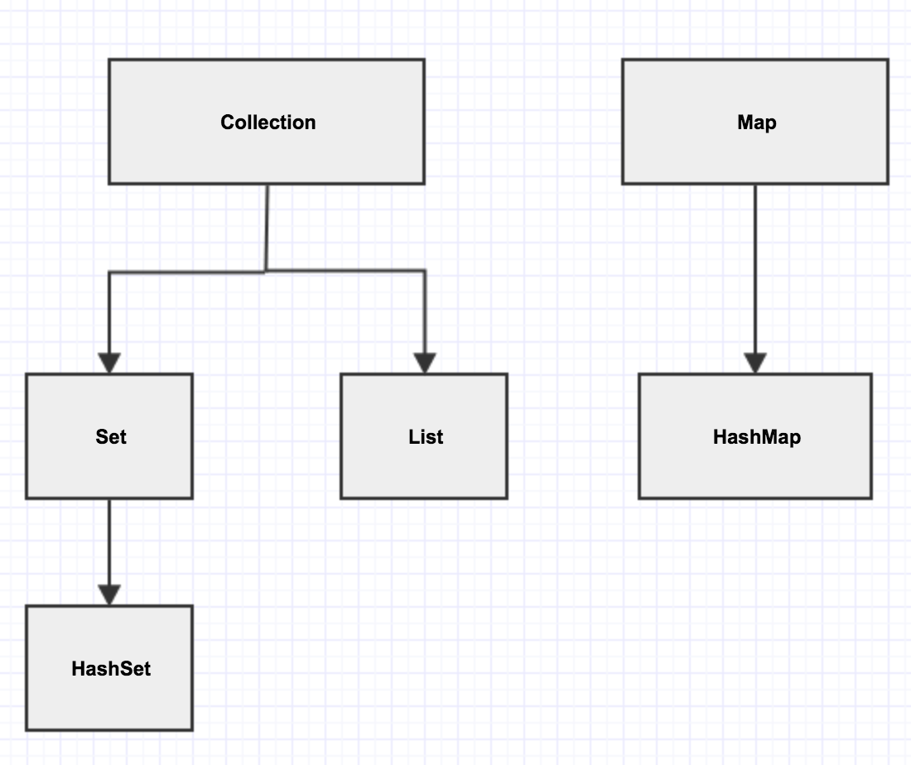

## 容器
> 容器接口继承图



1. Collection接口:定义了存取一组对象的方法,其子接口Set和List分别定义了存储方式
    * List中的数据对象有顺序且可以重复
    * Set中的数据对象没有顺序且不可以重复

2. Map接口:定义了存储“键(key)-值(value)映射对”的方法 

> eg:
```java
package com.yhy.collection;

import java.util.ArrayList;
import java.util.Collection;
import java.util.Date;
import java.util.LinkedList;
import java.util.List;
import java.util.Vector;

public class Test01 {

	public static void main(String[] args) {
		
		// 线程不安全, 效率高
		// ArrayList 底层实现是数组，所以查询快，修改、插入、删除慢
		List list1 = new ArrayList<>();
		// LinkedList 底层实现是链表 所以查询慢，修改、插入、删除快
		List list2 = new LinkedList<>();
		// 
		List vector = new Vector<>(); // 线程安全，效率低
		
		list1.add("aaa");
		list1.add(new Date());
		list1.add(123); // 包装类，自动装箱
		System.out.println(list1.size());
		
		list1.remove("aaa");
		System.out.println(list1.size());
		
		list1.remove(new Date()); // hashcode和equals
		System.out.println(list1.size());
		
		List list3 = new ArrayList<>();
		list3.add("bbb");
		list3.add("ccc");
		list3.add("ddd");
		list1.add(list3);
		for(int i = 0; i < list1.size(); i ++) {
			System.out.println("list1中元素: " + list1.get(i));
		}
		System.out.println(list1.size());
	}
}
```

#### List
1. ArrayList (底层实现是数组，所以查询快，修改、插入、删除慢. 线程不安全, 效率高)
2. LinkedList (底层实现是链表 所以查询慢，修改、插入、删除快. 线程不安全, 效率高)
3. Vector (线程安全，效率低)