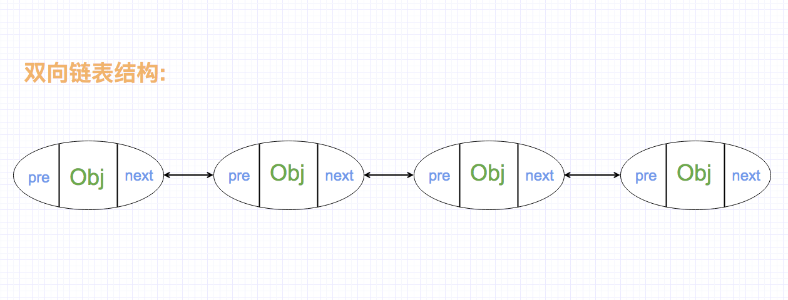
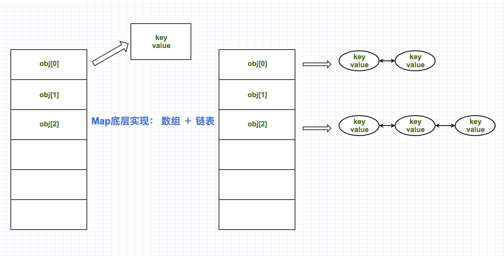

## 容器
> 容器接口继承图


1. Collection接口:定义了存取一组对象的方法,其子接口Set和List分别定义了存储方式
    * List中的数据对象有顺序且可以重复
    * Set中的数据对象没有顺序且不可以重复

2. Map接口:定义了存储“键(key)-值(value)映射对”的方法 

> eg:
```java
package com.yhy.collection;

import java.util.ArrayList;
import java.util.Collection;
import java.util.Date;
import java.util.LinkedList;
import java.util.List;
import java.util.Vector;

public class Test01 {

	public static void main(String[] args) {
		
		// 线程不安全, 效率高
		// ArrayList 底层实现是数组，所以查询快，修改、插入、删除慢
		List list1 = new ArrayList<>();
		// LinkedList 底层实现是链表 所以查询慢，修改、插入、删除快
		List list2 = new LinkedList<>();
		// 
		List vector = new Vector<>(); // 线程安全，效率低
		
		list1.add("aaa");
		list1.add(new Date());
		list1.add(123); // 包装类，自动装箱
		System.out.println(list1.size());
		
		list1.remove("aaa");
		System.out.println(list1.size());
		
		list1.remove(new Date()); // hashcode和equals
		System.out.println(list1.size());
		
		List list3 = new ArrayList<>();
		list3.add("bbb");
		list3.add("ccc");
		list3.add("ddd");
		list1.add(list3);
		for(int i = 0; i < list1.size(); i ++) {
			System.out.println("list1中元素: " + list1.get(i));
		}
		System.out.println(list1.size());
	}
}
```

#### List
1. ArrayList (底层实现是数组，所以查询快，修改、插入、删除慢. 线程不安全, 效率高)
2. LinkedList (底层实现是链表 所以查询慢，修改、插入、删除快. 线程不安全, 效率高)
3. Vector (线程安全，效率低)

#### 自己实现ArrayList（数组扩容add和get方法的实现）
```java
package com.yhy;

/**
 * 自己实现ArrayList（数组扩容add和get方法的实现）
 */
public class MyArrayList {

    private Object[] elementData;

    private int size;

    /**
     * @return 返回容器长度
     */
    public int size() {
        return size;
    }

    public boolean isEmpty() {
        return size == 0;
    }

    public Object get(int index) {
        rangeCheck(index);
        return elementData[index];
    }

    private void rangeCheck(int index) {
        if (index < 0 || index >= size) {
            try {
                throw new Exception();
            } catch (Exception e) {
                e.printStackTrace();
            }
        }
    }

    public void remove(int index) {
        rangeCheck(index);
        // 删除指定位置的对象
        // a b c d e
        int numMoved = size - index - 1;
        if (numMoved > 0)
            System.arraycopy(elementData, index + 1, elementData, index,
                    numMoved);
        elementData[--size] = null; // clear to let GC do its work
    }

    public void remove(Object obj) {
        for (int i = 0; i < size; i++) {
            if (get(i).equals(obj)) { // 注意: 底层调用的equals方法而不是==
                remove(i);
            }
        }
    }

    public Object set(int index, Object obj) {
        rangeCheck(index);

        Object oldValue = elementData[index];
        elementData[index] = obj;
        return oldValue;
    }

    public void add(int index, Object obj) {
        rangeCheck(index);

        ensureCapacity();  // 数组扩容
        System.arraycopy(elementData, index, elementData, index + 1,
                size - index);
        elementData[index] = obj;
    }

    public void ensureCapacity() {
        if (size == elementData.length) {
            Object[] newArray = new Object[size * 2 + 1];
            System.arraycopy(elementData, 0, newArray, 0, elementData.length);
            elementData = newArray;
        }
    }

    public MyArrayList() {
        this(10);
    }

    public MyArrayList(int initialCapacity) {
        super();
        if (initialCapacity < 0)
            throw new IllegalArgumentException("Illegal Capacity: " +
                    initialCapacity);
        this.elementData = new Object[initialCapacity];
    }

    public void add(Object obj) {
        // 数组扩容和数据的拷贝
        if (size == elementData.length) {
            Object[] newArray = new Object[size * 2 + 1];
            System.arraycopy(elementData, 0, newArray, 0, elementData.length);
            elementData = newArray;
            // 手动拷贝
            //for (int i = 0; i < elementData.length; i++) {
            //    newArray[i] = elementData[i];
            //}
        }
        elementData[size++] = obj;
    }

    public static void main(String[] args) {
        MyArrayList myArrayList = new MyArrayList(3);
        myArrayList.add("111");
        myArrayList.add("222");
        myArrayList.add("333");
        myArrayList.add("444");
        myArrayList.add("555");
        System.out.println(myArrayList.size());

        System.out.println(myArrayList.get(3));
        System.out.println(myArrayList.get(4));
    }

}

```
#### 自己实现LinkedList

```java
/**
 * 用来表示一个节点
 */
public class Node {

    Node previous; // 上一个节点
    Object obj; // 当前节点
    Node next; // 下一个节点

    public Node() {
    }

    public Node(Node previous, Object obj, Node next) {
        super();
        this.previous = previous;
        this.obj = obj;
        this.next = next;
    }

    public Node getPrevious() {
        return previous;
    }

    public void setPrevious(Node previous) {
        this.previous = previous;
    }

    public Object getObj() {
        return obj;
    }

    public void setObj(Object obj) {
        this.obj = obj;
    }

    public Node getNext() {
        return next;
    }

    public void setNext(Node next) {
        this.next = next;
    }
}
```
```java
/**
 * 自己实现LinkedList（双向链表的概念、节点定义和add方法）
 */
public class MyLinkedList {

    private Node first;
    private Node last;

    private int size;

    public void add(Object obj) {
        Node n = new Node();
        if (first == null) {

            n.setPrevious(null);
            n.setObj(obj);
            n.setNext(null);

            first = n;
            last = n;
        } else {
            // 直接往last节点后增加新的节点
            n.setPrevious(last);
            n.setObj(obj);
            n.setNext(null);

            last.setNext(n);

            last = n;
        }
        size++;
    }

    public int size() {
        return size;
    }

    public Object get(int index) { // 2
        // index 越界处理
        rangeCheck(index);

        // 0 1 2 3 4
        Node temp = node(index);
        if (temp != null) {
            return temp.obj;
        }
        return null;
    }

    private Node node(int index) {
        Node temp = null;
        if (first != null) {
			// size: 50, 2  48 [0, 49]
            // index 跟size / 2 做比较, 二分法查找
            // if (index < (size >> 1)) {} else {}
            temp = first;
            for (int i = 0; i < index; i++) {
                temp = temp.next;
            }
        }

        return temp;
    }

    public void remove(int index) {
        Node temp = node(index);

        if (temp != null) {
            Node up = temp.previous;
            Node down = temp.next;
            up.next = down;
            down.previous = up;
            size--;
        }
    }

    public void add(int index, Object obj) {
        Node temp = node(index);

        Node newNode = new Node();
        newNode.obj = obj;

        if (temp != null) {
            Node up = temp.previous;
            up.next = newNode;
            newNode.previous = up;

            newNode.next = temp;
            temp.previous = newNode;

            size++;
        }
    }

    private void rangeCheck(int index) {
        if (index < 0 || index >= size) {
            try {
                throw new Exception();
            } catch (Exception e) {
                e.printStackTrace();
            }
        }
    }

    public static void main(String[] args) {
        MyLinkedList linkedList = new MyLinkedList();

        linkedList.add("aaa");
        linkedList.add("bbb");
        linkedList.add("ccc");
        System.out.println(linkedList.size());
        linkedList.add(1, "BBBB");
        //linkedList.remove(1);
        System.out.println(linkedList.get(1));
    }

}
```

#### Map和HashMap的基本用法（HashMap和HashTable区别）
```java
import java.util.HashMap;
import java.util.Map;

/**
 * Map和HashMap的基本用法（HashMap和HashTable区别）
 * hashMap 线程不安全,效率高
 * hashTable 线程安全,效率低
 */
public class Demo02 {

    public static void main(String[] args) {
        Map map = new HashMap();

        map.put("老鱼", new Wife("高圆圆"));
        map.put("张三", new Wife("迪丽热巴"));

        Wife w = (Wife) map.get("老鱼");

        map.remove("张三");

        Wife w2 = (Wife) map.get("张三");

        System.out.println(w.name);
        // null 移除
        System.out.println(w2);

        System.out.println(map.containsKey("老鱼"));
    }
}

class Wife {
    String name;

    public Wife(String name) {
        this.name = name;
    }
}

```

#### 自己实现HashMap
```java
/**
 * 自己实现HashMap (待优化)
 * Map: 存放键值对, 根据键对象找对应的值对象 (键不可重复)
 */
public class MyMap01 {

    MyEntry[] arr = new MyEntry[990];
    int size;

    public void put(Object key, Object value) {
        MyEntry entry = new MyEntry(key, value);

        // 存在相同key, 直接覆盖value
        for (int i = 0; i < size; i++) {
            if (arr[i].key.equals(key)) {
                arr[i].value = value;
                return;
            }
        }

        arr[size++] = entry;
    }

    public Object get(Object key) {
        for (int i = 0; i < size; i++) {
            if (arr[i].key.equals(key)) {
                return arr[i].value;
            }
        }
        return null;
    }

    public boolean containsKey(Object key) {
        for (int i = 0; i < size; i++) {
            if (arr[i].key.equals(key)) {
                return true;
            }
        }
        return false;
    }

    public boolean containsValue(Object value) {
        for (int i = 0; i < size; i++) {
            if (arr[i].value.equals(value)) {
                return true;
            }
        }
        return false;
    }

    public static void main(String[] args) {
        MyMap01 m = new MyMap01();
        m.put("老鱼", new Wife("高圆圆"));
        m.put("老鱼", new Wife("张梦"));
        m.put("张三", new Wife("李四"));

        Wife w = (Wife) m.get("张三");

        // 张梦
        System.out.println(((Wife) m.get("老鱼")).name);
        // 李四
        System.out.println(w.name);
    }

}

class MyEntry {
    Object key;
    Object value;

    public MyEntry(Object key, Object value) {
        super();
        this.key = key;
        this.value = value;
    }
}
```

### 自己实现HashMap（Map底层实现、哈希算法实现: 使用数组和链表）

```java
import java.util.LinkedList;

/**
 * 自己实现HashMap（Map底层实现、哈希算法实现: 使用数组和链表）
 */
public class MyMap02 {

    LinkedList[] arr = new LinkedList[999]; // Map的底层结构就是: 数组 + 链表
    int size;

    public void put(Object key, Object value) {

        MyEntry e = new MyEntry(key, value);

        // a: 1000 => 1, b: 10000 => 13
        int hash = key.hashCode();
        // 如hash值为负数,做取反处理
        hash = hash < 0 ? -hash : hash;
        int a = hash % arr.length;

        // 余数冲突怎么办? 用链表存储

        if (arr[a] == null) {
            // 1. 链表对象不存在
            LinkedList list = new LinkedList();
            arr[a] = list;
            list.add(e);
        } else {
            // 2. 已经存在链表对象
            LinkedList list = arr[a];
            for (int i = 0; i < list.size(); i++) {
                MyEntry e2 = (MyEntry) list.get(i);
                if (e.key.equals(key)) {
                    e2.value = value; // 键重复,直接覆盖
                    return;
                }
            }

            arr[a].add(e);
        }

    }

    public Object get(Object key) {
        // 1. 计算取余后的值
        int a = key.hashCode() % arr.length;
        if (arr[a] != null) {
            LinkedList list = arr[a];
            // 2. 遍历list, 获取存储的value
            for (int i = 0; i < list.size(); i++) {
                MyEntry e = (MyEntry) list.get(i);
                if (e.key.equals(key)) {
                    return e.value;
                }
            }
        }
        return null;
    }

    public static void main(String[] args) {
        MyMap02 m = new MyMap02();
        m.put("老鱼", new Wife("高圆圆"));
        m.put("老鱼", new Wife("张梦"));


        // 张梦, 键重复, 值被覆盖
        System.out.println(((Wife) m.get("老鱼")).name);
    }

}
```

### equals和hashcode（JDK源代码分析）
```java
/**
 * equals和hashcode（JDK源代码分析）
 * 
 * 1. equals相等,则hashcode一定相等,
 * 2. hashcode相等, 则equals不一定相等
 */
public class Student {

    private Integer id;
    private String name;
    private Date birthday;

    @Override
    public boolean equals(Object o) {
        if (this == o) return true;
        if (o == null || getClass() != o.getClass()) return false;

        Student student = (Student) o;

        return id != null ? id.equals(student.id) : student.id == null;

    }

    @Override
    public int hashCode() {
        return id != null ? id.hashCode() : 0;
    }
}
```
```java
public class DemoEquals {

    public static void main(String[] args) {
        List list = new ArrayList();

        String s1 = new String("aaa");

        String s2 = new String("aaa");

        list.add(s1);
        list.add(s2);
        System.out.println(list.size());


        Map map = new HashMap();
        // 键不能重复
        // equals相等, 认为是重复的key
        map.put(s1, "AAA");
        map.put(s2, "BBB");
        System.out.println(map.get("aaa"));
    }
}
```

### Set和HashSet基本用法（源码分析）
```java
/**
 * Set和HashSet基本用法（源码分析）
 */
public class DemoSet {

    public static void main(String[] args) {
        Set set = new HashSet();

        set.add("aaa");
        set.add("bbb");
        set.add(new String("aaa"));

        // equals 相等, 认为重复,不能添加入set集合
        System.out.println(set.size());

        System.out.println(set.contains("aaa"));

		set.remove("aaa");

        System.out.println(set.contains("aaa"));
    }
}
```
#### Queue单向队列（模拟银行业务和自定义堆栈）
```java
import java.util.ArrayDeque;
import java.util.Queue;

/**
 * Queue单向队列（模拟银行业务和自定义堆栈）
 * // 队列 => 先进先出
 */
public class DemoBank {

    public static void main(String[] args) {

        // 面相接口编程
        Queue<Request> queue = new ArrayDeque<Request>();
        // 1. 模拟排队情况
        for (int i = 0; i < 10; i++) {
            final int num = i;
            queue.offer(new Request() {
                @Override
                public void deposit() {
                    System.out.println("第" + num + "个人,办理存款业务, 存款额度为:" + Math.random() * 10000 + "元");
                }
            });
        }

        dealWith(queue);
    }

    // 2. 处理业务
    public static void dealWith(Queue<Request> queue) {
        Request request = null;
        while (null != (request=queue.poll())) {
            request.deposit();
        }
    }
}

interface Request {
    // 存款
    void deposit();
}
```
### 使用队列实现自定义堆栈
```java
import java.util.ArrayDeque;
import java.util.Deque;

/**
 * 使用队列实现自定义堆栈
 * 1. 弹
 * 2. 压
 * 3. 获取头
 *
 * 队列: 单向和双向
 * 一. 单向: 一端操作
 * 1.1 一般: FIFO
 * 1.2 优先级队列和堆栈: LIFO
 * 二. 双向操作, 头或尾操作
 */
public class MyStack<E> {

    // 容器
    private Deque<E> container = new ArrayDeque<E>();
    // 容量
    private int cap;

    public MyStack(int cap) {
        super();
        this.cap = cap;
    }

    // 压栈
    public boolean push(E e) {
        if (container.size() + 1 > cap) {
            return false;
        }
        return container.offerLast(e);
    }

    // 弹栈
    public E pop() {
        return container.pollLast();
    }

    // 获取
    public E peek() {
        return container.peekLast();
    }

    public int size() {
        return this.container.size();
    }

    public static void main(String[] args) {
        MyStack<String> backHistory = new MyStack<String>(3);

        backHistory.push("www.baidu.com");
        backHistory.push("www.google.com");
        backHistory.push("www.sina.com");
        backHistory.push("www.yhyecho.com"); // 超过队列容量

        System.out.println("大小:" + backHistory.size());

        // 遍历
        String item = null;
        while (null != (item = backHistory.pop())) {
            // 后进先出
            System.out.println(item);
        }
    }

}

```

### Enumeration接口（Vector和StringTokenizer）
```java
/**
 * Vector的 elements()方法
 */
public class Demo03 {

    public static void main(String[] args) {
        Vector<String> vector = new Vector<String>();

        vector.add("javase");
        vector.add("html");
        vector.add("oracle");

        // 遍历该Vector
        Enumeration<String> en = vector.elements();
        while (en.hasMoreElements()) {
            System.out.println(en.nextElement());
        }
    }
}
```
```java
/**
 * StringTokenizer: 类似String split() 字符串分割
 * 不支持正则表达式
 */
public class Demo04 {

    public static void main(String[] args) {

        String emailStr = "yhyecho@qq.com:yhytest@163.com:haha@126.com";

        StringTokenizer token = new StringTokenizer(emailStr, ":");

        // 遍历获取
        while(token.hasMoreElements()) {
            System.out.println(token.nextElement());
        }
    }
}
```

### HashTable与Properties（绝对、相对、类路径存储与读取）
* Hashtable与HashMap的区别
	1. Hashtable线程安全，同步，效率相对低下
	2. HashMap线程不安全，非同步，效率相对较高
	3. 父类不同 Hashtable是Dictionary HashMap是AbstractMap
	4. Hashtable键和值不能为null
	5. HashMap键最多一个null，值可以多个null
* Properties
	1. 作用: 读写资源配置文件
	2. 键与值只能为字符串
```java
/**
 * 一.Properties资源配置文件的读写
 * 1. key与value只能是字符串
 *
 * 二.使用Properties输出到文件
 * 2. 资源配置文件
 *
 * 三.使用Properties读取配置文件
 */
public class Demo05 {

    public static void main(String[] args) throws IOException {
        // 1. 创建对象
        Properties pro = new Properties();

        // 2. 存储
        pro.setProperty("driver", "oracle.jdbc.driver.OracleDriver");
        pro.setProperty("url", "jdbc:oracle:thin:@localhost:1521:orcl");
        pro.setProperty("user", "scott");
        pro.setProperty("pwd", "tiger");

        // 3. 获取
        String url = pro.getProperty("url", "test");
        System.out.println(url);

        // 4. 存储到某个路径 使用绝对路径
        pro.store(new FileOutputStream(new File("/Users/yuhuayang/ideaProjects/coreJava/collection/src/main/resources/db.properties")), "db配置");
        pro.storeToXML(new FileOutputStream(new File("/Users/yuhuayang/ideaProjects/coreJava/collection/src/main/resources/db.xml")), "db配置");

        // 使用相对路径
        // pro.store(new FileOutputStream(new File("src/db2.properties")), "db配置");

        // 5. 读取配置文件 使用绝对路径
        pro.load(new FileReader("/Users/yuhuayang/ideaProjects/coreJava/collection/src/main/resources/db.properties"));
        // 使用相对路径
        System.out.println(pro.getProperty("user"));

        // 6. 使用类相对路径读取配置文件
        pro.load(Demo05.class.getResourceAsStream("/"));

        // 7. 使用当前线程加载配置文件
        pro.load(Thread.currentThread().getContextClassLoader().getResourceAsStream(""));

    }
}
```

### 引用（WeakHashMap和IdentityHashMap以及EnumMap）
* 引用分类: 强, 软, 弱, 虚
```java
import java.lang.ref.WeakReference;

/**
 * 引用（WeakHashMap和IdentityHashMap以及EnumMap）
 * 引用分类: 强, 软, 弱, 虚
 */
public class Demo06 {

    public static void main(String[] args) {

        // 1. 字符串常量池
        String str = new String("yhyecho.com");
        // 2. 弱引用管理对象
        WeakReference<String> wr = new WeakReference<String>(str);

        System.out.println("gc运行前:" + wr.get());

        // 3. 断开引用
        str = null;
        // 4. 通知回收
        System.gc();
        System.runFinalization();
        // 5. 对象被回收
        System.out.println("gc运行后:" + wr.get());
    }

    public static void testStrong() {
        // 字符串常量池
        String str = "yhyecho.com";
        // 弱引用管理对象
        WeakReference<String> wr = new WeakReference<String>(str);

        System.out.println("gc运行前:" + wr.get());

        // 断开引用
        str = null;
        System.gc();
        System.runFinalization();

        System.out.println("gc运行后:" + wr.get());
    }
}
```
```java
import java.util.WeakHashMap;

/**
 * WeakHashMap 键为弱类型,gc运行立即回收
 */
public class Demo07 {

    public static void main(String[] args) {
        WeakHashMap<String, String> map = new WeakHashMap<String, String>();

        // 1. 测试数据
        // 2. 常量池对象, 不会回收
        map.put("abc", "abc");
        map.put("ddd", "test");

        // 3. gc运行时被回收
        map.put(new String("test"), "ccc");
        map.put(new String("haha"), "ddd");

        // 4. 通知回收
        System.gc();
        System.runFinalization();

        System.out.println(map.size()); // 2
    }
}
```
```java
import java.util.IdentityHashMap;

/**
 * 键只以地址去重, 而不是比较hashcode与equals
 * 注意: 键是常量池中的字符串
 */
public class Demo08 {

    public static void main(String[] args) {

        IdentityHashMap<String, String> map = new IdentityHashMap<String, String>();

        // 常量池中的"a"
        map.put("a", "a1");
        map.put("a", "a2");

        // 1
        System.out.println(map.size());

        map.put(new String("a"), "a3"); // new 出来的地址不同
        map.put(new String("a"), "a4");

        // 3
        System.out.println(map.size());
    }
}

```

```java
import java.util.EnumMap;

/**
 * EnumMap 要求键为枚举类型
 */
public class Demo09 {

    public static void main(String[] args) {
        EnumMap<Season, String> map = new EnumMap<Season, String>(Season.class);

        //存放值
        map.put(Season.SPRING, "春困");
        map.put(Season.SUMMER, "夏无力");
        map.put(Season.AUTUMN, "秋乏");
        map.put(Season.WINTER, "冬眠");

        System.out.println(map.size());
    }
}

enum Season {
    SPRING,SUMMER,AUTUMN,WINTER
}
```

### 容器的同步控制与只读设置
```java
import java.util.ArrayList;
import java.util.Collections;
import java.util.List;

/**
 * 容器的同步控制与只读设置
 * 使用Collection管理同步容器
 * 1. SynchronizedList
 * 2. SynchronizedSet
 * 3. SynchronizedMap
 */
public class Demo10 {

    public static void main(String[] args) {
        List<String> list = new ArrayList<>();

        list.add("aaa");
        list.add("bbb");
        List<String> synchronizedList = Collections.synchronizedList(list);
        System.out.println("线程安全的list制作完毕" + synchronizedList);
    }
}
```
```java
/**
 * 只读设置
 * 1. SingletonList
 * 2. SynchronizedSet
 * 3. SynchronizedMap
 *
 */
public class Demo11 {

    public static void main(String[] args) {
        Map<String, String> map = new HashMap<String, String>();

        map.put("test", "test");
        map.put("yhyecho", "yhyecho");

        // 只读控制
        Map<String, String> map2 = Collections.unmodifiableMap(map);
        // map2.put("haha", "haha"); 不能操作 // Exception in thread "main" java.lang.UnsupportedOperationException
        System.out.println(map2.size());

        // 一个元素的容器 测试
        List<String> list = Collections.singletonList(new String("haha"));
        // list.add("ddd");
        // list.add("bbb"); // 只能包含一个元素的容器
        System.out.println(list.size());

    }

    public static Set<String> oper(Set<String> set) {
        if (null == set) {
            return Collections.emptySet(); // 外部获取避免NullPointerException
        }
        // 操作
        return set;
    }
}
```

### Guava只读和函数式编程（过滤、转换和约束）以及集合
```java
/**
 * Guava中的只读设置
 */
public class Demo12 {

    public static void main(String[] args) {
        List<String> list = new ArrayList<>();

        list.add("a");
        list.add("b");
        list.add("c");
        // 对原有的list进行包装, 相当于原有list的一个视图,快照, 不够安全
        List<String> readList = Collections.unmodifiableList(list);
        readList.add("test");
        list.add("d"); // 改变原有list, 视图也一起被改变 不安全


        // 对比测试, guava对只读设置安全可靠,并且相对简单
        List<String> immutableList = ImmutableList.of("aa", "bb", "cc");
        // immutableList.add("test"); // Exception in thread "main" java.lang.UnsupportedOperationException

    }
}
```
```java
import com.google.common.base.Function;
import com.google.common.base.Functions;
import com.google.common.base.Predicate;
import com.google.common.collect.Collections2;
import com.google.common.collect.Lists;
import com.google.common.collect.Sets;

import java.text.SimpleDateFormat;
import java.util.Collection;
import java.util.List;
import java.util.Set;

/**
 * 函数式编程
 * Predicate
 * Function
 * 1. Collections2.filter() 相当于过滤器
 * 2. Collections2.transform() 转换
 * 3. Functions.compose 函数式编程: 解耦
 * 4. 集合的交并补操作
 */
public class Demo13 {

    public static void main(String[] args) {
        //test01();
        //test03();
        //test02();

        // Set<String> set=Sets.newHashSet();
        // Constraint<String> constraint=new Constraint<String>() {//创建约束
        //    @Override
        //    public String checkElement(String element) {
        //        //非空验证
        //        Preconditions.checkNotNull(element);
        //        //长度验证5-20位的字符串
        //        Preconditions.checkArgument(element.length()>=5 && element.length()<=20);
        //        return element;
        //    }
        // };
        // Set<String> set2=Constraints.constrainedSet(set, constraint);
        // //cs.add(null);//java.lang.NullPointerException
        // //cs.add("aaas");//java.lang.IllegalArgumentException
        // set2.add("bbddsd");
        // for(String str:set2){
        //    System.out.println(str);
        // }
    }

    /**
     * 过滤
     */
    public static void test01() {
        // 创建List 静态初始化
        List<String> list = Lists.newArrayList("test", "yhy", "mom", "refer");

        // 找出回文的字符串: 正着写和倒着写一样
        // 匿名内部类对象, 匿名内部类, 同时创建类对象
        Collection<String> palinewordList = Collections2.filter(list, new Predicate<String>() {
            @Override
            public boolean apply(String input) {
                // 业务逻辑
                return new StringBuilder(input).reverse().toString().equals(input);
            }
        });

        for (String temp : palinewordList) {
            System.out.println(temp);
        }
    }

    /**
     * 转换
     */
    public static void test02() {
        // 类型转换
        Set<Long> timeSet = Sets.newHashSet();
        timeSet.add(1000000000L);
        timeSet.add(99999999000L);
        timeSet.add(200000000000L);

        Collection<String> timeStrList = Collections2.transform(timeSet, new Function<Long, String>() {
            @Override
            public String apply(Long input) {
                return new SimpleDateFormat("yyyy-MM-dd").format(input);
            }
        });

        for (String temp : timeStrList) {
            System.out.println(temp);
        }
    }

    /**
     * 组合式函数编程
     */
    public static void test03() {
        // 组合式函数编程
        List<String> list = Lists.newArrayList("sdfdfsf", "yhyecho", "good", "bad");

        // 确保容器中的字符串长度不超过5, 超过进行截取,后 全部大写
        Function<String, String> f1 = new Function<String, String>() {
            @Override
            public String apply(String input) {
                return input.length() > 5 ? input.substring(0, 5) : input;
            }
        };

        // 转成大写
        Function<String, String> f2 = new Function<String, String>() {
            @Override
            public String apply(String input) {
                return input.toUpperCase();
            }
        };

        Function<String, String> f = Functions.compose(f1, f2);
        Collection<String> resultCol = Collections2.transform(list, f);
        for (String temp : resultCol) {
            System.out.println(temp);
        }
    }

    public static void test04() {
        Set<Integer> sets = Sets.newHashSet(1, 2, 3, 4, 5, 6);
        Set<Integer> sets2 = Sets.newHashSet(3, 4, 5, 6, 7, 8, 9);

        // 交集
        System.out.print("交集为: ");
        Sets.SetView<Integer> intersection = Sets.intersection(sets, sets2);
        for (Integer temp : intersection) {
            System.out.print(temp + "\t");
        }

        System.out.println();
        // 差集
        System.out.print("差集为: ");
        Sets.SetView<Integer> diff = Sets.difference(sets, sets2);
        for (Integer temp : diff) {
            System.out.print(temp + "\t");
        }

        System.out.println();
        // 并集
        System.out.print("并集为: ");
        Sets.SetView<Integer> union = Sets.union(sets, sets2);
        for (Integer temp : union) {
            System.out.print(temp + "\t");
        }
    }
}
```

### Guava实用功能（Multiset、Multimap和BiMap）
```java
import com.google.common.collect.HashMultiset;
import com.google.common.collect.Multiset;

import java.util.Set;

/**
 * 统计单词出现的次数
 * 1. HashMap 分拣存储 + 面相对象思维
 * 2. Multiset: 无序 + 可重复 .count() 增强可读性 + 操作简单
 */
public class Demo14 {

    public static void main(String[] args) {
        String str = "this is a cat and that is a mice where is the food";

        // 分割字符串
        String[] strArray = str.split(" ");
        // 存储到Mutiset中
        Multiset<String> set = HashMultiset.create();
        for (String strTemp : strArray) {
            set.add(strTemp);
        }
        // 获取所有单词的Set
        Set<String> letters = set.elementSet();
        for (String temp : letters) {
            System.out.println(temp + "==>" + set.count(temp));
        }
    }
}

```

```java
import com.google.common.collect.ArrayListMultimap;
import com.google.common.collect.Multimap;

import java.util.*;

/**
 *  分析查看 教师教授的每门课程
 *  Multimap: key-value key可以重复
 */
public class Demo15 {

    public static void main(String[] args) {
        Map<String, String> courses = new HashMap<String, String>();

        // 加入测试数据
        courses.put("改革开发", "邓爷爷");
        courses.put("三个代表", "江主席");
        courses.put("科学发展", "胡主席");
        courses.put("八荣八耻", "胡主席");
        courses.put("和谐社会", "胡主席");
        courses.put("习思想", "习主席");

        Multimap<String, String> teachers = ArrayListMultimap.create();

        Iterator<Map.Entry<String, String>> iterator = courses.entrySet().iterator();

        while (iterator.hasNext()) {
            Map.Entry<String, String> entry = iterator.next();
            String key = entry.getKey();// 课程
            String value = entry.getValue();// 教师

            // 教师 --> 课程
            teachers.put(value, key);
        }

        // 查看Multimap

        Set<String> keyset = teachers.keySet();
        for (String key : keyset) {
            Collection<String> col = teachers.get(key);
            System.out.println(key + "==>" + col);
        }
    }
}
```

```java
import com.google.common.collect.BiMap;
import com.google.common.collect.HashBiMap;

/**
 * HashMap 键唯一, 值可以重复
 * BiMap: 双向Map(Bidirectional Map) 键与值都不能重复(unique-valued map)
 */
public class Demo16 {

    public static void main(String[] args) {
        BiMap<String, String> biMap = HashBiMap.create();

        biMap.put("yhyecho", "yhyecho@gmail.com");
        biMap.put("hello", "hello@gmail.com");

        // 通过邮箱找用户

        String user = biMap.inverse().get("yhyecho@gmail.com");
        System.out.println(user);

        System.out.println(biMap.inverse().inverse() == biMap);
    }
}

```

### Guava实现Table成绩表行转列
```java
import com.google.common.collect.HashBasedTable;
import com.google.common.collect.Table;
import com.google.common.collect.Tables;

import java.util.Map;
import java.util.Set;

/**
 * 双键的Map --> Table --> rowKey + columnKey + value
 * 所有的行数据: cellSet()
 * 所有的学生: rowKeySet()
 * 所有的课程: columnKeySet()
 * 所有的成绩: values()
 * 学生对应的课程: rowMap() + get(学生)
 * row(学生)
 * 课程对应的学生: columnMap + get(课程)
 * column(课程)
 */
public class Demo17 {

    public static void main(String[] args) {
        Table<String, String, Integer> tables = HashBasedTable.create();

        // 测试数据
        tables.put("a", "javase", 80);
        tables.put("b", "javase", 90);
        tables.put("a", "oracle", 100);
        tables.put("c", "oracle", 95);

        // 所有的行数据

        Set<Table.Cell<String, String, Integer>> cells = tables.cellSet();

        for (Table.Cell<String, String, Integer> temp : cells) {
            System.out.println(temp.getRowKey() + "-->" + temp.getColumnKey() + "-->" + temp.getValue());
        }

        System.out.println("=========== 学生查看成绩 ============");
        System.out.print("学生\t");

        Set<String> course = tables.columnKeySet();
        for (String t : course) {
            System.out.print(t + "\t");
        }

        System.out.println();
        // 所有的学生
        Set<String> stus = tables.rowKeySet();
        for (String stu : stus) {
            System.out.print(stu + "\t");
            Map<String, Integer> scores = tables.row(stu);
            for (String c : course) {
                System.out.print(scores.get(c) + "\t\t");
            }
            System.out.println();
        }

        System.out.println("=========== 课程查看成绩 ============");
        System.out.print("课程" + "\t\t");

        Set<String> stuSet = tables.rowKeySet();
        for (String t : stuSet) {
            System.out.print(t + "\t");
        }

        System.out.println();
        // 所有的学生
        Set<String> courSet = tables.columnKeySet();
        for (String c : courSet) {
            System.out.print(c + "\t");
            Map<String, Integer> scores = tables.column(c);
            for (String s : stuSet) {
                System.out.print(scores.get(s) + "\t");
            }
            System.out.println();
        }

        System.out.println("=========== 转换 ============");
        Table<String, String, Integer> tables2 = Tables.transpose(tables);

        Set<Table.Cell<String, String, Integer>> cells2 = tables2.cellSet();

        for (Table.Cell<String, String, Integer> temp : cells2) {
            System.out.println(temp.getRowKey() + "-->" + temp.getColumnKey() + "-->" + temp.getValue());
        }

    }
}
```

### Commons函数式编程（Predicate和Transformer）
```java
import org.apache.commons.collections4.Predicate;
import org.apache.commons.collections4.PredicateUtils;
import org.apache.commons.collections4.functors.EqualPredicate;
import org.apache.commons.collections4.functors.NotNullPredicate;
import org.apache.commons.collections4.functors.UniquePredicate;
import org.apache.commons.collections4.list.PredicatedList;

import java.util.ArrayList;
import java.util.List;

/**
 * 函数式编程之 Predicate断言
 * 封装条件或判别式 if...else 替代
 */
public class Demo18 {

    public static void main(String[] args) {

        System.out.println("====== 自定义判断 ======");

        // 自定义的判别式
        Predicate<String> selfPre = new Predicate<String>() {
            @Override
            public boolean evaluate(String obj) {
                return obj.length() >= 5 && obj.length() <= 20;
            }
        };

        Predicate notNull = NotNullPredicate.notNullPredicate();

        Predicate all = PredicateUtils.allPredicate(selfPre, notNull);

        List<String> list = PredicatedList.predicatedList(new ArrayList<String>(), all);
        list.add("yhyecho");
        // list.add(null);
        list.add("bj");


    }

    /**
     * 比较相等的判断
     */
    public static void equal() {
        System.out.println("====== 相等判断 ======");
        // Predicate<String> pre = new EqualPredicate<>("yhyecho");
        Predicate<String> pre = EqualPredicate.equalPredicate("yhyecho");
        boolean flag = pre.evaluate("yhy");
        System.out.println(flag);
    }

    /**
     * 判断非空
     */
    public static void notNull() {
        System.out.println("====== 非空判断 ======");
        // Predicate notNull = NotNullPredicate.INSTANCE;
        Predicate notNull = NotNullPredicate.notNullPredicate();

        // String str = "yhy";
        String str = null;
        System.out.println(notNull.evaluate(str)); // 如果非空为true, 否则为false

        // 添加容器值的判断
        List<Long> list = PredicatedList.predicatedList(new ArrayList<Long>(), notNull);
        list.add(1000L);
        list.add(null); // 验证失败, 出现异常
    }

    /**
     * 判断唯一性
     */
    public static void unique() {
        System.out.println("====== 唯一性判断 ======");

        Predicate<Long> uniquePre = UniquePredicate.uniquePredicate();
        List<Long> list = PredicatedList.predicatedList(new ArrayList<Long>(), uniquePre);
        list.add(100L);
        list.add(200L);
        list.add(100L);
    }
}
```

```java
/**
 * 员工类
 */
public class Employee {

    private String name;
    private double salary;

    public Employee() {
    }

    public Employee(String name, double salary) {
        super();
        this.name = name;
        this.salary = salary;
    }

    public String getName() {
        return name;
    }

    public void setName(String name) {
        this.name = name;
    }

    public double getSalary() {
        return salary;
    }

    public void setSalary(double salary) {
        this.salary = salary;
    }

    @Override
    public String toString() {
        return "" +
                "码农='" + name + '\'' +
                ", 搬砖钱=" + salary +
                '}';
    }
}
```
```java
/**
 * 工资等级类
 */
public class Level {

    private String name;
    private String level;

    public Level() {
    }

    public Level(String name, String level) {
        super();
        this.name = name;
        this.level = level;
    }

    public String getName() {
        return name;
    }

    public void setName(String name) {
        this.name = name;
    }

    public String getLevel() {
        return level;
    }

    public void setLevel(String level) {
        this.level = level;
    }

    @Override
    public String toString() {
        return "{码农='" + name + '\'' +
                ", 水平='" + level + '\'' +
                '}';
    }
}
```
```java
import com.yhy.Level;
import org.apache.commons.collections4.CollectionUtils;
import org.apache.commons.collections4.Predicate;
import org.apache.commons.collections4.Transformer;
import org.apache.commons.collections4.functors.SwitchTransformer;

import java.text.SimpleDateFormat;
import java.util.ArrayList;
import java.util.Collection;
import java.util.Iterator;
import java.util.List;

/**
 * 函数式编程Transformer 类型转换
 * 解偶: 业务处理与判断进行分离
 */
public class Demo19 {

    public static void main(String[] args) {

        System.out.println("===自定义类型转换====");

        // 1. 判别式1
        Predicate<Employee> isLow = new Predicate<Employee>() {
            @Override
            public boolean evaluate(Employee emp) {
                return emp.getSalary() < 10000;
            }
        };

        // 判别式2
        Predicate<Employee> isHigh = new Predicate<Employee>() {
            @Override
            public boolean evaluate(Employee emp) {
                return emp.getSalary() >= 10000;
            }
        };

        Predicate[] pres = {isLow, isHigh};

        // 2. 转换1
        Transformer<Employee, Level> lowTrans = new Transformer<Employee, Level>() {
            @Override
            public Level transform(Employee input) {
                return new Level(input.getName(), "卖身中");
            }
        };

        // 转换2
        Transformer<Employee, Level> highTrans = new Transformer<Employee, Level>() {
            @Override
            public Level transform(Employee input) {
                return new Level(input.getName(), "养身中");
            }
        };

        Transformer[] trans = {lowTrans, highTrans};

        // 3.二者进行了关联
        Transformer switchTrans = new SwitchTransformer(pres, trans, null);

        List<Employee> list = new ArrayList<Employee>();
        list.add(new Employee("老鱼", 1000000));
        list.add(new Employee("老张", 9999));

        Collection<Level> levelList = CollectionUtils.collect(list, switchTrans);

        // 4. 遍历容器
        Iterator<Level> levelIt = levelList.iterator();
        while (levelIt.hasNext()) {
            System.out.println(levelIt.next());
        }


    }

    /**
     * 日期类型转换
     */
    public static void timeConver() {

        System.out.println("====内置类型转换 长整型 日期时间, 转换成指定格式的字符串====");

        // 类型转换器
        Transformer<Long, String> trans = new Transformer<Long, String>() {
            @Override
            public String transform(Long input) {
                return new SimpleDateFormat("yyyy年MM年dd日").format(input);
            }
        };

        // 容器
        List<Long> list = new ArrayList<Long>();
        list.add(9999999999L);
        list.add(100000000000L);

        // 工具类 程序员出钱 -- 开发商 -- 农名工出力

        Collection<String> result = CollectionUtils.collect(list, trans);

        for (String time : result) {
            System.out.println(time);
        }
    }
}
```

### Commons函数式编程（Closure）
```java
/**
 * 商品类
 */
public class Goods {

    private String name;
    private double price;
    private boolean discount;

    public Goods() {
    }

    public Goods(String name, double price, boolean discount) {
        super();
        this.name = name;
        this.price = price;
        this.discount = discount;
    }

    public String getName() {
        return name;
    }

    public void setName(String name) {
        this.name = name;
    }

    public double getPrice() {
        return price;
    }

    public void setPrice(double price) {
        this.price = price;
    }

    public boolean isDiscount() {
        return discount;
    }

    public void setDiscount(boolean discount) {
        this.discount = discount;
    }

    @Override
    public String toString() {
        return "商品" + name + '\'' +
                ", 价格=" + price +
                ", 是否打折=" + (discount ? "是" : "否");
    }
}
```
```java
package com.yhy;

import org.apache.commons.collections4.Closure;
import org.apache.commons.collections4.CollectionUtils;
import org.apache.commons.collections4.Predicate;
import org.apache.commons.collections4.functors.ChainedClosure;
import org.apache.commons.collections4.functors.IfClosure;
import org.apache.commons.collections4.functors.WhileClosure;

import java.util.ArrayList;
import java.util.Iterator;
import java.util.List;

/**
 * 函数式编程 Closure闭包封装待定的业务功能
 * Closure
 * IfClosure
 * WhileClosure
 * chainClosure
 */
public class Demo20 {

    public static void main(String[] args) {

        // basic();
        //ifClosure();
        //System.out.println("======");
        //chainClosure();

        whileClosure();
    }

    /**
     * 二选一, 如果是打折商品,进行九折, 否则满百减二十
     */
    public static void ifClosure() {
        List<Goods> goodsList = new ArrayList<Goods>();
        goodsList.add(new Goods("javaSe", 120, true));
        goodsList.add(new Goods("javaEE", 100, false));
        goodsList.add(new Goods("高级架构师", 60, false));

        // 满百减二十
        Closure<Goods> subtract = new Closure<Goods>() {
            @Override
            public void execute(Goods goods) {
                if (goods.getPrice() >= 100) {
                    goods.setPrice(goods.getPrice() - 20);
                }
            }
        };

        // 打折
        Closure<Goods> discount = new Closure<Goods>() {
            @Override
            public void execute(Goods goods) {
                if (goods.isDiscount()) {
                    goods.setPrice(goods.getPrice() * 0.9);
                }
            }
        };

        // 判断
        Predicate<Goods> pre = new Predicate<Goods>() {
            @Override
            public boolean evaluate(Goods goods) {
                return goods.isDiscount();
            }
        };

        // 二选一
        Closure<Goods> ifClo = IfClosure.ifClosure(pre, discount, subtract);

        // 关联
        CollectionUtils.forAllDo(goodsList, ifClo);

        // 查看
        for (Goods temp : goodsList) {
            System.out.println(temp);
        }


    }

    /**
     * 折上减, 先打折,进行九折, 满百再减二十
     */
    public static void chainClosure() {
        List<Goods> goodsList = new ArrayList<Goods>();
        goodsList.add(new Goods("javaSe", 120, true));
        goodsList.add(new Goods("javaEE", 100, false));
        goodsList.add(new Goods("高级架构师", 60, false));

        // 满百减二十
        Closure<Goods> subtract = new Closure<Goods>() {
            @Override
            public void execute(Goods goods) {
                if (goods.getPrice() >= 100) {
                    goods.setPrice(goods.getPrice() - 20);
                }
            }
        };

        // 打折
        Closure<Goods> discount = new Closure<Goods>() {
            @Override
            public void execute(Goods goods) {
                if (goods.isDiscount()) {
                    goods.setPrice(goods.getPrice() * 0.9);
                }
            }
        };

        // 先打折,后 满百减二十
        Closure<Goods> chainClo = ChainedClosure.chainedClosure(discount, subtract);

        // 关联
        CollectionUtils.forAllDo(goodsList, chainClo);

        // 查看
        for (Goods temp : goodsList) {
            System.out.println(temp);
        }


    }

    /**
     * 确保所有员工工资都大于10000, 如果已经超过的不再上涨
     */
    public static void whileClosure() {
        // 数据
        List<Employee> empList = new ArrayList<Employee>();

        empList.add(new Employee("yhy", 1000));
        empList.add(new Employee("zhangm", 2000));
        empList.add(new Employee("laoli", 11000));
        empList.add(new Employee("xiaozhang", 42000));

        // 业务功能: 每次上涨0.2
        Closure<Employee> clos = new Closure<Employee>() {
            @Override
            public void execute(Employee employee) {
                employee.setSalary(employee.getSalary() * 1.2);
            }
        };

        // 判断
        Predicate<Employee> empPre = new Predicate<Employee>() {
            @Override
            public boolean evaluate(Employee employee) {
                return employee.getSalary() < 10000;
            }
        };

        // false表示while结构,先判断后执行, true do.while 先执行后判断
        Closure<Employee> whileClosure = WhileClosure.whileClosure(empPre, clos, false);

        // 工具类
        CollectionUtils.forAllDo(empList, whileClosure);

        Iterator<Employee> empIt = empList.iterator();
        while (empIt.hasNext()) {
            System.out.println(empIt.next());
        }

    }

    /**
     * 基本操作
     */
    public static void basic() {
        // 数据
        List<Employee> empList = new ArrayList<Employee>();

        empList.add(new Employee("yhy", 20000));
        empList.add(new Employee("zhangm", 42000));
        empList.add(new Employee("laoli", 12000));
        empList.add(new Employee("xiaozhang", 42000));

        // 业务功能
        Closure<Employee> clos = new Closure<Employee>() {
            @Override
            public void execute(Employee employee) {
                employee.setSalary(employee.getSalary() * 1.2);
            }
        };

        // 工具类
        CollectionUtils.forAllDo(empList, clos);

        Iterator<Employee> empIt = empList.iterator();
        while (empIt.hasNext()) {
            System.out.println(empIt.next());
        }

    }
}
```

### Commons集合与队列
```java
import org.apache.commons.collections4.CollectionUtils;

import java.util.Collection;
import java.util.HashSet;
import java.util.Set;

/**
 * 集合操作
 * 1. 并集 CollectionUtils.union
 * 2. 交集 CollectionUtils.intersection / CollectionUtils.retainAll
 * 3. 差集 CollectionUtils.subtract
 */
public class Demo21 {

    public static void main(String[] args) {
        Set<Integer> set1 = new HashSet<>();
        set1.add(1);
        set1.add(2);
        set1.add(3);

        Set<Integer> set2 = new HashSet<>();
        set2.add(2);
        set2.add(3);
        set2.add(4);

        // 1. 并集
        System.out.println("===== 并集 =====");
        Collection<Integer> col = CollectionUtils.union(set1, set2);
        for (Integer temp : col) {
            System.out.print(temp + "\t");
        }

        System.out.println();
        System.out.println("===== 交集 =====");
        // 2. 交集
        // col = CollectionUtils.intersection(set1, set2);
        col = CollectionUtils.retainAll(set1, set2);
        for (Integer temp : col) {
            System.out.print(temp + "\t");
        }

        System.out.println();
        System.out.println("===== 差集 =====");
        col = CollectionUtils.subtract(set1, set2);
        for (Integer temp : col) {
            System.out.print(temp + "\t");
        }

    }
}
```
```java
import org.apache.commons.collections4.Predicate;
import org.apache.commons.collections4.functors.NotNullPredicate;
import org.apache.commons.collections4.queue.CircularFifoQueue;
import org.apache.commons.collections4.queue.PredicatedQueue;
import org.apache.commons.collections4.queue.UnmodifiableQueue;

import java.util.Queue;

/**
 * Queue 队列
 * 1. 循环队列
 * 2. 只读队列
 * 3. 断言队列
 */
public class Demo22 {

    public static void main(String[] args) {

        //circulate();
        //readOnly();
        predicate();
    }

    /**
     * 断言队列
     */

    public static void predicate() {
        CircularFifoQueue<String> que = new CircularFifoQueue<String>(2);
        que.add("a");
        que.add("b");
        que.add("c");

        Predicate notNull = NotNullPredicate.INSTANCE;
        // 包装成对应的队列
        Queue<String> que2 = PredicatedQueue.predicatedQueue(que, notNull);
        que2.add(null);
    }

    /**
     * 只读队列
     */
    public static void readOnly() {
        // 只读队列
        CircularFifoQueue<String> que = new CircularFifoQueue<String>(2);
        que.add("a");
        que.add("b");
        que.add("c");

        Queue<String> readOnlyQue = UnmodifiableQueue.unmodifiableQueue(que);
        readOnlyQue.add("d"); // Exception in thread "main" java.lang.UnsupportedOperationException

    }

    /**
     * 循环队列
     */
    public static void circulate() {
        // 循环队列
        CircularFifoQueue<String> que = new CircularFifoQueue<String>(2);
        que.add("a");
        que.add("b");
        que.add("c");

        // 查看
        for (int i = 0; i < que.size(); i ++) {
            System.out.println(que.get(i));
        }
    }

}
```

### Commons迭代器（Map、过滤、循环和双向Map包）
```java
package com.yhy;

import org.apache.commons.collections4.IterableMap;
import org.apache.commons.collections4.MapIterator;
import org.apache.commons.collections4.Predicate;
import org.apache.commons.collections4.iterators.ArrayListIterator;
import org.apache.commons.collections4.iterators.FilterIterator;
import org.apache.commons.collections4.iterators.LoopingIterator;
import org.apache.commons.collections4.iterators.UniqueFilterIterator;
import org.apache.commons.collections4.map.HashedMap;

import java.util.ArrayList;
import java.util.Iterator;
import java.util.List;

/**
 * 迭代器的扩展
 * 1. MapIterator 以后不再使用 map.keySet.iterator访问
 * IterableMap HashedMap
 * <p/>
 * 2. UniqueFilterIterator
 * <p/>
 * 3. 自定义过滤器 FilterIterator
 * <p/>
 * 4. 循环迭代器 LoopingIterator
 *
 * 5. 数组迭代器 ArrayListIterator
 */
public class Demo23 {

    public static void main(String[] args) {
        //mapIt();
        //uniqueIt();
        //filterIt();
        //loopIt();
        arrayIt();
    }

    /**
     * map迭代器
     */
    public static void mapIt() {
        System.out.println("====map 迭代器=====");
        IterableMap<String, String> map = new HashedMap<>();
        map.put("a", "yhy");
        map.put("b", "zhangm");
        map.put("c", "good");

        // 使用MapIterator
        MapIterator<String, String> it = map.mapIterator();
        while (it.hasNext()) {
            //it.next();
            //String key = it.getKey();
            String key = it.next();
            String value = it.getValue();
            System.out.println(key + "==>" + value);
        }
    }

    /**
     * 去重迭代器
     */
    public static void uniqueIt() {
        System.out.println("====去重 迭代器=====");
        List<String> list = new ArrayList<String>();
        list.add("a");
        list.add("b");
        list.add("c");
        list.add("a");

        // 去除重复的过滤器
        Iterator<String> it = new UniqueFilterIterator(list.iterator());
        while (it.hasNext()) {
            System.out.println(it.next());
        }
    }

    /**
     * 自定义过滤迭代器
     */
    public static void filterIt() {
        System.out.println("====自定义过滤迭代器=====");
        List<String> list = new ArrayList<String>();
        list.add("refer");
        list.add("mum");
        list.add("yhyecho");
        list.add("noon");

        // 自定义条件判断
        Predicate<String> pre = new Predicate<String>() {
            @Override
            public boolean evaluate(String input) {
                // 回文判断
                return new StringBuilder(input).reverse().toString().equals(input);
            }
        };

        // 得到回文的结果
        Iterator<String> it = new FilterIterator<>(list.iterator(), pre);
        while (it.hasNext()) {
            System.out.println(it.next());
        }
    }

    /**
     * 循环迭代器
     */
    public static void loopIt() {
        System.out.println("====循环迭代器=====");
        List<String> list = new ArrayList<String>();
        list.add("refer");
        list.add("mum");
        list.add("yhyecho");
        list.add("noon");

        Iterator<String> it = new LoopingIterator(list);

        for (int i = 0; i < 6; i++) {
            System.out.println(it.next());
        }
    }

    /**
     * 数组迭代器
     */

    public static void arrayIt() {
        System.out.println("====数组迭代器=====");
        int[] arr = {1, 2, 3, 4, 5};

        // 数组迭代器 可以指定启始的索引
        Iterator<Integer> it = new ArrayListIterator<>(arr, 1, 3);
        while (it.hasNext()) {
            System.out.print(it.next() + "\t");
        }
    }

}
```
```java
import org.apache.commons.collections4.BidiMap;
import org.apache.commons.collections4.MapIterator;
import org.apache.commons.collections4.bidimap.DualHashBidiMap;
import org.apache.commons.collections4.bidimap.DualTreeBidiMap;

/**
 * 双向map: 要求键和值都不能重复
 * BidiMap
 *  1. DualHashBidiMap 无序
 *  2. DualTreeBidiMap 有序
 */
public class Demo24 {

    public static void main(String[] args) {
        //hashMap();
        treeMap();
    }

    /**
     * 无序的双向map
     */
    public static void hashMap() {
        System.out.println("=====无序的双向map=====");

        BidiMap<String, String> map = new DualHashBidiMap<>();
        map.put("nj", "nj@126.com");
        map.put("yhy", "yhy@126.com");

        // 反转, 通过值找到键
        System.out.println(map.inverseBidiMap().get("yhy@126.com"));

        // 遍历查看
        MapIterator<String, String> it = map.inverseBidiMap().mapIterator();
        while (it.hasNext()) {
            String key = it.next();
            String value = it.getValue();
            System.out.println(key + "==>" + value);
        }
    }

    /**
     * 有序的双向map
     */
    public static void treeMap() {
        System.out.println("=====有序的双向map=====");

        BidiMap<String, String> map = new DualTreeBidiMap<String, String>();
        map.put("nj", "nj@126.com");
        map.put("yhy", "yhy@126.com");

        // 遍历查看
        MapIterator<String, String> it = map.inverseBidiMap().mapIterator();
        while (it.hasNext()) {
            String key = it.next();
            String value = it.getValue();
            System.out.println(key + "==>" + value);
        }
    }


}
```
```java
import org.apache.commons.collections4.Bag;
import org.apache.commons.collections4.bag.HashBag;
import org.apache.commons.collections4.bag.TreeBag;

import java.util.Iterator;
import java.util.Set;

/**
 * Created by Echo on 12/14/17.
 * Bag 包 允许重复
 * 1. HashBag 无序
 * 2. TreeBag 有序
 */
public class Demo25 {

    public static void main(String[] args) {
        //hashBag();
        //treeBag();

        // 应用: 统计单词的出现次数
        String str = "this is a cat and that is a mice where is the food";
        // 分割字符串
        String[] strArrray = str.split(" ");
        Bag<String> bag = new TreeBag<String>();
        for (String temp : strArrray) {
            bag.add(temp);
        }

        System.out.println("====统计次数====");
        Set<String> keys = bag.uniqueSet();
        for (String letter : keys) {
            System.out.println(letter + "==>" + bag.getCount(letter));
        }

    }

    /**
     * 无序
     */
    public static void hashBag() {
        System.out.println("====无序的包====");

        Bag<String> bag = new HashBag<String>();
        bag.add("a");
        bag.add("a", 5);
        bag.remove("a", 2);
        bag.add("b");
        bag.add("c");

        Iterator<String> it = bag.iterator();
        while (it.hasNext()) {
            System.out.print(it.next() + "\t");
        }
    }

    /**
     * 有序
     */
    public static void treeBag() {
        System.out.println("====无序的包====");

        Bag<String> bag = new TreeBag<>();
        bag.add("a");
        bag.add("a", 5);
        bag.remove("a", 2);
        bag.add("b");
        bag.add("c");

        Iterator<String> it = bag.iterator();
        while (it.hasNext()) {
            System.out.print(it.next() + "\t");
        }
    }
}
```

### Java容器重点总结
#### 一. 一张图

#### 二. 三个知识点
迭代器
* java.util.Iterator + hasNext() next() remove()
* foreach: java.lang.Iterable + iterator()
比较器
* 实体类可以排序: java.langComparable + compareTo
* 排序比较器(解耦，多种排序规则) java.util.Comparator + compare
	* List + Collections.sort()
	* TreeSet
	* TreeMap
* 泛型: <> 泛型类，泛型方法，泛型接口，泛型擦除，通配符？ extends super 泛型嵌套 
#### 三. 六个接口
Collection Set List Map Iterator Comparable
#### 四. 九个常用类 添加、删除、修改、遍历 + 查看
* ArrayList： 数组 查看多于修改
	* add(元素) add(索引，元素) remove(元素) remove(索引) set(索引, 元素) get(索引)
	* for + get foreach() Iterator ListIterator

* LinkedList: 链表，修改多于查看，多了些链头和链尾的方法

* HashSet 重写 hashcode + equals
	* add(元素) remove(元素)
	* foreach() Iterator
* TreeSet元素可以排序，或者提供排序的业务类

* HashMap: 键不能重复 必须重写hashcode+equals, 值可以重复
	* put(k, v) remove(k) get(k) containKey() containValue()
	* 获取值: values() keySet() + get entrySet() + getValue
	* 获取键: keySet entrySet() + getKey()
	* 获取键与值:keySet() + get entrySet() + getKey() getValue()
* Properties: 资源配置文件，相对路径获取文件

* Hashtable: 键与值都不能为null 线程安全

* Stack: 栈

* Collections: 工具类