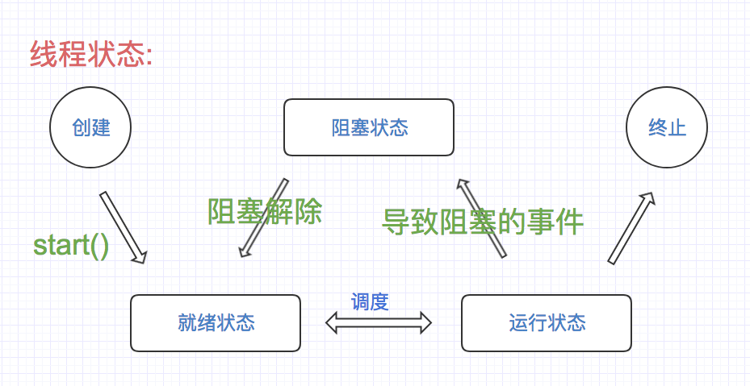

## 线程
#### 一.程序 进程 线程
1. 程序: 指令集 静态概念
2. 进程: 操作系统 调度程序 动态概念
3. 线程: 在进程内多条执行路径

> 进程和线程的区别

|区别|进程|线程|
|:--|:--|:--|
|根本区别|作为资源分配的单位|调度和执行的单位|
|开销|每个进程都有独立的代码和数据空间(进程上下文), 进程间的切换有较大的开销|线程可以看成轻量级的进程,同一类线程共享代码和数据空间,每个线程有独立的运行栈和程序计数器(PC), 线程切换的开销小|
|所处环境|在操作系统中能同时运行多个任务(程序)|在同一应用程序中有多个顺序流同时执行|
|分配内存|系统在运行的时候会为每个进程分配不同的内存区域|除了CPU之外, 不会为线程分配内存(线程所使用的资源是它所属进程的资源), 线程组只能共享资源|
|包含关系|没有线程的进程可以被看作时单线程的，如果一个进程内拥有多个线程，则执行过程不是一条线的，而是多条线(线程)共同完成的|线程时进程的一部分,所以线程有的时候被称为是轻权进程，或者轻量级进程|

#### 线程创建之继承Thread
```java
package com.yhy;

/**
 * 线程创建之继承Thread
 * 1. 继承Thread类
 * 2. 覆写run方法
 * 3. 新建子类并调用子类的start方法,启动线程
 */
public class Demo01 extends Thread {

    @Override
    public void run() { // 线程体
        for (int i = 0; i < 100; i++) {
            System.out.println("兔子跑了" + i + "步");
        }
    }

    public static void main(String[] args) {
        // 1. 创建子类对象
        Demo01 demo01 = new Demo01();
        // 2. 调用对象的start()方法, 启动线程
        demo01.start();

        Tortoise tor = new Tortoise();
        tor.start();
    }
}

class Tortoise extends Thread {
    @Override
    public void run() { // 线程体
        for (int i = 0; i < 100; i++) {
            System.out.println("乌龟跑了" + i + "步");
        }
    }
}
```
#### 静态代理模式
```java
/**
 * 静态代理模式
 * 1. 真实角色
 * 2. 代理角色: 持有真实角色的引用
 * 3. 二者要实现相同的接口
 */
public class Demo02 {

    public static void main(String[] args) {
        // 创建真实角色
        Marry you = new You();

        // 创建代理角色 + 真实角色的引用
        WeddingCompany company = new WeddingCompany(you);

        // 执行任务
        company.marry();
    }
}

// 结婚接口
interface Marry {
    void marry();
}

// 真实角色
class You implements Marry {

    public void marry() {
        System.out.println("you and 嫦娥结婚了....");
    }
}

// 代理角色
class WeddingCompany implements  Marry {

    private Marry you;

    public WeddingCompany() {
    }

    public WeddingCompany(Marry you) {
        super();
        this.you = you;
    }

    private void before() {
        System.out.println("布置猪窝....");
    }

    private void after() {
        System.out.println("闹玉兔....");
    }

    public void marry() {
        before();
        you.marry();
        after();
    }
}
```

#### 线程创建之实现Runnable接口
```java
/**
 * 线程创建之实现Runnable接口
 */
public class Demo03 implements Runnable {

    public void run() {
        for (int i = 0; i < 100; i++) {
            System.out.println("一边写程序 Hello world....");
        }
    }
}
```
```java

/**
 * 面相接口编程的优势
 * 1. 避免单线程的局限性
 * 2. 便于共享资源
 */
public class Demo04 {

    public static void main(String[] args) {
        // 创建真实角色
        Demo03 demo03 = new Demo03();
        // 创建代理角色 + 真实角色引用
        Thread proxy = new Thread(demo03);
        // 调用 .start() 启动线程
        proxy.start();

        for (int i = 0; i < 100; i++) {
            System.out.println("一边聊qq.....");
        }
    }

}
```
```java
package com.yhy;

/**
 * 方便共享资源
 * 1.实现Runnable 重写run方法
 * 2.使用静态代理
 */
public class Web12306 implements Runnable {

    private int num = 50;

    public void run() {
        while (true) {
            if (num <= 0) {
                break; // 跳出循环
            }
            System.out.println(Thread.currentThread().getName() + "抢到了" + num-- + "号票");
        }
    }

    public static void main(String[] args) {
        // 真实角色
        Web12306 web = new Web12306();
        // 代理 + 真实角色的引用
        Thread t1 = new Thread(web, "路人甲");
        Thread t2 = new Thread(web, "路人乙");
        Thread t3 = new Thread(web, "工程师");
        // 启动线程
        t1.start();
        t2.start();
        t3.start();
    }
}
```

#### 线程创建之Callable和Future接口（龟兔赛跑）
```java
import java.util.concurrent.*;

/**
 * 线程创建之Callable和Future接口（龟兔赛跑）
 * 1. 有返回值
 * 2. 可以向外声明异常
 */
public class Demo05 {

    public static void main(String[] args) throws ExecutionException, InterruptedException {
        // 1. 创建线程
        ExecutorService ser = Executors.newFixedThreadPool(2);

        Race tortoise = new Race("小乌龟", 1000);

        Race rabbit = new Race("兔子", 500);

        //Race tortoise = new Race();
        // 2. 获取值
        Future<Integer> result1 = ser.submit(tortoise);
        Future<Integer> result2 = ser.submit(rabbit);

        Thread.sleep(2000); // 2秒

        // 停止线程体循环
        tortoise.setFlag(false);
        rabbit.setFlag(false);

        int num1 = result1.get();
        int num2 = result2.get();

        System.out.println("乌龟跑了-->" + num1 + "步");
        System.out.println("兔子跑了-->" + num2 + "步");

        // 3.停止服务
        ser.shutdownNow();
    }
}

class Race implements Callable<Integer> {

    private String name; // 名称
    private long time; // 延时时间
    private boolean flag = true;
    private int step = 0; // 步

    public Race() {
    }

    public Race(String name) {
        this.name = name;
    }

    public Race(String name, long time) {
        this.name = name;
        this.time = time;
    }

    public Integer call() throws Exception {
        while (flag) {
            Thread.sleep(time); // 延时
            step++;
        }
        return step;
    }

    public String getName() {
        return name;
    }

    public void setName(String name) {
        this.name = name;
    }

    public long getTime() {
        return time;
    }

    public void setTime(long time) {
        this.time = time;
    }

    public boolean isFlag() {
        return flag;
    }

    public void setFlag(boolean flag) {
        this.flag = flag;
    }

    public int getStep() {
        return step;
    }

    public void setStep(int step) {
        this.step = step;
    }
}
```

#### 线程状态与停止线程

```java
/**
 * 线程状态与停止线程
 * 新生状态 -- 就绪状态 -- 运行状态 -- (阻塞, 挂起)就绪状态 -- 死亡状态
 * 停止线程
 * 1. 自然终止, (正常执行完毕)
 * 2. 外部干涉
 * 2.1 线程类中 定义线程体使用的标志
 * 2.2 线程体中使用该标志
 * 2.3 提供对外的方法,改变该标示
 */
public class Demo06 {

    public static void main(String[] args) {
        Study s = new Study();
        new Thread(s).start();

        // 外部干涉
        for (int i = 0; i < 100; i++) {
            if (50 == i) {
                s.stop();
            }
            System.out.println("main....-->" + i);
        }
    }
}

class Study implements Runnable {
    // 2.1 线程类中 定义线程体使用的标志
    private boolean flag = true;

    public void run() {
        // 2.2 线程体中使用该标志
        while (flag) {
            System.out.println("study thread....");
        }
    }

    // 提供对外的方法,改变该标示
    public void stop() {
        this.flag = false;
    }
}
```

#### 线程阻塞（join和yield）
```java
/**
 * 线程阻塞（join和yield）
 * join: 合并线程
 */
public class Demo07 extends Thread {

    public static void main(String[] args) throws InterruptedException {

        Demo07 demo07 = new Demo07();

        Thread t1 = new Thread(demo07); // 1. 新生
        t1.start(); // 就绪

        // cpu 调度执行
        for (int i =0; i < 100; i++) {
            if (50 == i) {
                t1.join(); // main 阻塞
            }
            System.out.println("main...." + i);
        }
    }

    @Override
    public void run() {
        for (int i = 0; i < 100; i++) {
            System.out.println("线程调用......." + i);
        }
    }
}
```
```java
/**
 * yield 暂停当前正在执行的线程对象, 并执行其他线程
 */
public class Demo08 extends Thread {


    public static void main(String[] args) {

        Demo08 demo08 = new Demo08();

        Thread t1 = new Thread(demo08); // 1. 新生
        t1.start(); // 就绪

        // cpu 调度执行
        for (int i =0; i < 100; i++) {
            if (i % 20 == 0) {
                // 暂停本线程
                Thread.yield(); // 静态方法
            }
            System.out.println("main...." + i);
        }
    }

    @Override
    public void run() {
        for (int i = 0; i < 100; i++) {
            System.out.println("join线程调用......." + i);
        }
    }
}
```

#### 线程阻塞（sleep、倒计时、网络延时）
```java
/**
 * 线程阻塞（sleep、倒计时、网络延时）
 * 1. 倒数10个数, 一秒打印一个
 */
public class Demo09 {

    public static void main(String[] args) throws InterruptedException {

        Date endTime = new Date(System.currentTimeMillis() + 10 * 1000);
        long end = endTime.getTime();
        while (true) {
            // 输出
            System.out.println(new SimpleDateFormat("mm:ss").format(endTime));
            // 构建下一秒的事件
            endTime = new Date(endTime.getTime() - 1000);
            // 等待一秒
            Thread.sleep(1000);
            // 十秒以内继续,否则退出
            if (end - 10000 > endTime.getTime()) {
                break;
            }
        }
    }

    /**
     * 倒数10个数, 一秒打印一个
     * @throws InterruptedException
     */
    public static void test01() throws InterruptedException {
        int num = 10;
        while (true) {
            System.out.println(num--);
            Thread.sleep(1000); // 休眠
            if (num <= 0) {
                break;
            }
        }
    }
}
```

```java
/**
 * 模拟网络延迟
 * 数据就不准确了, 线程间资源共享(并发问题)
 */
public class Demo10 {

    public static void main(String[] args) {
        // 真实角色
        WebTime web = new WebTime();
        // 代理 + 真实角色的引用
        Thread t1 = new Thread(web, "路人甲");
        Thread t2 = new Thread(web, "路人乙");
        Thread t3 = new Thread(web, "工程师");
        // 启动线程
        t1.start();
        t2.start();
        t3.start();
    }
}


class WebTime implements Runnable {

    private int num = 50;

    public void run() {
        while (true) {
            if (num <= 0) {
                break; // 跳出循环
            }
            try {
                Thread.sleep(500); // 延时
            } catch (InterruptedException e) {
                e.printStackTrace();
            }
            System.out.println(Thread.currentThread().getName() + "抢到了" + num-- + "号票");
        }
    }
}
```

### 线程基本信息（优先级）
```java
/**
 * 线程基本信息（优先级）
 * Thread.currentThread() 当前线程
 * setName() 设置名称
 * getName() 获取名称
 * isAlive 判断状态
 *
 */
public class Demo11 implements Runnable {

    private boolean flag = true;
    private int num = 0;

    public void run() {
        while (flag) {
            System.out.println(Thread.currentThread().getName() + num++);
        }
    }

    public void stop() {
        this.flag = !this.flag;
    }

    public static void main(String[] args) throws InterruptedException {
        Demo11 t1 = new Demo11();
        Thread proxy = new Thread(t1, "挨踢");
        // 线程命名
        proxy.setName("test--> ");
        System.out.println(proxy.getName());

        System.out.println(Thread.currentThread().getName()); // main线程
        proxy.start();

        // 线程的状态
        System.out.println("启动后的状态" + proxy.isAlive());

        Thread.sleep(200);

        t1.stop();
        System.out.println("停止后的状态1" + proxy.isAlive());
        Thread.sleep(100);

        System.out.println("停止后的状态2" + proxy.isAlive());

    }
}
```
```java
/**
 * 线程优先级 (执行概率)
 * MAX_PRIORITY 10
 * NORM_PRIORITY 5 (默认)
 * MIN_PRIORITY 1
 * setPriority
 * getPriority
 */
public class Demo12 {

    public static void main(String[] args) throws InterruptedException {
        Demo11 t1 = new Demo11();
        Thread proxy1 = new Thread(t1, "挨踢1  =>");

        Demo11 t2 = new Demo11();
        Thread proxy2 = new Thread(t2, "挨踢2  =>");

        proxy1.setPriority(Thread.MIN_PRIORITY); // 设置优先级
        proxy2.setPriority(Thread.NORM_PRIORITY);
        proxy1.start();
        proxy2.start();

        Thread.sleep(100);
        t1.stop();

        t2.stop();
    }
}
```

#### 线程同步与锁定（synchronized）
```java
/**
 * 线程同步与锁定（synchronized）并发
 * 多个线程访问同一份资源 [确保资源安全] 线程安全
 * 1. 同步块
 * synchronized(引用类型|this|类.class) {
 * <p/>
 * }
 * 2. 同步方法
 */
public class Demo13 {


    public static void main(String[] args) {
        // 真实角色
        Web306 web = new Web306();
        // 代理 + 真实角色的引用
        Thread t1 = new Thread(web, "路人甲");
        Thread t2 = new Thread(web, "路人乙");
        Thread t3 = new Thread(web, "工程师");
        // 启动线程
        t1.start();
        t2.start();
        t3.start();

    }

}

class Web306 implements Runnable {

    private boolean flag = true;
    private int num = 50;

    public void run() {
        while (flag) {
            //test01();
            //test02();
            test03();
        }
    }

    public void test01() { // 线程不安全的
        if (num <= 0) {
            this.flag = !this.flag;
            return;
        }

        try {
            Thread.sleep(500);
        } catch (InterruptedException e) {
            e.printStackTrace();
        }
        System.out.println(Thread.currentThread().getName() + "抢到了" + num-- + "号票");
    }

    //  同步方法块
    public synchronized void test02() { // 线程安全的 synchronized 同步方法块
        if (num <= 0) {
            this.flag = !this.flag;
            return;
        }

        try {
            Thread.sleep(500);
        } catch (InterruptedException e) {
            e.printStackTrace();
        }
        System.out.println(Thread.currentThread().getName() + "抢到了" + num-- + "号票");
    }

    // 同步代码块
    public void test03() { // 线程安全的 synchronized 同步代码块
        synchronized (this) { // 引用类型
            if (num <= 0) {
                this.flag = !this.flag;
                return;
            }

            try {
                Thread.sleep(500);
            } catch (InterruptedException e) {
                e.printStackTrace();
            }
            System.out.println(Thread.currentThread().getName() + "抢到了" + num-- + "号票");
        }

    }

    // 线程不安全
    // 1. 锁定范围不正确
    // 2. 锁定资源不正确

    // 锁定范围太大,效率低下, 锁定范围不正确,线程不安全. 线程安全问题的难点所在

}
```

#### 线程同步与锁定（synchronized、单例模式、doubleChecking）
```java
/**
 * 单例设计模式: 确保一个类只有一个对象
 */
public class Demo14 {

    public static void main(String[] args) {
        JvmThread thread1 = new JvmThread(100);
        JvmThread thread2 = new JvmThread(500);

        thread1.start();
        thread2.start();
        // 两次取到的对象不一致

    }
}

// 确保一个类只有一个对象
// 单例设计模式: 懒汉式

/**
 * 1. 构造器私有化, 避免外部直接创建对象
 * 2. 声明一个私有的静态变量
 * 3. 创建一个对外的公共的静态方法访问该变量, 如果变量没有对象, 创建该对象
 */
class Jvm {

    // 2. 声明一个私有的静态变量
    private static Jvm instance = null;

    // 1. 构造器私有化, 避免外部直接创建对象
    private Jvm() {

    }

    // 3. 创建一个对外的公共的静态方法访问该变量, 如果变量没有对象, 创建该对象

    public static Jvm getInstance(long time) {
        // a, b, c  doubleChecking 双重检查, 提升效率
        if (null == instance) {
            synchronized (Jvm.class) {
                if (null == instance) {
                    try {
                        Thread.sleep(time);
                    } catch (InterruptedException e) {
                        e.printStackTrace();
                    }
                    instance = new Jvm();
                }

            }
        }
        return instance;
    }

}

class JvmThread extends Thread {
    private long time;

    public JvmThread() {

    }

    public JvmThread(long time) {
        this.time = time;
    }

    @Override
    public void run() {
        System.out.println(Thread.currentThread().getName() + "-->创建" + Jvm.getInstance(time));
    }
}
```
```java
/**
 * 懒汉和饿汉单例设计模式
 * // Runtime 饿汉模式
 */
public class MyJvm {

    private static MyJvm instance;

    private MyJvm() {

    }

    public static MyJvm getInstance() {
        if (null == instance) { // 提高效率
            synchronized (MyJvm.class) {
                if (null == instance) { // 安全
                    instance = new MyJvm();
                }
            }
        }

        return instance;

    }
}

// 饿汉式
class MyJvm2 {

    private static MyJvm2 instance = new MyJvm2();

    private MyJvm2() {

    }

    public static MyJvm2 getInstance() {
        return instance;
    }
}

/**
 * 使用内部类
 * 类在使用的时候才加载
 */
class MyJvm3 {

    private static class JVMholder {
        // 延缓加载时机
        private static MyJvm3 instance = new MyJvm3();
    }

    private MyJvm3() {

    }

    public static MyJvm3 getInstance() {
        return JVMholder.instance;
    }
}
```

#### 线程死锁 (过多的同步，容易造成死锁)
```java
/**
 * 过多的同步方法可能造成 线程死锁
 */
public class Demo15 {

    public static void main(String[] args) {

        Object g = new Object();
        Object m = new Object();

        Test t1 = new Test(g, m);
        Test2 t2 = new Test2(g, m);

        Thread proxy1 = new Thread(t1);
        Thread proxy2 = new Thread(t2);
        proxy1.start();
        proxy2.start();
    }
}

class Test implements Runnable {

    Object goods;
    Object money;

    public Test(Object goods, Object money) {
        this.goods = goods;
        this.money = money;
    }

    public void run() {
        while (true) {
            test();
        }
    }

    public void test() {
        synchronized (goods) {
            try {
                Thread.sleep(500);
            } catch (InterruptedException e) {
                e.printStackTrace();
            }

            synchronized (money) {

            }
        }

        System.out.println("一手给钱...");
    }
}

class Test2 implements Runnable {

    Object goods;
    Object money;

    public Test2(Object goods, Object money) {
        this.goods = goods;
        this.money = money;
    }

    public void run() {
        while (true) {
            test();
        }
    }

    public void test() {
        synchronized (money) {
            try {
                Thread.sleep(500);
            } catch (InterruptedException e) {
                e.printStackTrace();
            }

            synchronized (goods) {

            }
        }

        System.out.println("一手给货物...");
    }
}
```

### 线程（生产者消费者模式、信号灯法）
```java
/**
 * 生产者 消费者模式
 */
public class App {

    public static void main(String[] args) {
        // 共同的资源
        Movie m = new Movie();

        //多线程
        Player p = new Player(m);
        Watcher w = new Watcher(m);

        new Thread(p).start();
        new Thread(w).start();
    }
}
```
```java
/**
 * 表演者 生产者
 */
public class Player implements Runnable {

    private Movie m;

    public Player(Movie m) {
        this.m = m;
    }

    public void run() {
        for (int i = 0; i < 20; i++) {
            if (0 == i % 2) {
                m.play("左青龙");
            } else {
                m.play("右白虎");
            }
        }
    }
}
```
```java
/**
 * 观看者 消费者
 */
public class Watcher implements Runnable {

    private Movie m;

    public Watcher(Movie m) {
        this.m = m;
    }

    public void run() {
        for (int i = 0; i < 20; i++) {
            m.watch();
        }
    }
}
```
```java
/**
 * 线程（生产者消费者模式、信号灯法）
 * wait() 等待, 释放锁
 * sleep() 不释放锁
 * notify()/ notifyAll
 */
public class Movie {
    private String pic;

    // flag -> T 生产者生产, 消费者等待, 生产完成后通知消费
    // flag -> F 消费者消费, 生产者等待, 消费完成后通知生产
    private boolean flag = true;

    /**
     * 播放
     *
     * @param pic
     */
    public synchronized void play(String pic) {
        if (!flag) { // 生产者等待
            try {
                this.wait();
            } catch (InterruptedException e) {
                e.printStackTrace();
            }
        }

        // 开始生产
        try {
            Thread.sleep(500);
        } catch (InterruptedException e) {
            e.printStackTrace();
        }

        System.out.println("生产了: " + pic);
        this.pic = pic;
        // 通知消费者
        this.notify();
        // 生产者停下
        this.flag = false;
    }

    /**
     * 观看
     */
    public synchronized void watch() {
        if (flag) { // 消费者等待
            try {
                this.wait();
            } catch (InterruptedException e) {
                e.printStackTrace();
            }
        }
        // 开始消费
        try {
            Thread.sleep(200);
        } catch (InterruptedException e) {
            e.printStackTrace();
        }
        System.out.println("消费了" + pic);

        // 消费完毕
        // 通知生产
        this.notifyAll();
        this.flag = true;
    }
}
```

#### 线程任务调度
```java
/**
 * 线程任务调度 Timer
 * quartz
 */
public class Demo16 {
    public static void main(String[] args) {
        Timer timer = new Timer();
        timer.schedule(new TimerTask() {
            @Override
            public void run() {
                System.out.println("so easy....");
            }
        }, new Date(System.currentTimeMillis() + 1000), 1000);
    }
}
```

#### 线程总结
1. 继承Thread
2. 实现Runnable
3. 实现Callable

4. 线程的状态
* 新生 -- start -- 就绪 -- 运行 -- 阻塞 -- 终止
* 终止线程(重点)
* 阻塞: join yield sleep(持有锁) wait(释放锁)
5. 线程的信息
* Thread.currentThread
* 获取名称 设置名称 设置优先级 判断状态
6. 同步
* 同步方法，同步代码块
synchronized(引用类型|this|类.class) {

}
* 过多的同步容易造成死锁
7. 生产者与消费者
8. 任务的调度
