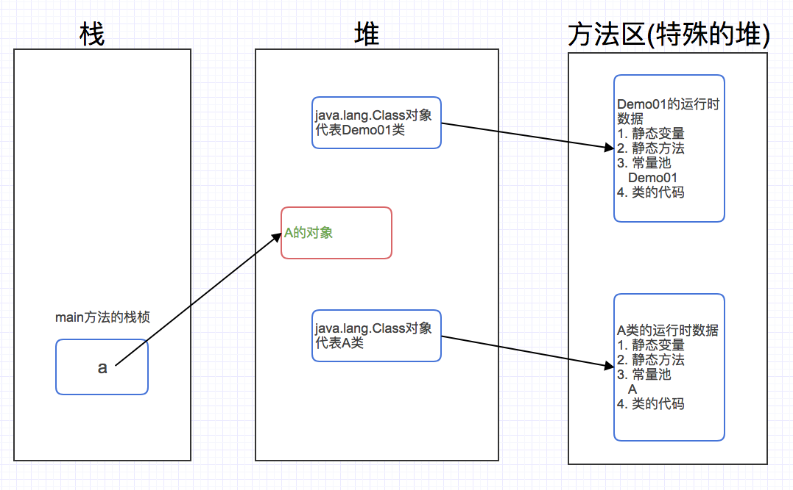
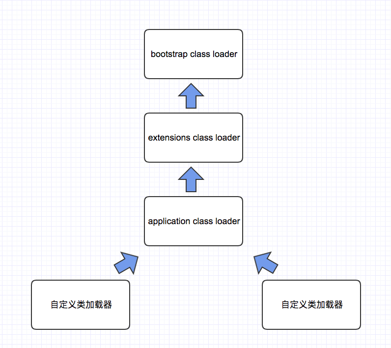

## Annotation注解和内置注解
> Annotation是JDK5.0开始引入的新技术
#### 什么是注解
1. 不是程序本身，可以对程序作出解释
2. 可以被其他程序(比如:编译器等)读取

#### 常用内置注解
* @Override
> 此注解只适用于修饰方法，表示一个方法声明打算重写父类中的另一个方法的声明

> eg:
```java
public class Demo1 /* extends Object */ {

    @Override // 注解说明: 重写了父类的方法
    public String toString() {
        return "";
    }
}
```
* @Deprecated
> 此注解可用于修饰方法、属性、类，表示不鼓励使用这样的元素，通常是因为它很危险或存在更好的选择

> eg:
```java
public class Demo2 {

    @Deprecated
    public static void test1() {
        System.out.println("Deprecated method");
    }

    public static void main(String[] args) {
        Date date = new Date();
        data.parse("yyyy");
        test1(); //不推荐使用
    }
}
```
* @SuppressWarnings
> 用来抑制编译时的警告信息
> eg:
```java
public class Demo3 {

    @SuppressWarnings("all") // 抑制警告信息
    public static void test03() {
        List list = new ArrayList();
        List list2 = new ArrayList();
    }

    // @SuppressWarnings(value={"unchecked","deprecation"}) 可赋值字符串数组
}
```

#### 自定义注解
* 源注解(对注解进行解释)
    * @Target (用于描述注解的使用范围，即被描述的注解可以用在什么地方)

        |取值ElementType|修饰范围|
        |--|--|
        |PACKAGE|package包|
        |TYPE|类、接口、枚举、Annotation类型|
        |CONSTRUCTOR:用于描述构造器,FIELD:用于描述域,METHOD:用于描述方法|类型成员(方法、构造方法、成员变量、枚举值)|
        |LOCAL_VARIABLE:用于描述局部变量,PARAMETER:用于描述参数|方法参数和本地变量|
    * @Retention (表示需要在什么级别保存该注释信息，用于描述注解的生命周期)

        |取值|作用|
        |--|--|
        |SOURCE|在源文件中有效(即源文件保留)|
        |CLASS|在class文件中有效(即class保留)|
        |RUNTIME|在运行时有效(即运行时保留)为Runtime可以反射机制读取|
    * @Documented
    * @Inherited

> eg:
```java
// @Target(value={ElementType.METHOD,ElementType.TYPE}) 
@Target(value=ElementType.METHOD) //修饰方法
@Retention(RetentionPolicy.RUNTIME);
public @interface MyAnnotation01 {
    // 参数类型－参数名 默认值
    String userName() default "";
    int age() default 0; // －1 表示不存在的含义

    String[] schools() default {"huawei", "ali"};
}

public class Demo2 {

    @MyAnnotation01(age=19, userName="yu", schools={"tengx","360"})
    public void test1() {
        
    }
}
```
> eg:
```java
@Target(value=ElementType.METHOD) //修饰方法
@Retention(RetentionPolicy.RUNTIME);
public @interface MyAnnotation02 {
    // 一般注解定义只有一个值时, 默认参数名为value();
    String value();
}
```

#### 反射机制读取注解
```java
package com.yhy;

import java.lang.annotation.ElementType;
import java.lang.annotation.Retention;
import java.lang.annotation.RetentionPolicy;
import java.lang.annotation.Target;

/**
 */

@Target(value = ElementType.TYPE)
@Retention(RetentionPolicy.RUNTIME)
public @interface YhyTable {
    String value();
}
```
```java
package com.yhy;

import java.lang.annotation.ElementType;
import java.lang.annotation.Retention;
import java.lang.annotation.RetentionPolicy;
import java.lang.annotation.Target;

/**
 */
@Target(value = ElementType.FIELD)
@Retention(RetentionPolicy.RUNTIME)
public @interface YhyField {

    String columnName();
    String type();
    int length();
}

```
```java
package com.yhy;

/**
 */
@YhyTable("tb_student")
public class Student {

    @YhyField(columnName = "id", type = "int", length = 10)
    private int id;
    @YhyField(columnName = "sname", type = "varchar", length = 10)
    private String stuName;
    @YhyField(columnName = "age", type = "int", length = 3)
    private int age;

    public int getId() {
        return id;
    }

    public void setId(int id) {
        this.id = id;
    }

    public String getStuName() {
        return stuName;
    }

    public void setStuName(String stuName) {
        this.stuName = stuName;
    }

    public int getAge() {
        return age;
    }

    public void setAge(int age) {
        this.age = age;
    }
}

```
```java
package com.yhy;

import java.lang.annotation.Annotation;
import java.lang.reflect.Field;

/**
 * 使用反射机制读取注解信息
 */
public class Demo03 {

    public static void main(String[] args) throws NoSuchFieldException {
        try {
            Class clazz = Class.forName("com.yhy.Student");

            // 1. 获取类的所有的注解
            Annotation[] annotations = clazz.getAnnotations();
            for (Annotation item : annotations) {
                System.out.println(item);
            }

            // 2. 获取类指定注解的值
            YhyTable st = (YhyTable) clazz.getAnnotation(YhyTable.class);
            System.out.println(st.value());

            // 3. 获取类的属性的注解
            Field stuName = clazz.getDeclaredField("stuName");
            YhyField yhyField = stuName.getAnnotation(YhyField.class);
            System.out.println(yhyField.columnName() + "--" + yhyField.type() + "--" + yhyField.length());

            // 4. 根据获得的表名, 字段的信息, 拼出DDL语句, 然后使用JDBC执行这个SQL, 在数据库中生成相关的表

        } catch (ClassNotFoundException e) {
            e.printStackTrace();
        }
    }
}
```

#### 反射机制介绍（Class对象获取、合并文件）
```java
public class User {
    private int id;
    private int age;
    private String uname;

    public User() {
    }

    public User(int id, int age, String uname) {
        this.id = id;
        this.age = age;
        this.uname = uname;
    }

    public int getId() {
        return id;
    }

    public void setId(int id) {
        this.id = id;
    }

    public int getAge() {
        return age;
    }

    public void setAge(int age) {
        this.age = age;
    }

    public String getUname() {
        return uname;
    }

    public void setUname(String uname) {
        this.uname = uname;
    }
}
```
```java
/**
 * 测试各种类型对应的java.lang.Class对象的获取方式
 */
public class Demo01 {

    public static void main(String[] args) {

        String path = "com.reflection.User";

        try {
            Class clazz = Class.forName(path);

            // 1. 对象是表示或封装一些数据
            // 一个类被加载以后,JVM会创建该类对应的Class对象,类的整个结构信息,就会放到这个对象里
            // 这个class对象就像一面镜子, 通过这个镜子可以获得这个类的全部信息
            System.out.println(clazz);
            System.out.println(clazz.hashCode());

            Class clazz2 = Class.forName(path);

            // 2. 同一个类 只会被加载一次
            System.out.println(clazz2.hashCode()); // 一个类只对应一个反射对象

            // 3. 获取Class对象的方式
            Class strClass = String.class;

            Class strClass2 = path.getClass();
            System.out.println(strClass == strClass2);

            Class intClass = int.class;

            int[] arr01 = new int[10];
            int[] arr02 = new int[30];
            int[][] arr03 = new int[3][10];
            double[] arr04 = new double[10];

            System.out.println(arr01.getClass().hashCode());
            System.out.println(arr02.getClass().hashCode());
            System.out.println(arr03.getClass().hashCode());
            System.out.println(arr04.getClass().hashCode());

        } catch (ClassNotFoundException e) {
            e.printStackTrace();
        }
    }
}
```

#### 反射机制（动态操作、构造器、方法、属性、合并文件）
```java
import java.lang.reflect.Constructor;
import java.lang.reflect.Field;
import java.lang.reflect.Method;

/**
 * 利用反射的API,获取类的信息(类的名字,属性,方法,构造器)
 */
public class Demo02 {

    public static void main(String[] args) throws NoSuchFieldException, NoSuchMethodException {
        String path = "com.reflection.User";

        try {
            Class clazz = Class.forName(path);

            // 1. 获取类的名字
            System.out.println(clazz.getName()); // 获取包名 + 类名
            System.out.println(clazz.getSimpleName()); // 获取类名

            // 2. 获取属性信息
            // Field[] fields = clazz.getFields();  // 只能获取public的field
            Field[] fields = clazz.getDeclaredFields(); // 获取所有的field

            Field f = clazz.getDeclaredField("uname");

            System.out.println(f);
            System.out.println(fields.length);

            System.out.println("====== 属性信息 ======");

            for (Field temp : fields) {
                System.out.println("属性: " + temp);
            }

            // 3. 获取方法信息
            Method[] methods = clazz.getDeclaredMethods();
            Method method = clazz.getDeclaredMethod("getUname", null);
            Method method2 = clazz.getDeclaredMethod("setUname", String.class); // 如果方法有参数,则必须传递参数的类型对应的class对象

            System.out.println("====== 获取方法信息 ======");

            for (Method m : methods) {
                System.out.println("方法: " + m);
            }

            System.out.println("====== 获取构造器信息 ======");
            // 4. 获取构造器信息
            Constructor[] constructors = clazz.getDeclaredConstructors();
            Constructor c1 = clazz.getDeclaredConstructor(null);
            Constructor c2 = clazz.getDeclaredConstructor(int.class, int.class, String.class);
            System.out.println(c1);
            System.out.println(c2);

            for (Constructor c : constructors) {
                System.out.println("构造器: " + c);
            }

        } catch (ClassNotFoundException e) {
            e.printStackTrace();
        }
    }
}
```
```java
import java.lang.reflect.Constructor;
import java.lang.reflect.Field;
import java.lang.reflect.Method;

/**
 * 通过反射api, 动态的操作: 构造器, 方法, 属性
 */
public class Demo03 {

    public static void main(String[] args) {

        String path = "com.reflection.User";
        Class<User> clazz = null;
        try {
            clazz = (Class<User>) Class.forName(path);

            // 1. 通过反射api 动态构造对象

            // 1.1 调用无参构造器
            User user = clazz.newInstance(); // 其实是调用了User的无参构造方法
            System.out.println(user);

            // 指定相关构造器
            Constructor<User> c = clazz.getDeclaredConstructor(int.class, int.class, String.class);

            // 1.2 调用有参构造器
            User user2 = c.newInstance(10, 10, "小张");
            System.out.println(user2.getUname());

            // 2. 通过反射API调用普通方法
            User user3 = clazz.newInstance();
            // user3.setUname("Yhyecho");
            Method method = clazz.getDeclaredMethod("setUname", String.class);
            method.invoke(user3, "大梦梦"); // 相当于 user3.setUname("Yhyecho");

            System.out.println(user3.getUname());

            // 3. 通过反射API操作属性
            User user4 = clazz.newInstance();
            Field f = clazz.getDeclaredField("uname");
            f.setAccessible(true); // 这个属性不需要做安全检查了,可以直接访问
            f.set(user4, "yhy4");
            System.out.println(user4.getUname()); // 通过反射 读取属性的值
            System.out.println(f.get(user4));

        } catch (Exception e) {
            e.printStackTrace();
        }

    }
}
```

#### 反射机制（提高反射效率、操作泛型、操作注解、合并文件）
```java
public class Demo04 {

    public void test01(Map<String, User> map, List<User> list) {
        System.out.println("Demo04.test01()");
    }

    public Map<Integer, User> test02() {
        System.out.println("Demo04.test02()");
        return null;
    }

    public static void main(String[] args) {
        try {
            Method m = Demo04.class.getMethod("test01", Map.class, List.class);
            // 获取带泛型参数类型
            Type[] t = m.getGenericParameterTypes();
            for (Type paramType : t) {
                System.out.println("#" + paramType);
                if (paramType instanceof ParameterizedType) {
                    Type[] arguments = ((ParameterizedType) paramType).getActualTypeArguments();
                    for (Type item : arguments) {
                        System.out.println("泛型类型: " + item);
                    }
                }
            }

            System.out.println("=======返回值泛型类型========");

            Method m2 = Demo04.class.getMethod("test02", null);
            Type returnType = m2.getGenericReturnType();
            if (returnType instanceof ParameterizedType) {
                Type[] actualTypeArguments = ((ParameterizedType) returnType).getActualTypeArguments();

                for (Type item : actualTypeArguments) {
                    System.out.println("返回值: 泛型类型" + item);
                }
            }

        } catch (NoSuchMethodException e) {
            e.printStackTrace();
        }
    }
}
```
#### 动态编译（DynamicCompile、反射调用main方法）
```java
/**
 * 动态编译（DynamicCompile、反射调用main方法）
 */
public class Demo05 {

    public static void main(String[] args) throws IOException {

        // 1. 通过IO操作, 将字符串存储为一个临时文件, 然后调用动态编译方法
        String str = "public class Hello { public static void main(String[] args) { System.out.println(\"hello Java\");} }";

        JavaCompiler javaCompiler = ToolProvider.getSystemJavaCompiler();
        int result = javaCompiler.run(null, null, null, "/Users/yuhuayang/ideaProjects/coreJava/core/src/main/resources/Hello.java");

        System.out.println(result == 0 ? "编译成功" : "编译失败");


        // 2. 通过Runtime 启动新的进程运行
        Runtime run = Runtime.getRuntime();
        Process process = run.exec("java -cp c:/myJava HelloWorld");

        InputStream in = process.getInputStream();
        BufferedReader reader = new BufferedReader(new InputStreamReader(in));
        String info = "";
        while ((info = reader.readLine()) != null) {
            System.out.println(info);
        }

    }

    // 3. 通过类加载器, 加载main方法
    public static void test01() throws MalformedURLException, ClassNotFoundException, NoSuchMethodException, InvocationTargetException, IllegalAccessException {

        URL[] urls = new URL[]{new URL("file:/" + "c:/myJava")};
        URLClassLoader loader = new URLClassLoader(urls);
        Class c = loader.loadClass("HelloWorld");
        Method m = c.getMethod("main", String.class);
        m.invoke(null, (Object) new String());
    }
}
```

#### 脚本引擎执行Javascript代码（Rhino引擎）
```java
/**
 * 脚本引擎执行Javascript代码（Rhino引擎）
 */
public class Demo06 {

    public static void main(String[] args) throws ScriptException, NoSuchMethodException, IOException {
        // 获取脚本引擎的对象
        ScriptEngineManager sem = new ScriptEngineManager();
        ScriptEngine engine = sem.getEngineByName("javascript");

        //定义变量, 会存储到引擎的上下文里面
        engine.put("msg", "yhy is a good man!");

        String str = "var user = {name: 'yhy', age: 18, schools: ['南京', '航天航空']};";
        str += "println(user.name);";

        // 执行脚本
        engine.eval(str);

        engine.eval("msg = 'mengmeng is a good woman';"); // js修改

        System.out.println(engine.get("msg")); // java获取

        System.out.println("==============");

        // 1. 定义函数
        engine.eval("function add(a, b) {var sum = a + b; return sum;}");
        // 2. 执行js函数
        Invocable jsInvoke = (Invocable) engine;
        Object result = jsInvoke.invokeFunction("add", new Object[]{12, 20});
        System.out.println(result);

        System.out.println("==============");
        // 导入其他java包,使用其他包中的java类
        String jsCode = "importPackage(java.util); var list = Arrays.asList([\"你好\",\"北京\"]);";
        engine.eval(jsCode);

        List<String> list2 = (List<String>) engine.get("list");

        for (String temp : list2) {
            System.out.println(temp);
        }

        System.out.println("==============");
        // 执行一个js文件
        URL url = Demo06.class.getClassLoader().getResource("a.js");
        FileReader fr = new FileReader(url.getPath());
        engine.eval(fr);
        fr.close();

    }
}
```

#### 字节码操作（Javaassist库介绍、动态创建新类、属性、方法、构造器）
```java
import javassist.*;

import java.io.IOException;

/**
 * 字节码操作（Javassist库介绍、动态创建新类、属性、方法、构造器）
 */
public class Demo07 {

    public static void main(String[] args) throws CannotCompileException, NotFoundException, IOException {
        ClassPool pool = ClassPool.getDefault();

        CtClass cc = pool.makeClass("com.yhy.bean.Emp");

        // 创建属性
        CtField f1 = CtField.make("private int empno;", cc);
        CtField f2 = CtField.make("private String ename;", cc);
        cc.addField(f1);
        cc.addField(f2);

        // 创建方法
        CtMethod m1 = CtMethod.make("public int getEmpno() {return empno;}", cc);
        CtMethod m2 = CtMethod.make("public void setEmpno(int empno) {this.empno = empno;}", cc);
        cc.addMethod(m1);
        cc.addMethod(m2);

        // 添加构造器
        CtConstructor constructor = new CtConstructor(new CtClass[]{CtClass.intType, pool.get("java.lang.String")}, cc);
        constructor.setBody("{this.empno = empno; this.ename = ename;}");

        cc.addConstructor(constructor);
        // 将上面构造好的类写入磁盘
        cc.writeFile("/Users/yuhuayang/ideaProjects/coreJava/core/src/main/resources/");

    }
}
```

#### 字节码操作（Javaassist库介绍、API详解）
```java
/**
 * 字节码操作（Javaassist库介绍、API详解）
 */
public class Demo08 {

    /**
     * 处理类的基本用法
     */
    public static void test01() throws NotFoundException, IOException, CannotCompileException {
        ClassPool pool = ClassPool.getDefault();
        CtClass cc = pool.get("com.yhy.Student");

        byte[] bytes = cc.toBytecode();

        System.out.println(Arrays.toString(bytes));

        System.out.println(cc.getName()); // 获取类名
        System.out.println(cc.getSimpleName()); // 获取简要类名

        System.out.println(cc.getSuperclass()); // 获取父类
        System.out.println(cc.getInterfaces()); // 获取接口

    }

    /**
     * 测试产生新的方法
     */
    public static void test02() throws NotFoundException, CannotCompileException, IllegalAccessException, InstantiationException, NoSuchMethodException, InvocationTargetException {
        ClassPool pool = ClassPool.getDefault();
        CtClass cc = pool.get("com.yhy.Student");

        // 方法一
        //CtMethod m = CtNewMethod.make("public int add(int a, int b) {return a + b;}", cc);

        CtMethod m = new CtMethod(CtClass.intType, "add", new CtClass[]{CtClass.intType, CtClass.intType}, cc);

        m.setModifiers(Modifier.PUBLIC);
        m.setBody("{ System.out.println(\"hello Student\"); return $1 + $2;}");
        cc.addMethod(m);

        // 通过反射调用新生成的方法
        Class clazz = cc.toClass();
        Object obj = clazz.newInstance(); // 调用Student的构造器,创建新的Student对象

        Method method = clazz.getDeclaredMethod("add", int.class, int.class);
        Object result = method.invoke(obj, 200, 300);
        System.out.println(result);

    }

    /**
     * 获取已有方法,并进行更改
     */
    public static void test03() throws NotFoundException, CannotCompileException, IllegalAccessException, InstantiationException, NoSuchMethodException, InvocationTargetException {
        ClassPool pool = ClassPool.getDefault();
        CtClass cc = pool.get("com.yhy.Student");

        CtMethod cm = cc.getDeclaredMethod("sayHello", new CtClass[]{CtClass.intType});

        // 方法前添加内容
        cm.insertBefore("System.out.println($1); System.out.println(\"start!!!\");");

        // 在第几行添加代码
        cm.insertAt(15, "int b = 3; System.out.println(\"b=\" + b);");

        // 方法后添加内容
        cm.insertAfter("System.out.println(\"end...\");");

        // 通过反射调用新生成的方法
        Class clazz = cc.toClass();
        Object obj = clazz.newInstance(); // 调用Student的构造器,创建新的Student对象

        Method method = clazz.getDeclaredMethod("sayHello", int.class);
        Object result = method.invoke(obj, 300);
    }

    /**
     * 添加新的属性/获取属性
     *
     * @throws NotFoundException
     */
    public static void test04() throws NotFoundException, CannotCompileException {
        ClassPool pool = ClassPool.getDefault();
        CtClass cc = pool.get("com.yhy.Student");

        // CtField f = CtField.make("private int empno;", cc);
        CtField f1 = new CtField(CtClass.intType, "empno", cc);
        f1.setModifiers(Modifier.PRIVATE);
        cc.addField(f1);

        cc.getDeclaredField("ename"); // 获取相关的属性

        // 增加get/set方法
        cc.addMethod(CtNewMethod.getter("getSalary", f1));
        cc.addMethod(CtNewMethod.setter("setSalary", f1));
    }

    /**
     * 构造器方法的操作
     *
     * @throws NotFoundException
     */
    public static void test05() throws NotFoundException {
        ClassPool pool = ClassPool.getDefault();
        CtClass cc = pool.get("com.yhy.Student");

        CtConstructor[] cs = cc.getConstructors();
        for (CtConstructor c : cs) {
            System.out.println(c.getLongName());
        }
    }

    /**
     * 注解信息的读取与操作
     *
     * @throws NotFoundException
     * @throws ClassNotFoundException
     */
    public static void test06() throws NotFoundException, ClassNotFoundException {
        ClassPool pool = ClassPool.getDefault();
        CtClass cc = pool.get("com.yhy.Student");

        Object[] all = cc.getAnnotations();
        YhyTable yt = (YhyTable) all[0];
        String value = yt.value();
        System.out.println("value:" + value);
    }

    public static void main(String[] args) throws IOException, CannotCompileException, NotFoundException, InvocationTargetException, NoSuchMethodException, InstantiationException, IllegalAccessException, ClassNotFoundException {

        //test01();
        //test02();

        //test03();

        // test04();

        //test05();

        test06();
    }

}
```

#### JVM核心机制（类加载过程、JVM内存分析、反射机制核心原理、常量池理解）
```java
/**
 * JVM核心机制（类加载过程)
 */
public class Demo01 {

    public static void main(String[] args) {

        A a = new A();
        System.out.println(A.width);
    }
}

class A {

    public static int width = 100; // 静态变量, 静态域 field

    static {
        System.out.println("静态初始化类A");
        width = 300;
    }

    public A() {
        System.out.println("创建A类的对象");
    }
}
```

> 类加载过程: 加载 －> 链接 －> 初始化

#### JVM核心机制（类加载过程、初始化、主动引用、被动引用、静态初始化块执行顺序
```java
public class Demo01 {

    static {
        System.out.println("静态初始化Demo01");
    }

    public static void main(String[] args) {

        System.out.println("Demo01的main方法!");
        A a = new A();
        System.out.println(A.width);

        // 1. 主动引用
        A a2 = new A();
        // 反射也是主动应用

        // 2. 被动引用, 常量
        System.out.println(A.MAX);
        A[] as = new A[10];
        System.out.println(B.width);


    }
}

class A extends A_Father {

    public static final int MAX = 100;

    public static int width = 100;  // 静态变量, 静态域 field

    static {
        System.out.println("静态初始化类A");
        width = 300;
    }

    public A() {
        System.out.println("创建A类的对象");
    }
}

class A_Father {
    static {
        System.out.println("静态初始化A_Father");
    }
}

class B extends A {
    static {
        System.out.println("静态初始化B");
    }
}
```

#### JVM核心机制（类加载器、三种类加载器、代理加载模式、双亲委派机制）
* 引导类加载器(bootstrap class loader)
* 扩展类加载器 (extensions class loader)
* 应用程序类加载器 (application class loader)
* 自定义类加载器 


```java
/**
 * 类加载器、三种类加载器、代理加载模式、双亲委派机制
 */
public class Demo02 {

    public static void main(String[] args) {
        System.out.println(ClassLoader.getSystemClassLoader()); // 应用程序类加载器
        System.out.println(ClassLoader.getSystemClassLoader().getParent()); // 扩展类加载器
        System.out.println(ClassLoader.getSystemClassLoader().getParent().getParent());


        System.out.println(System.getProperty("java.class.path"));

        // 代理模式 - 双亲委派机制 (父类加载器优先加载)
        // 优势: 安全
        // 自定义java.lang.String 类,不能加载, 默认加载java核心包的String类 (保证安全性);

        System.out.println("============");
        String a = "yhy";
        System.out.println(a.getClass().getClassLoader());

        System.out.println(a);

        // tomcat 也是使用了代理模式,但和双亲委派模式 加载顺序刚好相反
    }
}
```

#### JVM核心机制（类加载器、自定义文件系统类加载器、网络自定义类加载器）
```java
package com.classLoader;

import java.io.*;

/**
 * 自定义文件系统类加载器
 */
public class FileSystemClassLoader extends ClassLoader {

    // com.yhy.User -->  d:/myjava/com/yhy/User.class

    private String rootDir;

    public FileSystemClassLoader(String rootDir) {
        this.rootDir = rootDir;
    }

    @Override
    protected Class<?> findClass(String name) throws ClassNotFoundException {
        Class<?> c = findLoadedClass(name);

        // 应该先查询 有没有加载过这个类, 如果已经加载,则直接返回该类, 否则加载
        if (c != null) {
            return c;
        } else {
            // 获取父类加载器
            ClassLoader parent = this.getParent();
            try {
                c = parent.loadClass(name); // 委派给父类加载
            } catch (Exception e) {

            }

            if (c != null) {
                return c;
            } else {
                byte[] classData = getClassData(name);
                if (classData == null) {
                    throw new ClassNotFoundException();
                } else {
                    c = defineClass(name, classData, 0, classData.length);
                }
            }
        }

        return c;
    }

    private byte[] getClassData(String className) {

        String path = rootDir + "/" + className.replace(".", "/") + ".class";

        InputStream is = null;

        ByteArrayOutputStream baos = new ByteArrayOutputStream();

        try {
            is = new FileInputStream(path);

            byte[] buffer = new byte[1024];
            int temp = 0;
            while ((temp = is.read(buffer)) != -1) {
                baos.write(buffer, 0, temp);
            }

            return baos.toByteArray();
        } catch (Exception e) {
            return null;
        } finally {
            if (baos != null) {
                try {
                    baos.close();
                } catch (IOException e) {
                    e.printStackTrace();
                }
            }
            if (is != null) {
                try {
                    is.close();
                } catch (IOException e) {
                    e.printStackTrace();
                }
            }
        }

    }
}
```
```java
package com.classLoader;

import java.io.ByteArrayOutputStream;
import java.io.IOException;
import java.io.InputStream;
import java.net.URL;

/**
 * 网络类加载器
 */
public class NetClassLoader extends ClassLoader {

    private String rootUrl;

    public NetClassLoader(String rootUrl) {
        this.rootUrl = rootUrl;
    }

    @Override
    protected Class<?> findClass(String name) throws ClassNotFoundException {

        Class<?> c = findLoadedClass(name);

        if (c != null) {
            return c;
        } else {
            ClassLoader parent = this.getParent(); // 委托给父类加载
            try {
                c = parent.loadClass(name);
            } catch (Exception e) {
                //e.printStackTrace();
            }

            if (c != null) {
                return c;
            } else {
                byte[] classData = getClassData(name);
                if (classData == null) {
                    throw new ClassNotFoundException();
                } else {
                    c = defineClass(name, classData, 0, classData.length);
                }
            }
        }

        return c;
    }

    private byte[] getClassData(String className) {

        String path = rootUrl + "/" + className.replace(".", "/") + ".class";
        InputStream is = null;
        ByteArrayOutputStream baos = new ByteArrayOutputStream();
        try {
            URL url = new URL(rootUrl);
            is = url.openStream();

            byte[] buffer = new byte[1024];
            int temp = 0;
            while ((temp = is.read(buffer)) != -1) {
                baos.write(buffer, 0, temp);
            }
            return baos.toByteArray();
        } catch (IOException e) {
            //e.printStackTrace();
            return null;
        } finally {
            if (baos != null) {
                try {
                    baos.close();
                } catch (IOException e) {
                    e.printStackTrace();
                }
            }
            if (is != null) {
                try {
                    is.close();
                } catch (IOException e) {
                    e.printStackTrace();
                }
            }
        }

    }
}
```
```java
package com.classLoader;
/**
 */
public class Demo03 {

    public static void main(String[] args) throws ClassNotFoundException {

        FileSystemClassLoader loader = new FileSystemClassLoader("/Users/yuhuayang/ideaProjects/coreJava/core/src/main/resources");
        FileSystemClassLoader loader2 = new FileSystemClassLoader("/Users/yuhuayang/ideaProjects/coreJava/core/src/main/resources");

        Class<?> c = loader.loadClass("Hello");
        Class<?> c2 = loader.loadClass("Hello");
        Class<?> c3 = loader2.loadClass("Hello");

        Class<?> c4 = loader2.loadClass("java.lang.String");

        System.out.println(c.hashCode());
        System.out.println(c2.hashCode());
        System.out.println(c3.hashCode()); // 同一个类,被不同的类加载器加载, jvm认为不是相同的类


        System.out.println(c4.getClassLoader()); // 引导类加载器
        System.out.println(c2.getClassLoader()); // 自定义类加载器
    }
}
```

#### JVM核心机制（类加载器、自定加密解密类加载器）
```java
package com.classLoader;

import java.io.*;

/**
 * 加密工具类
 */
public class EncrptUtil {

    public static void encrpt(String src, String dest) {
        FileInputStream fis = null;
        FileOutputStream fos = null;

        try {
            fis = new FileInputStream(src);
            fos = new FileOutputStream(dest);

            int temp = -1;
            while ((temp = fis.read()) != -1) {
                fos.write(temp ^ 0xff); // 取反操作
            }
        } catch (IOException e) {
            e.printStackTrace();
        } finally {
            if (fos != null) {
                try {
                    fos.close();
                } catch (IOException e) {
                    e.printStackTrace();
                }
            }

            if (fis != null) {
                try {
                    fis.close();
                } catch (IOException e) {
                    e.printStackTrace();
                }
            }
        }
    }

    public static void main(String[] args) {
        encrpt("/Users/yuhuayang/ideaProjects/coreJava/core/src/main/resources/Hello.class",
                "/Users/yuhuayang/ideaProjects/coreJava/core/src/main/resources/Hello2.class");
    }
}
```
```java
package com.classLoader;

import java.io.*;

/**
 * 解密类加载器(文件系统中使用)
 */
public class DecrptClassLoader extends ClassLoader {

    private String rootDir;

    public DecrptClassLoader(String rootDir) {
        this.rootDir = rootDir;
    }

    @Override
    protected Class<?> findClass(String name) throws ClassNotFoundException {

        Class<?> c = findLoadedClass(name);
        if (c != null) {
            return c;
        } else {
            ClassLoader parent = this.getParent();
            try {
                parent.loadClass(name);
            } catch (Exception e) {

            }

            if (c != null) {
                return c;
            } else {
                byte[] classData = getClassData(rootDir);
                if (classData == null) {
                    throw new ClassNotFoundException();
                } else {
                    c = defineClass(name, classData, 0, classData.length);
                }
            }
        }

        return c;
    }

    private byte[] getClassData(String className) {
        String path = rootDir + "/" + className.replace('.', '/') + ".class";

        InputStream is = null;
        ByteArrayOutputStream baos = new ByteArrayOutputStream();

        try {
            is = new FileInputStream(path);
            int temp = -1;
            while ((temp = is.read()) != -1) {
                baos.write(temp ^ 0xff); // 取反操作
            }

            return baos.toByteArray();
        } catch (IOException e) {
            //e.printStackTrace();
            return null;
        } finally {
            if (baos != null) {
                try {
                    baos.close();
                } catch (IOException e) {
                    e.printStackTrace();
                }
            }

            if (is != null) {
                try {
                    is.close();
                } catch (IOException e) {
                    e.printStackTrace();
                }
            }
        }

    }
}
```
```java
/**
 * 测试简单的加密解密(取反)操作
 */
public class Demo04 {

    public static void main(String[] args) throws ClassNotFoundException {
        //int a = 3; // 00000011
        //System.out.println(Integer.toBinaryString(a^0xff)); // 位运算 取反操作


        // 1. 加密后的class文件,正常的类加载器无法加载, 报classFormatError
        //FileSystemClassLoader loader = new FileSystemClassLoader("/Users/yuhuayang/ideaProjects/coreJava/core/src/main/resources");
        //
        //Class<?> c = loader.loadClass("Hello2");
        //
        //System.out.println(c);

        DecrptClassLoader loader = new DecrptClassLoader("/Users/yuhuayang/ideaProjects/coreJava/core/src/main/resources");

        Class<?> c = loader.loadClass("Hello2");

        System.out.println(c);
    }
}
```

#### JVM核心机制（线程上下文类加载器、Web服务器类加载机制、OSGI模块开发原理）
* 线程上下文类加载器 (为了抛弃双亲委派加载链模式)
```java
Thread.currentThread.getContextClassLoader();
Thread.currentThread.setContextClassLoader();
```
```java
/**
 * 使用线程上下文, 设置类加载器
 */
public class Demo05 {

    public static void main(String[] args) throws ClassNotFoundException {
        ClassLoader loader = Demo05.class.getClassLoader();

        System.out.println(loader);

        ClassLoader loader2 = Thread.currentThread().getContextClassLoader();

        System.out.println(loader2);

        Thread.currentThread().setContextClassLoader(new FileSystemClassLoader("/Users/yuhuayang/ideaProjects/coreJava/core/src/main/resources"));
        System.out.println(Thread.currentThread().getContextClassLoader());

        Class<?> hello = Thread.currentThread().getContextClassLoader().loadClass("Hello");

        System.out.println(hello); // FileSystemClassLoader

        System.out.println(hello.getClassLoader()); // AppClassLoader
    }
}
```
* tomcat服务器的类加载机制
* OSGI原理(面相Java的动态模块系统)
```java
A B C 组件可以分开开发再统一整合到一个系统中
```

#### 内部类分类介绍（静态内部类详解、成员内部类详解）
* 内部类(Nested Class) 嵌套类
    * 静态内部类
    * 非静态内部类
        * 普通内部类
        * 匿名内部类
        * 方法内部类
```java
/**
 * 测试内部类
 */
public class Demo01 {

    /**
     * 静态内部类
     */
    private static class StaticNestClass {

    }

    /**
     * 普通内部类(成员内部类)
     */
    private class FieldInnerClass {

    }

    void sayHello() {
        // 方法内部类(局部内部类)
        class LoaclClass {

        }

        // 匿名内部类
        Runnable runnable = new Runnable() { // 两个作用: 定义了匿名内部类的类体,同时创建了匿名内部类的一个实例
            public void run() {

            }
        };
    }
}
```
> class文件命名方式: Demo1$StaticNestedClass

* 静态内部类的基本用法
    * 静态内部类可以包含静态成员、非静态成员
    * 静态内部类可以直接调用外部类的静态属性、静态方法，但不能调用外部类的普通属性、普通方法
    * 在不相关的类中, 可以直接创建静态内部类的对象(不需要通过所在外部类)
    * 静态内部类实际上和外部类联系很少，也就是命名空间上的联系
```java
package com.innerClass;

import com.innerClass.Outer02.StaticInnerClass;

/**
 * Created by Echo on 12/29/17.
 */
public class Demo02 {

    public static void main(String[] args) {

        // 两种new内部类的方式
        Outer02.StaticInnerClass osic = new Outer02.StaticInnerClass();

        StaticInnerClass osic2 = new StaticInnerClass();
    }

}

class Outer02 {
    int c = 5;
    static int d = 10;

    void test() {
        StaticInnerClass sic = new StaticInnerClass();
    }

    // 静态内部类
    public static class StaticInnerClass {
        int a = 3;
        static int b = 5;

        public void test() {
            System.out.println(d);
            // System.out.println(c); // 静态内部类中不能调用外部类的普通成员,只能调用静态成员
        }
    }
}
```
```java
public class Demo03 {

    public static void main(String[] args) {

        Outer03 out3 = new Outer03();
        Outer03.InnerClass ic = out3.new InnerClass();
        ic.test();
    }
}

class Outer03 {

    private int a = 3;
    int b = 10;

    public void test02() {
        InnerClass ic2 = new InnerClass();
    }

    // 成员内部类
    class InnerClass {

        int c = 1;
        // static int d = 8; // 成员内部类不能有静态成员
        final static int d = 8; // 除非声明为final

        void test() {
            System.out.println(a);
            System.out.println("内部类对象:" + this); // 成员内部类对象的创建, 必须先有外部类对象
            System.out.println("外部类对象:" + Outer03.this); // 引用了外部类的对象
        }
    }

}
```
* 成员内部类的基本用法
    * 成员内部类就像一个成员变量一样存在于外部类
    * 成员内部类可以访问外部类的所有成员(包含: private的)
    * 成员内部类的this指内部类对象本身,要拿到内部类对象可以使用
    外部类名+.this
        * 成员内部类的对象是一定要绑定到一个外部类的对象上的，
        因此，创建成员内部类对象时需要持有外部类对象的引用，因此要先有外部类对象，后有成员内部类对象。
    * 成员内部类不能有静态成员
* 成员内部类对象的创建方式
    * 外部类内部
    ```java
    Inner inner = new Inner();
    ```
    * 外部类外部 
    ```java
    Inner inner = new Outer.new Inner();
    ```
    
#### 方法内部类（Final修饰局部变量问题、匿名内部类）
```java
/**
 * <p/>
 * 测试方法内部类(局部内部类)
 */
public class Demo04 {

    public static void main(String[] args) {

    }
}

class Outer04 {

    public void test() {
        final int a = 3;
        // int a = 3;

        class Inner {
            int b = 10;

            // static int c = 30 // 方法内部类中只能定义非静态成员

            void tt() {
                System.out.println(b);
                // 方法内部类中,不能引用所在方法的的普通局部变量, 除非是常量
                System.out.println(a);
                // 原因如下:
                // 方法的生命周期和方法内部类对象的生命周期不一致!
            }
        }

        Inner i = new Inner();
    }

    void test2() {

    }
}
```
```java
public class Demo05 {

    public static void main(String[] args) {
        Outer05 out = new Outer05();
        out.test();
    }

}

class Outer05 {

    public void test02(Car c) {
        c.run();
    }

    public void test() {
        // 1. 匿名内部类(接口式), 由于本内部类定义在方法中, 同时也是方法内部类
        Runnable runnable = new Runnable() {
            public void run() {

            }
        };

        // 2. 匿名内部类,继承式
        Car car = new Car() {
            @Override
            public void run() {
                System.out.println("子类的车跑!");
            }
        };

        car.run();

        test02(new Car() {
            @Override
            public void run() {
                System.out.println("参数式匿名内部类, 车在跑!");
            }
        });
    }
}

class Car {
    public void run() {
        System.out.println("汽车跑!");
    }
}
```


