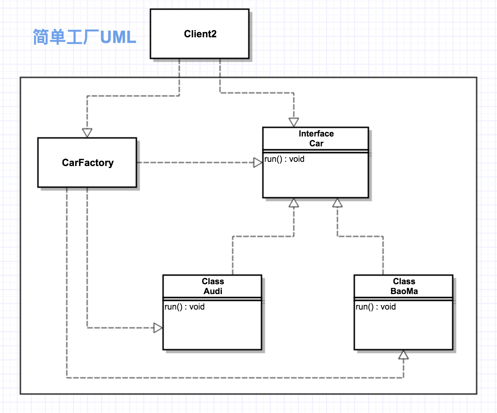

### 设计模式分类
* 创建型模式[都是用来帮助我们创建对象的]
    * 单例模式
    * 工厂模式
    * 抽象工厂模式
    * 建造者模式
    * 原型模式
* 结构型模式[是从程序的结构上实现松耦合，从而可以扩大整体的类结构，用来解决更大的问题.关注对象和类的组织]
    * 适配器模式 
    * 桥接模式
    * 装饰模式
    * 组合模式
    * 外观模式
    * 享元模式
    * 代理模式
* 行为型模式[关注系统中对象之间的相互交互，研究系统在运行时对象之间的相互通信和协作，进一步明确对象的职责]
    * 模版方法模式
    * 命令模式
    * 迭代器模式
    * 观察者模式
    * 中介者模式
    * 备忘录模式
    * 解释器模式
    * 状态模式
    * 策略模式
    * 责任链模式
    * 访问者模式
### 单例模式（应用场景、饿汉式、懒汉式）
> 保证一个类只有一个实例，并且提供一个访问该实例的全局访问点

* 饿汉式 (线程安全，调用效率高 但是不能延时加载)
```java
/**
 * 饿汉式单例模式
 */
public class Demo01 {

    // 由于加载类时,天然的是线程安全的
    private static Demo01 instance = new Demo01(); // 类初始化时, 立即加载这个对象

    private Demo01() {

    }

    // 方法没有同步, 调用效率高
    public static Demo01 getInstance() {
        return instance;
    }
}
```
* 懒汉式 (线程安全，调用效率不高高 可以延时加载)
```java
/**
 * 懒汉式单例模式
 */
public class Demo02 {

    // 类初始化时,不初始化这个对象(延时加载, 真正用的时候再创建)
    private static Demo02 instance;

    private Demo02() { // 私有化构造器

    }

    // 方法同步, 调用效率低
    public static synchronized Demo02 getInstance() {
        if (instance == null) {
            instance = new Demo02();
        }
        return instance;
    }
}
```

### 单例模式（双重检查锁式、静态内部类式、枚举式、UML、类图）
```java
/**
 * 双重检查锁 实现单例模式
 */
public class Demo03 {

    private static Demo03 instance = null;

    private Demo03() {

    }

    public static Demo03 getInstance() {
        if (instance == null) {
            Demo03 dm;
            synchronized (Demo03.class) {
                dm = instance;
                if (dm == null) {
                    synchronized (Demo03.class) {
                        if (dm == null) {
                            dm = new Demo03();
                        }
                    }
                    instance = dm;
                }
            }
        }

        return instance;
    }
}
```
```java
/**
 * 静态内部类实现单例模式
 * 这种方式: 线程安全,调用效率高,并且实现了延时加载
 */
public class Demo04 {

    private static class SingletonClassInstance {
        private static final Demo04 instance = new Demo04();
    }

    private Demo04() {

    }

    public static Demo04 getInstance() {
        return SingletonClassInstance.instance;
    }
}
```
```java
/**
 * 枚举实现单例模式 (没有延时加载)
 */
public enum Demo05 {

    // 这个枚举元素, 本身就是单例对象
    INSTANCE;

    // 添加自己需要的操作
    public void singletonOper() {

    }
}
```
```java
/**
 * 测试单例
 */
public class Client {
    public static void main(String[] args) {
        Demo01 s1 = Demo01.getInstance();
        Demo01 s2 = Demo01.getInstance();

        System.out.println(s1);
        System.out.println(s2);

        System.out.println(Demo05.INSTANCE == Demo05.INSTANCE);
    }
}
```

### 单例模式（反射和反序列化漏洞、多线程环境、CountDownLatch同步类的使用）
```java
/**
 * 如何防止反射和反序列化漏洞
 */
public class Demo06 implements Serializable {

    private static Demo06 instance;

    private Demo06() { // 私有化构造器
        if (instance != null) {
            throw new RuntimeException();
        }
    }

    public static synchronized Demo06 getInstance() {
        if (instance == null) {
            instance = new Demo06();
        }
        return instance;
    }

    // 反序列化时, 如果定义了readResolve() 则直接返回此方法指定的对象,而不需要单独再创建新对象!
    private Object readResolve() throws ObjectStreamException {
        return instance;
    }
}
```
```java
/**
 * 反射和反序列化破解单例
 */
public class Client2 {

    public static void main(String[] args) throws ClassNotFoundException, NoSuchMethodException, IllegalAccessException, InvocationTargetException, InstantiationException, IOException {
        Demo06 d1 = Demo06.getInstance();
        Demo06 d2 = Demo06.getInstance();
        System.out.println(d1);
        System.out.println(d2);

        // 1. 通过反射方式直接调用私有构造器
        //Class<Demo06> clazz = (Class<Demo06>) Class.forName("com.yhy.singleton.Demo06");
        //Constructor<Demo06> c = clazz.getDeclaredConstructor(null);
        //c.setAccessible(true);
        //
        //Demo06 d3 = c.newInstance();
        //Demo06 d4 = c.newInstance();
        //
        //System.out.println(d3);
        //System.out.println(d4);

        // 2. 通过反序列化的方式构造多个对象
        FileOutputStream fos = new FileOutputStream("/Users/yuhuayang/Desktop/a.txt");
        ObjectOutputStream oos = new ObjectOutputStream(fos);
        oos.writeObject(d1);
        oos.close();
        fos.close();

        ObjectInputStream ois = new ObjectInputStream(new FileInputStream("/Users/yuhuayang/Desktop/a.txt"));
        Demo06 dObj = (Demo06) ois.readObject();
        System.out.println(dObj); // 此时已不是同一个对象

    }
}
```
```java
/**
 * 测试多线程环境下五种创建单例模式的效率
 */
public class Client3 {

    public static void main(String[] args) throws InterruptedException {

        long start = System.currentTimeMillis();

        int threadNum = 10;
        // 线程计数器
        final CountDownLatch countDownLatch = new CountDownLatch(threadNum);

        for (int i = 0; i < threadNum; i++) {
            new Thread(new Runnable() {
                @Override
                public void run() {
                    for (int i = 0; i < 100000; i++) {
                        // Object o = Demo01.getInstance();
                        // Object o2 = Demo02.getInstance();
                        // Object o3 = Demo03.getInstance();
                        // Object o4 = Demo04.getInstance();
                        Demo05 instance = Demo05.INSTANCE;
                    }

                    countDownLatch.countDown();
                }
            }).start();
        }

        countDownLatch.await(); // main线程阻塞, 直到计数器变为0, 才会继续往下执行.

        long end = System.currentTimeMillis();

        System.out.println("总耗时: " + (end - start));

    }
}
```

### 简单工厂模式（面向对象设计原则、开闭原则、依赖反转原则、迪米特法则）[虽然某种程度不符合设计原则，但实际使用最多]
> 实现了创建者和调用者的分离
    - 简单工厂模式
    - 工厂方法模式
    - 抽象工厂模式
* 核心: 
    - 实例化对象，用工厂方法代替new操作
    - 将选择实现类、创建对象统一管理和控制。从而将调用者跟我们的实现类解耦。

* 面向对象设计的基本原则
    - OPC(开闭原则：一个软件的实体应当对扩展开放，对修改关闭)
    - DIP(依赖反转原则：要针对接口编程，不要针对实现编程)
    - LOD(迪米特法则：只与你直接的朋友通信，而避免和陌生人通信)

```java
/**
 * 汽车接口
 */
public interface Car {

    void run();
}
```
```java
public class Audi implements Car {
    @Override
    public void run() {
        System.out.println("奥迪在跑....");
    }
}
```
```java
public class BaoMa implements Car {
    @Override
    public void run() {
        System.out.println("宝马在跑....");
    }
}
```
```java
/**
 * 测试在没有工厂模式下
 */
public class Client01 { // 调用者

    public static void main(String[] args) {

        Car c1 = new Audi();
        Car c2 = new BaoMa();

        c1.run();
        c2.run();
    }
}
```
```java
/**
 * 创建车的工厂类(简单工厂)
 */
public class CarFactory {

    public static Car createCar(String type) {
        if ("奥迪".equals(type)) {
            return new Audi();
        } else if ("宝马".equals(type)) {
            return new BaoMa();
        } else {
            return null;
        }
    }
}
```
```java
/**
 * 创建车的工厂类(简单工厂)
 */
public class CarFactory02 {

    public static Car createAudi(String type) {
        return new Audi();
    }

    public static Car createBaoMa(String type) {
        return new BaoMa();
    }
}

```
```java
/**
 * 简单工厂模式下
 */
public class Client02 { // 调用者

    public static void main(String[] args) {

        Car c1 = CarFactory.createCar("奥迪");
        Car c2 = CarFactory.createCar("宝马");

        c1.run();
        c2.run();

    }
}
```


### 工厂方法模式详解 [不修改已有类的前提下，通过增加新的工厂类实现扩展]
```java
/**
 * 工厂方法模式
 */
public interface CarFactory03 {

    Car createCar();
}
```
```java
public class BaoMaFactory implements CarFactory03 {
    @Override
    public Car createCar() {
        return new BaoMa();
    }
}
```
```java
public class BaoMaFactory implements CarFactory03 {
    @Override
    public Car createCar() {
        return new BaoMa();
    }
}
```
```java
public class Benz implements Car {
    @Override
    public void run() {
        System.out.println("奔驰在跑....");
    }
}
```
```java
public class BenzFactory implements CarFactory03 {
    @Override
    public Car createCar() {
        return new Benz();
    }
}
```
```java
/**
 * 工厂方法模式测试
 */
public class Client03 {

    public static void main(String[] args) {
        Car c1 = new AudiFactory().createCar();

        c1.run();

        Car c2 = new BaoMaFactory().createCar();

        c2.run();

        Car c3 = new BenzFactory().createCar();

        c3.run();
    }
}
```

### 抽象工厂模式详解 [不可以增加产品，可以增加产品族]
```java
/**
 * 发动机接口
 */
public interface Engine {

    void run();

    void start();
}

class GoodEngine implements Engine {

    @Override
    public void run() {
        System.out.println("转的快!");
    }

    @Override
    public void start() {
        System.out.println("启动快,可以自动启停");
    }
}

class BadEngine implements Engine {

    @Override
    public void run() {
        System.out.println("转的慢!");
    }

    @Override
    public void start() {
        System.out.println("启动慢,不可以自动启停");
    }
}
```
```java
/**
 * 座椅接口
 */
public interface Seat {

    void massage();
}

class GoodSeat implements Seat {

    @Override
    public void massage() {
        System.out.println("可以自动按摩...");
    }
}

class BadSeat implements Seat {

    @Override
    public void massage() {
        System.out.println("不可以按摩...");
    }
}
```
```java
/**
 * 轮胎接口
 */
public interface Tyre {

    void revolve();
}

class GoodRevolve implements Tyre {

    @Override
    public void revolve() {
        System.out.println("防滑,磨损慢!");
    }
}

class BadRevolve implements Tyre {

    @Override
    public void revolve() {
        System.out.println("不防滑,磨损快!");
    }
}
```
```java
/**
 * 汽车工厂接口
 */
public interface CarFactory {

    Engine createEngine();

    Seat createSeat();

    Tyre createTyre();
}
```
```java
/**
 * 高端汽车制造工厂
 */
public class GoodCarFactory implements CarFactory {
    @Override
    public Engine createEngine() {
        return new GoodEngine();
    }

    @Override
    public Seat createSeat() {
        return new GoodSeat();
    }

    @Override
    public Tyre createTyre() {
        return new GoodRevolve();
    }
}
```
```java
/**
 * 低端汽车制造工厂
 */
public class BadCarFactory implements CarFactory {
    @Override
    public Engine createEngine() {
        return new BadEngine();
    }

    @Override
    public Seat createSeat() {
        return new BadSeat();
    }

    @Override
    public Tyre createTyre() {
        return new BadRevolve();
    }
}
```
```java
/**
 * 测试抽象工厂
 */
public class Client {

    public static void main(String[] args) {
        CarFactory factory = new GoodCarFactory();
        Engine e = factory.createEngine();
        e.run();
        e.start();
    }
}
```

### 建造者模式详解（类图关系）
> 本质：分离了对象子组件的单独构造(由Builder来负责)和装配(由Director负责)。从而可以构造出复杂的对象。这个模式适用于: 某个对象的构建过程复杂的情况下使用。
```java
/**
 * 宇宙飞船
 */
public class AirShip {

    private OrbitalModule orbitalModule; // 轨道舱
    private Engine engine; // 发动机
    private EscapeTower escapeTower; // 逃逸塔

    public void launch() {
        System.out.println("飞船起飞....");
    }

    public OrbitalModule getOrbitalModule() {
        return orbitalModule;
    }

    public void setOrbitalModule(OrbitalModule orbitalModule) {
        this.orbitalModule = orbitalModule;
    }

    public Engine getEngine() {
        return engine;
    }

    public void setEngine(Engine engine) {
        this.engine = engine;
    }

    public EscapeTower getEscapeTower() {
        return escapeTower;
    }

    public void setEscapeTower(EscapeTower escapeTower) {
        this.escapeTower = escapeTower;
    }
}

// 轨道舱组件
class OrbitalModule {
    private String name;

    public OrbitalModule(String name) {
        this.name = name;
    }

    public String getName() {
        return name;
    }

    public void setName(String name) {
        this.name = name;
    }
}

// 发动机组件
class Engine {
    private String name;

    public Engine(String name) {
        this.name = name;
    }

    public String getName() {
        return name;
    }

    public void setName(String name) {
        this.name = name;
    }
}

// 逃逸塔组件
class EscapeTower {
    private String name;

    public EscapeTower(String name) {
        this.name = name;
    }

    public String getName() {
        return name;
    }

    public void setName(String name) {
        this.name = name;
    }
}
```
```java
/**
 * 飞船组件构建接口
 */
public interface AirShipBuiler {

    /**
     * 发动机组件
     *
     * @return
     */
    Engine builderEngine();

    /**
     * 轨道舱组件
     *
     * @return
     */
    OrbitalModule builderOrbitalModule();

    /**
     * 逃逸塔组件
     *
     * @return
     */
    EscapeTower builderEscapeTower();
}
```
```java
/**
 * 飞船组装接口
 */
public interface AirShipDirector {

    /**
     * 组装飞船对象
     *
     * @return
     */
    AirShip directAirShip();
}
```
```java
/**
 * 构建者的实现类
 */
public class YhyAirShipBuilder implements AirShipBuiler { //  StringBuilder, JDOM中的: DomBuilder, SaxBuilder
    @Override
    public Engine builderEngine() {
        System.out.println("构建echo牌发动机");
        return new Engine("echo牌发动机");
    }

    @Override
    public OrbitalModule builderOrbitalModule() {
        System.out.println("构建echo牌轨道舱");
        return new OrbitalModule("echo牌轨道舱");
    }

    @Override
    public EscapeTower builderEscapeTower() {
        System.out.println("构建echo牌逃逸塔");
        return new EscapeTower("echo牌逃逸塔");
    }
}
```
```java
/**
 * 装配者实现类
 */
public class YhyAirShipDirector implements AirShipDirector {

    // 获得构建者对象的引用
    private AirShipBuiler builer;

    public YhyAirShipDirector(AirShipBuiler builer) {
        this.builer = builer;
    }

    @Override
    public AirShip directAirShip() {

        Engine engine = builer.builderEngine();
        OrbitalModule orbitalModule = builer.builderOrbitalModule();
        EscapeTower escapeTower = builer.builderEscapeTower();

        // 装配成飞船对象
        AirShip ship = new AirShip();
        ship.setEngine(engine);
        ship.setOrbitalModule(orbitalModule);
        ship.setEscapeTower(escapeTower);
        return ship;
    }
}
```
```java
/**
 * 测试建造者模式
 */
public class Client {


    public static void main(String[] args) {
        AirShipDirector director = new YhyAirShipDirector(new YhyAirShipBuilder());

        AirShip airShip = director.directAirShip();

        System.out.println(airShip.getEngine().getName());
    }
}
```

### 原型模式（Prototype、浅复制、深复制、Clonable接口）
* Cloneable接口和clone方法
* Prototype模式中实现起来最困难的地方就是内存复制操作，所幸在Java中提供了clone方法替我们做了绝大部分事。
```java
/**
 * 浅拷贝对象
 */
public class Sheep implements Cloneable { // 1997年 英国的克隆羊,多利
    private String name;
    private Date birthday;

    @Override
    protected Object clone() throws CloneNotSupportedException {
        Object obj = super.clone(); // 直接调用object对象的clone方法
        return obj;
    }

    public Sheep(String name, Date birthday) {
        this.name = name;
        this.birthday = birthday;
    }

    public Sheep() {
    }

    public String getName() {
        return name;
    }

    public void setName(String name) {
        this.name = name;
    }

    public Date getBirthday() {
        return birthday;
    }

    public void setBirthday(Date birthday) {
        this.birthday = birthday;
    }
}
```
```java
/**
 * 测试原型模式(浅克隆)
 */
public class Client {

    public static void main(String[] args) throws Exception {
        Date date = new Date(123123129332L);
        Sheep s1 = new Sheep("多利", date);

        // 浅克隆(只拷贝对象引用,属性没变)
        Sheep s2 = (Sheep) s1.clone();

        System.out.println(s1);
        System.out.println(s1.getName());
        System.out.println(s1.getBirthday());

        date.setTime(1233453543242L);
        System.out.println(s1.getBirthday());


        s2.setName("多利克隆体");
        System.out.println(s2);
        System.out.println(s2.getName());
        System.out.println(s2.getBirthday());
    }
}
```
```java
/**
 * Created by Echo on 1/4/18.
 * 深拷贝对象
 */
public class Sheep2 implements Cloneable { // 1997年 英国的克隆羊,多利
    private String name;
    private Date birthday;

    @Override
    protected Object clone() throws CloneNotSupportedException {
        Object obj = super.clone(); // 直接调用object对象的clone方法

        // 添加如下代码,实现深拷贝(deep clone)
        Sheep2 s = (Sheep2) obj;
        s.birthday = (Date) this.birthday.clone(); // 把属性也进行克隆

        return obj;
    }

    public Sheep2(String name, Date birthday) {
        this.name = name;
        this.birthday = birthday;
    }

    public Sheep2() {
    }

    public String getName() {
        return name;
    }

    public void setName(String name) {
        this.name = name;
    }

    public Date getBirthday() {
        return birthday;
    }

    public void setBirthday(Date birthday) {
        this.birthday = birthday;
    }
}
```
```java
/**
 * 原型模式(深拷贝)
 */
public class Client2 {

    public static void main(String[] args) throws Exception {
        Date date = new Date(123123129332L);
        Sheep2 s1 = new Sheep2("多利", date);

        // 深克隆 (不仅拷贝了对象的引用,同时birthday属性也拷贝了)
        Sheep2 s2 = (Sheep2) s1.clone();

        System.out.println(s1);
        System.out.println(s1.getName());

        System.out.println(s1.getBirthday());
        date.setTime(1233453543242L);
        System.out.println(s1.getBirthday());

        s2.setName("多利克隆体");
        System.out.println(s2);
        System.out.println(s2.getName());
        System.out.println(s2.getBirthday());
    }
}
```

### 原型模式（反序列化实现深复制、效率对比、创建型模式总结）
> 什么时候使用原型模式: 通过new产生一个对象需要非常繁琐的数据准备或访问权限，则可以使用原型模式
```java
/**
 * 原型模式(深复制, 使用序列化和反序列化的方式实现深复制)
 */
public class Client3 {
    public static void main(String[] args) throws Exception {
        Date date = new Date(123123129332L);
        Sheep s1 = new Sheep("多利", date);

        System.out.println(s1);
        System.out.println(s1.getName());
        System.out.println(s1.getBirthday());

        //Sheep s2 = (Sheep) s1.clone();
        // 使用序列化和反序列化的方式实现深复制
        // 原型对象需要实现Serializable接口
        ByteArrayOutputStream bos = new ByteArrayOutputStream();
        ObjectOutputStream oos = new ObjectOutputStream(bos);
        oos.writeObject(s1);
        byte[] bytes = bos.toByteArray();

        ByteArrayInputStream bis = new ByteArrayInputStream(bytes);
        ObjectInputStream ois = new ObjectInputStream(bis);
        // 克隆好的对象
        Sheep s2 = (Sheep) ois.readObject();
        System.out.println("修改原型对象的birthday属性值");
        date.setTime(1233453543242L);
        System.out.println(s1.getBirthday());
        // s2是经过深拷贝的值, 属性birthday不会被更改
        System.out.println(s2.getBirthday());

    }
}
```
```java
/**
 * 克隆方式和new方式创建对象的效率对比
 */
public class Client4 {
    public static void main(String[] args) throws Exception {
        testNew(1000);
        testClone(1000);
    }

    /**
     * new的方式
     *
     * @param size
     */
    public static void testNew(int size) {
        long start = System.currentTimeMillis();
        for (int i = 0; i < size; i++) {
            Computer c = new Computer();
        }
        long end = System.currentTimeMillis();
        System.out.println("new的方式创建耗时:" + (end - start));
    }

    /**
     * 克隆方式
     *
     * @param size
     * @throws CloneNotSupportedException
     */
    public static void testClone(int size) throws CloneNotSupportedException {
        long start = System.currentTimeMillis();
        Computer t = new Computer();
        for (int i = 0; i < size; i++) {
            Computer c2 = (Computer) t.clone();
        }
        long end = System.currentTimeMillis();
        System.out.println("克隆的方式耗时:" + (end - start));
    }
}

class Computer implements Cloneable { // 台式电脑
    public Computer() {
        try {
            Thread.sleep(10); // 模拟创建对象耗时的过程!
        } catch (InterruptedException e) {
            e.printStackTrace();
        }
    }

    @Override
    protected Object clone() throws CloneNotSupportedException {
        Object obj = super.clone(); // 直接调用object对象的clone方法
        return obj;
    }
}
```

### 适配器模式（对象适配器、类适配器、开发场景）
> 将一个类的接口转换成客户希望的另一个接口。Adapter模式使得原本由于接口不兼容而不能一起工作的那些类可以在一起工作。

```java
/**
 * 需要被适配的类
 * (相当于没有蓝牙功能的台式电脑)
 */
public class Adaptee {

    public void request() {
        System.out.println("台式机连接蓝牙耳机功能");
    }
}
```
```java
/**
 * 适配器接口
 */
public interface Target {
    void handleReq();
}
```
```java
/**
 * 适配器 (类适配器方式) 继承
 * (相当于蓝牙适配器)
 */
public class Adapter extends Adaptee implements Target {

    @Override
    public void handleReq() {
        super.request();
    }
}
```
```java
/**
 * 适配器2 (对象适配器) [使用组合的方式]
 * 跟被适配对象整合
 */
public class Adapter2 implements Target {

    private Adaptee adaptee;

    @Override
    public void handleReq() {
        adaptee.request();
    }

    public Adapter2(Adaptee adaptee) {
        this.adaptee = adaptee;
    }

}
```
```java
/**
 * 客户端类
 * (相当于蓝牙耳机)
 * 字节字符流转换 就是适配器模式
 */
public class Client {

    public void test01(Target t) {
        t.handleReq();
    }

    public static void main(String[] args) {
        // 台式机
        Client c = new Client();

        // 蓝牙功能
        Adaptee a = new Adaptee();

        // 方式1 继承
        // Target t = new Adapter();

        // 方式2 组合
        Target t = new Adapter2(a);

        // 台式机具有蓝牙功能
        c.test01(t);
    }

}
```

### 代理模式（静态代理）
> 通过代理，控制对对象的访问！
可以详细控制访问某个(某类)对象的方法，在调用
这个方法前做前置处理，调用这个方法后做后置处理。
> AOP[面向切面编程的核心实现机制]

* 应用场景：
    - 安全代理: 屏蔽对真实角色的直接访问
    - 远程代理: 通过代理类处理远程方法调用(RMI)
    - 延迟加载: 先加载轻量级的代理对象，真正需要再加载真实对象
* 分类
    - 静态代理(静态定义代理类)
    - 动态代理(动态生成代理类)
        - JDK自带的动态代理
        - javassist字节码操作库实现
        - CGLIB
        - ASM(底层使用指令，可维护性较差)

```java
/**
 * 明星接口
 */
public interface Star {
    // 面谈
    void confer();

    // 签合同
    void signContract();

    // 订票
    void bookTicket();

    // 唱歌
    void sing();

    // 收钱
    void collectMoney();
}
```
```java
/**
 * 真实角色
 */
public class RealStar implements Star {
    @Override
    public void confer() {
        System.out.println("RealStar, confer...");
    }

    @Override
    public void signContract() {
        System.out.println("RealStar, signContract...");
    }

    @Override
    public void bookTicket() {
        System.out.println("RealStar, bookTicket...");
    }

    @Override
    public void sing() {
        System.out.println("RealStar(李志本人), sing...");
    }

    @Override
    public void collectMoney() {
        System.out.println("RealStar, collectMoney...");
    }
}
```
```java
/**
 * 代理角色
 */
public class ProxyStar implements Star {

    private Star star;

    public ProxyStar(Star star) {
        this.star = star;
    }

    @Override
    public void confer() {
        System.out.println("ProxyStar, confer...");
    }

    @Override
    public void signContract() {
        System.out.println("ProxyStar, signContract...");
    }

    @Override
    public void bookTicket() {
        System.out.println("ProxyStar, bookTicket...");
    }

    @Override
    public void sing() {
        // 代理类持有真实角色的引用
        star.sing();
    }

    @Override
    public void collectMoney() {
        System.out.println("ProxyStar, collectMoney...");
    }
}
```
```java
/**
 * 静态代理测试
 */
public class Client {

    public static void main(String[] args) {
        Star real = new RealStar();
        Star proxy = new ProxyStar(real);

        // 代理人操作
        proxy.confer();
        proxy.signContract();
        proxy.bookTicket();
        // 李志唱歌
        proxy.sing();
        proxy.collectMoney();
    }
}
```

### 代理模式（动态代理、开发中常见的场景）
```java
/**
 * 动态代理处理器
 */
public class StarHandler implements InvocationHandler {

    Star realStar;

    public StarHandler(Star realStar) {
        this.realStar = realStar;
    }

    @Override
    public Object invoke(Object proxy, Method method, Object[] args) throws Throwable {

        Object object = null;

        System.out.println("真正方法执行前");
        System.out.println("面谈,签合同,预付款,订机票");
        if (method.getName().equals("sing")) {
            method.invoke(realStar, args);
        }
        System.out.println("真实角色方法执行后");
        System.out.println("收尾款");

        return object;
    }
}
```
```java
/**
 * 测试动态代理
 */
public class Client2 {

    public static void main(String[] args) {
        Star realStar = new RealStar();

        StarHandler handler = new StarHandler(realStar);

        Star proxy = (Star) Proxy.newProxyInstance(ClassLoader.getSystemClassLoader(), new Class[]{Star.class}, handler);

        proxy.sing();

    }
}
```

### 桥接模式（多层继承结构、银行日志管理、管理系统消息管理、人力资源的奖金计算）
> 场景分析
    - 商城系统中常见的商品分类，以电脑为类,如何良好的处理商品分类销售的问题?
    - 这个场景中有两个变化的纬度: 电脑类型,电脑品牌。
> 核心: 处理多层继承结构，处理多维度变化的场景，将各个维度设计成独立的继承结构，使各个维度可以独立的扩展在抽象层建立关联。
```java
/**
 * 类继承的方式
 */
public interface Computer {
    void sale();
}

class Desktop implements Computer {

    @Override
    public void sale() {
        System.out.println("销售台式机");
    }
}

class Laptop implements Computer {

    @Override
    public void sale() {
        System.out.println("销售笔记本");
    }
}

class Pad implements Computer {

    @Override
    public void sale() {
        System.out.println("销售平板电脑");
    }
}

class LenovoDesktop extends Desktop {

    @Override
    public void sale() {
        System.out.println("销售联想台式机");
    }
}

class LenovoLaptop extends Desktop {

    @Override
    public void sale() {
        System.out.println("销售联想笔记本");
    }
}

class LenovoPad extends Desktop {

    @Override
    public void sale() {
        System.out.println("销售联想平板电脑");
    }
}
```
```java
/**
 * 电脑类型的维度(使用桥接模式)
 */
public class Computer2 {
    protected Brand brand;

    public Computer2(Brand brand) {
        this.brand = brand;
    }

    public void sale() {
        brand.sale();
    }

}

class Desktop2 extends Computer2 {

    public Desktop2(Brand brand) {
        super(brand);
    }

    @Override
    public void sale() {
        super.sale();
        System.out.println("销售台式机");
    }
}

class Laptop2 extends Computer2 {

    public Laptop2(Brand brand) {
        super(brand);
    }

    @Override
    public void sale() {
        super.sale();
        System.out.println("销售笔记本");
    }
}
```
```java
/**
 * 品牌接口
 */
public interface Brand {
    void sale();
}

class Lenovo implements Brand {

    @Override
    public void sale() {
        System.out.println("销售联想电脑");
    }
}

class Dell implements Brand {

    @Override
    public void sale() {
        System.out.println("销售戴尔电脑");
    }
}
```
```java
/**
 * 品牌接口
 */
public interface Brand {
    void sale();
}

class Lenovo implements Brand {

    @Override
    public void sale() {
        System.out.println("销售联想电脑");
    }
}

class Dell implements Brand {

    @Override
    public void sale() {
        System.out.println("销售戴尔电脑");
    }
}
```
```java
/**
 * 桥接模式测试
 */
public class Client {

    public static void main(String[] args) {
        // 销售联想的笔记本电脑
        Computer2 c = new Laptop2(new Lenovo());

        c.sale();

        System.out.println("=======");

        // 销售戴尔的台式机
        Computer2 c2 = new Desktop2(new Dell());

        c2.sale();
    }
}
```

### 组合模式（树状结构、杀毒软件架构、JUnit底层架构、常见开发场景）

> 把部分和整体的关系用树形结构来表示，从而使客户端可以使用统一的方式处理部分对象和整体对象。
* 核心: 
    - 抽象构件(Component)角色: 定义了叶子和容器构件的共同点 
    - 叶子(Leaf)构件角色: 无子节点
    - 容器(Composite)构件角色: 有容器特征，可以包含子节点

```java
/**
 * 抽象组件
 */
public interface Component {
    void operation();
}

// 叶子组件
interface Leaf extends Component {

}

// 容器组件
interface Composite extends Component {
    void add(Component c);

    void remove(Component c);

    Component getChild(int index);
}
```
```java
/**
 * 抽象构建
 */
public interface AbstractFile {
    void killVirus(); // 杀毒
}

class ImageFile implements AbstractFile {

    private String name;

    public ImageFile(String name) {
        this.name = name;
    }

    @Override
    public void killVirus() {
        System.out.println("--图像文件" + name + "进行查杀");
    }
}

class TextFile implements AbstractFile {

    private String name;

    public TextFile(String name) {
        this.name = name;
    }

    @Override
    public void killVirus() {
        System.out.println("文本文件" + name + "进行查杀");
    }
}

class VideoFile implements AbstractFile {

    private String name;

    public VideoFile(String name) {
        this.name = name;
    }

    @Override
    public void killVirus() {
        System.out.println("视频文件" + name + "进行查杀");
    }
}

// 容器组件
class Folder implements AbstractFile {

    private String name;
    // 定义容器,用来存放本容器构建下的子节点
    private List<AbstractFile> list = new ArrayList<AbstractFile>();

    public Folder(String name) {
        this.name = name;
    }

    public void add(AbstractFile file) {
        list.add(file);
    }

    public void remove(AbstractFile file) {
        list.remove(file);
    }

    public AbstractFile getChild(int index) {
        return list.get(index);
    }

    @Override
    public void killVirus() {
        System.out.println("文件夹:" + name + "进行查杀");

        // 递归查杀
        for (AbstractFile file : list) {
            file.killVirus();
        }
    }

}
```
```java
/**
 * 测试组合模式(树形结构)
 */
public class Client {
    public static void main(String[] args) {

        Folder f1 = new Folder("我的收藏");

        AbstractFile f2, f3, f4, f5;


        f2 = new ImageFile("老鱼的头像.jpg");

        f3 = new TextFile("Hello.txt");

        //f1.add(f2);
        //f1.add(f3);

        // f2.killVirus();

        //f1.killVirus();

        Folder f11 = new Folder("电影");
        f4 = new VideoFile("苍老师.avi");
        f5 = new VideoFile("小泽老师.avi");
        f11.add(f4);
        f11.add(f5);

        f1.add(f11);

        f1.killVirus();
    }
}
```

### 装饰模式（IO流底层架构、装饰和桥接模式的区别）
* 动态的为一个对象增加新的功能
* 装饰模式是一种用于代替继承的技术，无需通过继承增加子类就能扩展对象的新功能。使用对象的关联关系代替继承关系，更加灵活，同时避免类型体系的快速膨胀。

* 实现细节
    - Component抽象构件角色
    - ConcreteComponent具体构件角色(真实对象) 
    - Decorator装饰角色 
    - ConcreteDecorator具体装饰角色

```java
/**
 * 抽象组件
 */
public interface ICar {
    void move();
}

// 真实对象(被装饰对象)
class Car implements ICar {

    @Override
    public void move() {
        System.out.println("陆地上跑");
    }
}

// 装饰角色
class SuperCar implements ICar {

    protected ICar car;

    public SuperCar(ICar car) {
        this.car = car;
    }

    @Override
    public void move() {
        car.move();
    }
}

// 具体装饰对象1
class FlyCar extends SuperCar {

    public FlyCar(ICar car) {
        super(car);
    }

    public void fly() {
        System.out.println("天上飞");
    }

    @Override
    public void move() {
        super.move();
        fly();
    }
}

// 具体装饰对象2
class WaterCar extends SuperCar {

    public WaterCar(ICar car) {
        super(car);
    }

    public void swim() {
        System.out.println("水上游");
    }

    @Override
    public void move() {
        super.move();
        swim();
    }
}

// 具体装饰对象3
class AICar extends SuperCar {

    public AICar(ICar car) {
        super(car);
    }

    public void autoMove() {
        System.out.println("自动驾驶");
    }

    @Override
    public void move() {
        super.move();
        autoMove();
    }
}
```
```java
/**
 * 测试装饰者模式
 */
public class Client {

    public static void main(String[] args) throws FileNotFoundException {
        Car car = new Car();

        car.move();

        System.out.println("增加新的共能,飞行------");

        FlyCar flyCar = new FlyCar(car);
        flyCar.move();

        System.out.println("增加新的功能,水上跑~~~~~");
        WaterCar waterCar = new WaterCar(car);
        waterCar.move();

        System.out.println("增加两个新的功能,飞行,水上游动");

        WaterCar waterCar2 = new WaterCar(new FlyCar(new Car()));
        waterCar2.move();

        // 典型应用
        // Reader r = new BufferedReader(new InputStreamReader(new FileInputStream(new File("d://test.txt"))));
        // HttpServletRequestWrapper, HttpServletResponseWrapper 增强了request对象的功能
    }
}
```
### 外观模式（公司注册流程、迪米特法则）
> 迪米特法则: 一个软件实体应当尽可能少的与其他实体发生相互作用。
> 核心: 为子系统提供统一的入口，封装子系统的复杂性，便于客户端调用。
```java
/**
 * 工商局
 */
public interface Business {
    void checkName(); // 核名
}

class NjBusiness implements Business {

    @Override
    public void checkName() {
        System.out.println("检查名字是否有冲突");
    }
}
```
```java
/**
 * 税务
 */
public interface Tax {
    void taxCertificate(); // 办理税务登记证
}

class NjTax implements Tax {
    @Override
    public void taxCertificate() {
        System.out.println("办理税务登记证");
    }
}
```
```java
/**
 * 银行
 */
public interface Bank {
    void openAccount(); // 开户
}

class NjBank implements Bank {
    @Override
    public void openAccount() {
        System.out.println("银行开户");
    }
}
```
```java
/**
 * 办理注册公司流程的门面对象
 */
public class RegisterFacade {

    public void register() {
        Business a = new NjBusiness();
        a.checkName();

        Bank b = new NjBank();
        b.openAccount();

        Tax t = new NjTax();
        t.taxCertificate();
    }
}
```
```java
/**
 * 测试外观模式的使用
 */
public class Client {
    public static void main(String[] args) {
        // 方式1
        //Business a = new NjBusiness();
        //a.checkName();
        //
        //Bank b = new NjBank();
        //b.openAccount();
        //
        //Tax t = new NjTax();
        //t.taxCertificate();

        // 方式2
        new RegisterFacade().register();
    }
}
```

### 享元模式（享元池、内部状态、外部状态、线程池、连接池）
* 场景:
    - 内存属于稀缺资源，不要随便浪费。如果有很多个完全相同或相似的对象，我们可以通过享元模式，节省内存。
* 核心:
    - 享元模式以共享的方式高效地支持大量细粒度对象的重用。
    - 享元对象能做到共享的关键是区分了内部状态和外表状态。
        - 内部状态: 可以共享，不会随环境变化而改变
        - 外部状态: 不可以共享, 会随环境变化而改变

* 享元模式实现: 
    - FlyWeightFactory享元工厂类
        - 创建并管理享元对象，享元池一般设计成键值对
    - FlyWeight抽象享元类
        - 通常是一个接口或抽象类，声明公共方法，这些方法可以向外界提供对象的内部状态，设置外部状态。
    - ConcreteFlyWeight具体享元类
        - 为内部状态提供成员变量进行存储
    - UnsharedConcreteFlyWeight非共享享元类
        - 不能被共享的子类可以设计为非共享享元类

* 应用场景
    - 如线程池，数据库连接池。
    - String类的设计也是享元模式

```java
/**
 * 享元接口
 */
public interface ChessFlyWeight {
    void setColor(String c);

    String getColor();

    void display(Coordinate c);
}

// 具体享元类对象
class ConcreteChess implements ChessFlyWeight {

    private String color;

    public ConcreteChess(String color) {
        this.color = color;
    }

    @Override
    public void setColor(String c) {
        this.color = c;
    }

    @Override
    public String getColor() {
        return color;
    }

    @Override
    public void display(Coordinate c) {
        System.out.println("棋子颜色:" + color);
        System.out.println("棋子位置:" + c.getX() + "----" + c.getY());
    }
}
```
```java
/**
 * 外部状态(棋子坐标)
 */
public class Coordinate {
    private int x, y;

    public Coordinate(int x, int y) {
        this.x = x;
        this.y = y;
    }

    public int getX() {
        return x;
    }

    public void setX(int x) {
        this.x = x;
    }

    public int getY() {
        return y;
    }

    public void setY(int y) {
        this.y = y;
    }
}
```
```java
import java.util.HashMap;
import java.util.Map;

/**
 * 享元工厂类
 */
public class ChessFlyWeightFactory {

    // 享元池
    private static Map<String, ChessFlyWeight> map = new HashMap<String, ChessFlyWeight>();

    public static ChessFlyWeight getChess(String color) {
        if (map.get(color) != null) {
            return map.get(color);
        } else {
            ChessFlyWeight cfw = new ConcreteChess(color);
            map.put(color, cfw);
            return cfw;
        }
    }

}
```
```java
/**
 * 测试享元对象(模拟国际象棋中的棋子和位置)
 */
public class Client {

    public static void main(String[] args) {
        ChessFlyWeight chess1 = ChessFlyWeightFactory.getChess("黑色");
        ChessFlyWeight chess2 = ChessFlyWeightFactory.getChess("黑色");

        System.out.println(chess1);
        System.out.println(chess2);

        System.out.println("增加外部状态的处理");

        chess1.display(new Coordinate(10, 10));
        chess2.display(new Coordinate(20, 20));
    }
}
```

### 责任链模式（公文审批、供应链系统的采购审批、异常链、过滤器和拦截器调用过程）
> 将能够处理同一类请求的对象连成一条链，所提交的请求沿着链传递，链上的对象逐个判断是否有能力处理该请求，如果能则处理，如果不能则传递给链上的下一个对象。

* 具体应用
    - 请假条审批流程
    - 供应链的采购流程
```java
/**
 * 封装请假的基本信息
 */
public class LeaveRequest {
    private String empName;
    private int leaveDays;
    private String reason;

    public LeaveRequest(String empName, int leaveDays, String reason) {
        this.empName = empName;
        this.leaveDays = leaveDays;
        this.reason = reason;
    }

    public String getEmpName() {
        return empName;
    }

    public void setEmpName(String empName) {
        this.empName = empName;
    }

    public int getLeaveDays() {
        return leaveDays;
    }

    public void setLeaveDays(int leaveDays) {
        this.leaveDays = leaveDays;
    }

    public String getReason() {
        return reason;
    }

    public void setReason(String reason) {
        this.reason = reason;
    }
}
```
```java
/**
 * 抽象类
 */
public abstract class Leader {

    protected String name;
    // 责任链上的后继对象
    protected Leader nextLeader;

    public Leader(String name) {
        this.name = name;
    }

    // 设定责任链上的后继对象
    public void setNextLeader(Leader nextLeader) {
        this.nextLeader = nextLeader;
    }

    /**
     * 处理请求的核心的业务方法
     * @param request
     */
    public abstract void handleRequest(LeaveRequest request);
}
```
```java
/**
 * 主任
 */
public class Director extends Leader {

    public Director(String name) {
        super(name);
    }

    @Override
    public void handleRequest(LeaveRequest request) {
        if (request.getLeaveDays() < 3) {
            System.out.println("员工:" + request.getEmpName() + "请假, 天数" + request.getLeaveDays() + "事由:" + request.getReason());
            System.out.println("主任" + this.name + "审批通过");
        } else {
            if (this.nextLeader != null) {
                this.nextLeader.handleRequest(request);
            }
        }
    }
}
```
```java
/**
 * 经理
 */
public class Manager extends Leader {
    public Manager(String name) {
        super(name);
    }

    @Override
    public void handleRequest(LeaveRequest request) {
        if (request.getLeaveDays() < 10) {
            System.out.println("员工:" + request.getEmpName() + "请假, 天数" + request.getLeaveDays() + "事由:" + request.getReason());
            System.out.println("经理" + this.name + "审批通过");
        } else {
            if (this.nextLeader != null) {
                this.nextLeader.handleRequest(request);
            }
        }
    }
}
```
```java
/**
 * 副总经理
 */
public class ViceGeneralManager extends Leader {
    public ViceGeneralManager(String name) {
        super(name);
    }

    @Override
    public void handleRequest(LeaveRequest request) {
        if (request.getLeaveDays() < 20) {
            System.out.println("员工:" + request.getEmpName() + "请假, 天数" + request.getLeaveDays() + "事由:" + request.getReason());
            System.out.println("副总经理" + this.name + "审批通过");
        } else {
            if (this.nextLeader != null) {
                this.nextLeader.handleRequest(request);
            }
        }
    }
}
```
```java
/**
 * 副总经理
 */
public class ViceGeneralManager extends Leader {
    public ViceGeneralManager(String name) {
        super(name);
    }

    @Override
    public void handleRequest(LeaveRequest request) {
        if (request.getLeaveDays() < 20) {
            System.out.println("员工:" + request.getEmpName() + "请假, 天数" + request.getLeaveDays() + "事由:" + request.getReason());
            System.out.println("副总经理" + this.name + "审批通过");
        } else {
            if (this.nextLeader != null) {
                this.nextLeader.handleRequest(request);
            }
        }
    }
}
```
```java
/**
 * 测试责任链模式
 */
public class Client {

    public static void main(String[] args) {
        Leader a = new Director("张三");
        Leader b = new Manager("李四");
        Leader e = new ViceGeneralManager("副总,老王");
        Leader c = new GeneralManager("老鱼");

        // 组织责任链对象的关系
        a.setNextLeader(b);
        b.setNextLeader(e);
        e.setNextLeader(c);

        // 开始请假操作
        LeaveRequest req1 = new LeaveRequest("TOM", 12, "回英国探望亲戚");
        a.handleRequest(req1);

    }
}
```

* java中的应用
    - java中的异常机制就是责任链模式
    - javascript事件的冒泡和捕获机制
    - servlet开发中的过滤器的链式处理
    - Struts2中拦截器的调用也是责任链模式

#### 迭代器模式（JDK内置迭代器、内部类迭代器）
* 场景: 
    - 提供一种可以遍历聚合对象的方式。又称为:游标模式
    - 聚合对象: 存储数据
    - 迭代器: 遍历数据

* 开发常用
    - JDK内置的迭代器(List/Set)
```java
/**
 * 自定义聚合类
 */
public class ConcreteMyAggregate {

    private List<Object> list = new ArrayList<Object>();

    public void addObject(Object obj) {
        this.list.add(obj);
    }

    public void removeObject(Object obj) {
        this.list.remove(obj);
    }

    public List<Object> getList() {
        return list;
    }

    public void setList(List<Object> list) {
        this.list = list;
    }

    // 调用迭代器
    public MyIterator createIterator() {
        return new ConcreteIterator();
    }

    // 使用内部类定义迭代器,可以使用外部类的属性
    private class ConcreteIterator implements MyIterator {
        // 定义游标,用于记录遍历时的位置
        private int cursor;

        @Override
        public void first() {
            cursor = 0;
        }

        @Override
        public void next() {
            if (cursor < list.size()) {
                cursor++;
            }
        }

        @Override
        public boolean hasNext() {
            if (cursor < list.size()) {
                return true;
            }
            return false;
        }

        @Override
        public boolean isFirst() {
            return cursor == 0 ? true : false;
        }

        @Override
        public boolean isLast() {
            return cursor == (list.size() - 1) ? true : false;
        }

        @Override
        public Object getCurrentObj() {
            return list.get(cursor);
        }
    }

}
```
```java
/**
 * 自定义迭代器接口
 */
public interface MyIterator {

    // 将游标指向第一个
    void first();
    // 将游标指向下一个
    void next();
    // 判断是否存在下一个元素
    boolean hasNext();

    boolean isFirst();
    boolean isLast();

    // 获取当前游标指向的对象
    Object getCurrentObj();
}
```
```java
/**
 * 测试自定义迭代器
 */
public class Client {

    public static void main(String[] args) {
        ConcreteMyAggregate cma = new ConcreteMyAggregate();
        cma.addObject("aa");
        cma.addObject("bb");
        cma.addObject("cc");

        MyIterator iter = cma.createIterator();

        while (iter.hasNext()) {
            System.out.println(iter.getCurrentObj());
            iter.next(); // 移动游标
        }
    }
}
```

### 中介者模式（同事协作类、内部类实现）
* 核心
    - 如果一个系统中对象之间的联系呈现为网状结构，对象之间存在大量多对多关系，将导致关系及其复杂，这些对象称为'同事对象'
    - 我们可以引入一个中介者对象, 使各个同事对象只跟中介者对象打交道，将复杂的网络结构化解为星形结构。
* 本质
    - 解耦多个同事对象之间的交互关系，每个对象都持有中介者对象的引用，只跟中介者对象打交道。我们通过中介者对象统一管理这些交互关系
```java
/**
 * 中介者接口
 */
public interface Mediator {

    void register(String dname, Department d);

    void command(String dname);
}
```
```java
/**
 * 同事类的接口
 */
public interface Department {

    void selfAction(); // 做本部门的事情

    void outAction(); // 向总经理发出申请
}
```
```java
/**
 * 开发者
 */
public class Development implements Department {

    // 持有中介者(总经理)的引用
    private Mediator m;

    public Development(Mediator m) {
        this.m = m;
        m.register("development", this);
    }

    @Override
    public void selfAction() {
        System.out.println("专心科研,开发项目");
    }

    @Override
    public void outAction() {
        System.out.println("汇报工作,需要资金支持");
        // m.
    }
}

```
```java
/**
 * 财务
 */
public class Finacial implements Department {

    // 持有中介者(总经理)的引用
    private Mediator m;

    public Finacial(Mediator m) {
        this.m = m;
        m.register("finacial", this);
    }

    @Override
    public void selfAction() {
        System.out.println("数钱");
    }

    @Override
    public void outAction() {
        System.out.println("汇报工作,钱太多了, 怎么花?");
        // m.
    }
}
```
```java
/**
 * 市场部门
 */
public class Market implements Department {
    // 持有中介者(总经理)的引用
    private Mediator m;

    public Market(Mediator m) {
        this.m = m;
        m.register("finacial", this);
    }

    @Override
    public void selfAction() {
        System.out.println("跑去接项目");
    }

    @Override
    public void outAction() {
        System.out.println("汇报工作,新项目合作, 需要资金支持");
        // 告诉总经理,需要财务部的资金支持!
        m.command("finacial");
    }
}
```
```java
/**
 * 总经理(中介者的实现类)
 */
public class President implements Mediator {

    private Map<String, Department> map = new HashMap<String, Department>();

    @Override
    public void register(String dname, Department d) {
        map.put(dname, d);
    }

    @Override
    public void command(String dname) {
        map.get(dname).selfAction();
    }
}
```
```java
/**
 * 测试中介者模式
 */
public class Client {

    public static void main(String[] args) {
        Mediator m = new President();

        Market market = new Market(m);

        Development devp = new Development(m);

        Finacial f = new Finacial(m);

        market.selfAction();

        market.outAction();
    }
}
```

### 命令模式（数据库事务机制底层架构实现、撤销和回复）
> 将一个请求封装为一个对象，从而使我们可以用不同的请求对客户参数化，对请求排队或者记录请求日志，以及支持可撤销的操作。也称之为: 动作Action模式，事物transaction模式
```java
/**
 * 命令接口
 */
public interface Command {
    /**
     * 这个方法是一个返回结果为空的方法
     * 实际项目中,可以根据需求设计多个不同的方法
     */
    void execute();
}

class ConcreteCommand implements Command {

    // 命令真正的执行者
    private Receiver receiver;

    public ConcreteCommand(Receiver receiver) {
        this.receiver = receiver;
    }

    @Override
    public void execute() {
        // 命令真正执行前或后,执行相关的处理!
        receiver.action();
    }
}
```
```java
/**
 * 真正命令的执行者
 */
public class Receiver {

    public void action() {
        System.out.println("Receiver. action");
    }
}
```
```java
/**
 * 命令的调用者/发起者
 */
public class Invoke {

    // 也可以通过容器List<Command>容纳很多个命令对象
    // 数据库底层的事物管理,就是类似的结构!
    private Command command;

    public Invoke(Command command) {
        this.command = command;
    }

    // 业务方法,用于调用命令类的方法
    public void call() {
        command.execute();
    }
}
```
```java
/**
 * 测试命令模式
 */
public class Client {

    public static void main(String[] args) {
        Command c = new ConcreteCommand(new Receiver());

        Invoke i = new Invoke(c);

        // 中介者模式调用,增强程序扩展性
        i.call();

        // 简单处理
        // new Receiver().action();
    }
}
```

### 解释器模式（访问者模、数学表达式动态解析库式）
* 是一种不常用的设计模式
* 当我们需要开发一种新的语言时, 可以考虑使用解释器模式
* 尽量不要使用解释器模式，后期维护会有很大麻烦。在项目中，可以使用Jruby, Groovy, java的js引擎来替代解释器的作用，弥补java语言的不足。

* 典型应用
    - EL表达式的处理
    - 正则表达式解释器
    - SQL语法的解释器
    - 数学表达式解释器
### 访问者模式(不常用)
* 典型应用
    - XML文档解析器设计
    - 编译器的设计
    - 复杂集合对象的处理

### 策略模式（CRM中报价策略、GUI编程中布局管理器底层架构）
> 本质: 分离算法，选择实现
```java
/**
 * 不使用策略模式时,处理方式
 * 若算法比较复杂时,这个方式不太合适.需要频繁修改源码,不符合开闭原则.
 */
public class TestStrategy {
    public double getPrice(String type, double price) {
        if (type.equals("普通客户小批量")) {
            System.out.println("不打折, 原价");
            return price;
        } else if (type.equals("普通客户大批量")) {
            System.out.println("打九折");
            return price * 0.9;
        } else if (type.equals("老客户小批量")) {
            System.out.println("打八五折");
            return price * 0.85;
        } else if (type.equals("老客户大批量")) {
            System.out.println("打八折");
            return price * 0.8;
        }
        return price;
    }
}
```
```java
/**
 * 策略接口
 */
public interface Strategy {

    double getPrice(double standardPrice);
}
```
```java
/**
 * 普通用户小批量
 */
public class NewCustomerFewStrategy implements Strategy {
    @Override
    public double getPrice(double standardPrice) {
        System.out.println("不打折, 原价");
        return standardPrice;
    }
}
```
```java
/**
 * 普通客户大批量
 */
public class NewCustomerMayStrategy implements Strategy{
    @Override
    public double getPrice(double standardPrice) {
        System.out.println("打九折");
        return standardPrice * 0.9;
    }
}
```
```java
/**
 * 老客户小批量
 */
public class OldCustomerFewStrategy implements Strategy {
    @Override
    public double getPrice(double standardPrice) {
        System.out.println("打八五折");
        return standardPrice * 0.85;
    }
}
```
```java
/**
 * 老客户大批量
 */
public class OldCustomerManyStrategy implements Strategy {
    @Override
    public double getPrice(double standardPrice) {
        System.out.println("打八折");
        return standardPrice * 0.8;
    }
}
```
```java
/**
 * 上下文类(负责和具体的策略类交互)
 * 具体的算法和客户端分离了
 * <p/>
 * 如果使用spring的依赖注入的功能,还可以通过配置文件,动态的注入不同的策略对象
 */
public class Context {
    // 当前采用的算法
    private Strategy strategy;

    // 可以通过构造器进行注入
    public Context(Strategy strategy) {
        this.strategy = strategy;
    }

    // 通过set方法注入
    public void setStrategy(Strategy strategy) {
        this.strategy = strategy;
    }

    public void printPrice(double s) {
        System.out.println("您的报价:" + strategy.getPrice(s));
    }
}
```
```java
/**
 * 测试策略模式
 */
public class Client {

    public static void main(String[] args) {
        // 老客户打折
        Strategy s1 = new OldCustomerManyStrategy();

        Context ctx = new Context(s1);

        ctx.printPrice(998);
    }
}
```

### 模板方法模式（钩子函数、方法回调、好莱坞原则）
* 场景(客户到银行办理业务)
    - 取号排队
    - 办理具体现金/转账/企业/个人/理财业务
    - 给银行工作人员评分
* 核心: 处理步骤父类中定义好，具体实现延迟到子类中定义。
```java
/**
 * 银行办理模版方法
 */
public abstract class BankTemplateMethod {

    public void takeNumber() {
        System.out.println("取号排队");
    }

    // 办理具体的业务(钩子方法)
    public abstract void transact();

    public void evaluate() {
        System.out.println("反馈评分");
    }

    public final void process() { // 模版方法
        this.takeNumber();
        this.transact();
        this.evaluate();
    }
}
```
```java
/**
 * 测试模版方法
 */
public class Client {
    public static void main(String[] args) {
        BankTemplateMethod btm = new DrawMoney();

        btm.process();

        // 采用匿名内部类的方式
        BankTemplateMethod btm2 = new BankTemplateMethod() {
            @Override
            public void transact() {
                System.out.println("我要存钱....");
            }
        };

        btm2.process();

        BankTemplateMethod btm3 = new BankTemplateMethod() {
            @Override
            public void transact() {
                System.out.println("我要理财,我有一千万美元....");
            }
        };

        btm3.process();

    }
}

class DrawMoney extends BankTemplateMethod {

    @Override
    public void transact() {
        System.out.println("我要取款....");
    }
}
```

### 状态模式（UML状态图、酒店系统房间状态、线程对象状态切换）
* 场景
    - 电梯的运行
    - 红绿灯
    - 文件审批
* 核心: 用于解决系统中复杂对象的状态转换以及不同状态下行为的封装问题
* 结构
    - Context环境类
        - 环境类中维护一个State对象，他是定义了当前的状态
    - State抽象状态类
    - ConcreteState具体状态类
        - 每一个类封装了一个状态对应的行为

```java
/**
 * 状态接口
 */
public interface State {
    void handle();
}
```
```java
/**
 * 空闲状态
 */
public class FreeState implements State {
    @Override
    public void handle() {
        System.out.println("房间空闲,无人入住");
    }
}
```
```java
/**
 * 预定状态
 */
public class BookedState implements State {
    @Override
    public void handle() {
        System.out.println("房间已预定,别人不能预定!");
    }
}
```
```java
/**
 * 已入住状态
 */
public class CheckedState implements State {
    @Override
    public void handle() {
        System.out.println("房间已入住,请勿打扰!");
    }
}
```
```java
/**
 * 上下文类 (房间对象的状态)
 * (维持不同状态间的切换)
 */
public class HomeContext {

    private State state;

    public void setState(State s) {
        System.out.println("修改状态");
        this.state = s;
        state.handle();
    }
}
```
```java
/**
 * 状态模式测试 (模拟酒店房间的预定)
 */
public class Client {

    public static void main(String[] args) {
        HomeContext ctx = new HomeContext();
        ctx.setState(new FreeState());
        ctx.setState(new BookedState());
    }
}
```

### 观察者模式（广播机制、消息订阅、网络游戏对战原理）
* 典型应用
    - 广播机制
    - 群聊天
    - 游戏对战
```java
/**
 * 观察者接口
 */
public interface Observer {
    void update(Subject subject);
}
```
```java
/**
 * 观察者
 */
public class ObserverA implements Observer {

    // myState需要更目标对象的state值保持一致
    private int myState;

    @Override
    public void update(Subject subject) {
        myState = ((ConcreteSubject) subject).getState();
    }

    public int getMyState() {
        return myState;
    }

    public void setMyState(int myState) {
        this.myState = myState;
    }
}
```
```java
/**
 * 主题对象
 */
public class Subject {

    protected List<Observer> list = new ArrayList<Observer>();

    public void registerObserver(Observer obs) {
        list.add(obs);
    }

    public void removeObserver(Observer obs) {
        list.remove(obs);
    }

    // 通知所有的观察者更新状态
    public void notifyAllObservers() {
        for (Observer obs : list) {
            obs.update(this);
        }
    }

}
```
```java
/**
 * 目标主题对象
 */
public class ConcreteSubject extends Subject {

    private int state;

    public int getState() {
        return state;
    }

    public void setState(int state) {
        this.state = state;
        // 主题对象(目标对象)值发生了变化,通知所有观察者更新状态
        this.notifyAllObservers();
    }
}
```
```java
/**
 * 测试观察者模式
 */
public class Client {

    public static void main(String[] args) {
        // 目标对象
        ConcreteSubject subject = new ConcreteSubject();

        // 创建多个观察者
        ObserverA obs1 = new ObserverA();
        ObserverA obs2 = new ObserverA();
        ObserverA obs3 = new ObserverA();

        // 将这三个观察者添加到subject对象的观察者队伍中
        subject.registerObserver(obs1);
        subject.registerObserver(obs2);
        subject.registerObserver(obs3);

        // 改变subject的状态
        subject.setState(3000);
        System.out.println("=====");
        // 查看观察者的状态
        System.out.println(obs1.getMyState());
        System.out.println(obs2.getMyState());
        System.out.println(obs3.getMyState());

        subject.setState(30);
        System.out.println("=====");
        // 查看观察者的状态
        System.out.println(obs1.getMyState());
        System.out.println(obs2.getMyState());
        System.out.println(obs3.getMyState());

    }

}
```
### 观察者模式（Obserable类和Observer接口、应用场景总结）
```java
/**
 * 目标对象
 */
public class ConcreteSubject extends Observable {

    private int state;

    public void set(int s) {
        // 目标对象的状态发生了改变
        this.state = s;

        // 表示目标对象已经做了更改
        setChanged();
        // 通知所有的观察者
        notifyObservers(state);
    }

    public int getState() {
        return state;
    }

    public void setState(int state) {
        this.state = state;
    }
}
```
```java
/**
 * 观察者
 */
public class ObserverA implements Observer {

    private int myState;

    @Override
    public void update(Observable o, Object arg) {
        this.myState = ((ConcreteSubject) o).getState();
    }

    public int getMyState() {
        return myState;
    }

    public void setMyState(int myState) {
        this.myState = myState;
    }
}
```
```java
/**
 * 测试观察者模式(jdk实现)
 */
public class Client {

    public static void main(String[] args) {
        // 创建目标对象Obserable
        ConcreteSubject subject = new ConcreteSubject();

        // 创建观察者
        ObserverA obs1 = new ObserverA();
        ObserverA obs2 = new ObserverA();
        ObserverA obs3 = new ObserverA();

        // 将上门三个观察者对象添加到目标对象subject的观察者容器中
        subject.addObserver(obs1);
        subject.addObserver(obs2);
        subject.addObserver(obs3);

        // 改变subject对象的状态
        subject.set(3000);
        System.out.println("=======");
        // 查看观察者的状态发生了变化
        System.out.println(obs1.getMyState());
        System.out.println(obs2.getMyState());
        System.out.println(obs3.getMyState());

    }
}
```
### 备忘录模式（多点备忘、事务操作、回滚数据底层架构）
* 核心
    - 就是保存某个对象内部状态的拷贝, 这样以后就可以将该对象恢复到原先的状态
* 结构
    - 源发器类 Originator
    - 备忘录类 Memento
    - 负责人类 Caretaker

```java
/**
 * 源发器类
 */
public class Emp {
    private String ename;
    private int age;
    private double salary;

    // 进行备忘操作,并返回备忘录对象
    public EmpMemento memento() {
        return new EmpMemento(this);
    }

    // 进行数据恢复, 恢复成指定备忘录对象的值
    public void recovery(EmpMemento mmt) {
        this.ename = mmt.getEname();
        this.age = mmt.getAge();
        this.salary = mmt.getSalary();
    }

    public Emp(String ename, int age, double salary) {
        this.ename = ename;
        this.age = age;
        this.salary = salary;
    }

    public String getEname() {
        return ename;
    }

    public void setEname(String ename) {
        this.ename = ename;
    }

    public int getAge() {
        return age;
    }

    public void setAge(int age) {
        this.age = age;
    }

    public double getSalary() {
        return salary;
    }

    public void setSalary(double salary) {
        this.salary = salary;
    }
}
```
```java
/**
 * 备忘录类
 */
public class EmpMemento {
    private String ename;
    private int age;
    private double salary;

    public EmpMemento(Emp e) {
        this.ename = e.getEname();
        this.age = e.getAge();
        this.salary = e.getSalary();
    }

    public String getEname() {
        return ename;
    }

    public void setEname(String ename) {
        this.ename = ename;
    }

    public int getAge() {
        return age;
    }

    public void setAge(int age) {
        this.age = age;
    }

    public double getSalary() {
        return salary;
    }

    public void setSalary(double salary) {
        this.salary = salary;
    }
}
```
```java
/**
 * 负责人类
 * 负责管理备忘录对象
 */
public class CareTaker {

    private EmpMemento memento;

    // 可以保存多个备忘点
    // private List<EmpMemento> list = new ArrayList<EmpMemento>();

    public EmpMemento getMemento() {
        return memento;
    }

    public void setMemento(EmpMemento memento) {
        this.memento = memento;
    }
}
```
```java
/**
 * 测试备忘录模式
 */
public class Client {
    public static void main(String[] args) {
        CareTaker taker = new CareTaker();

        Emp emp = new Emp("老鱼", 18, 9000);

        System.out.println("第一次打印对象" + emp.getEname() + "---" + emp.getAge() + "---" + emp.getSalary());

        taker.setMemento(emp.memento()); // 备忘一次

        emp.setAge(38);
        emp.setEname("大梦梦");
        emp.setSalary(800);

        System.out.println("第二次打印对象" + emp.getEname() + "---" + emp.getAge() + "---" + emp.getSalary());

        // 恢复到备忘录对象保存的状态
        emp.recovery(taker.getMemento());

        System.out.println("第三次打印对象" + emp.getEname() + "---" + emp.getAge() + "---" + emp.getSalary());
    }
}
```


